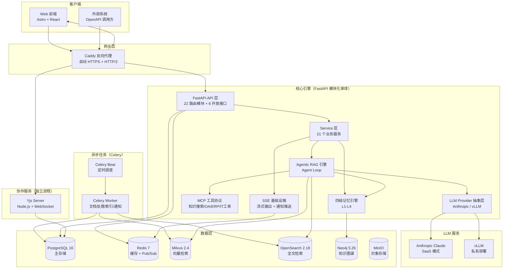
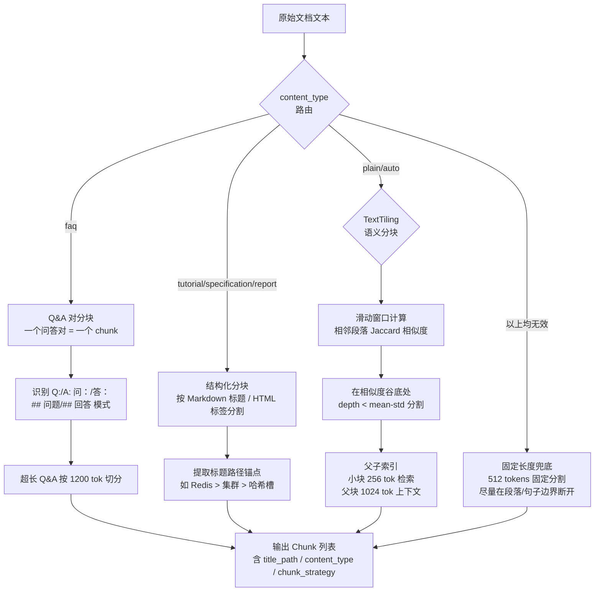
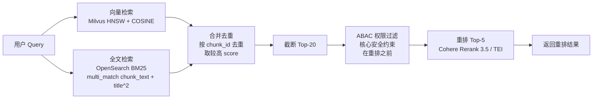
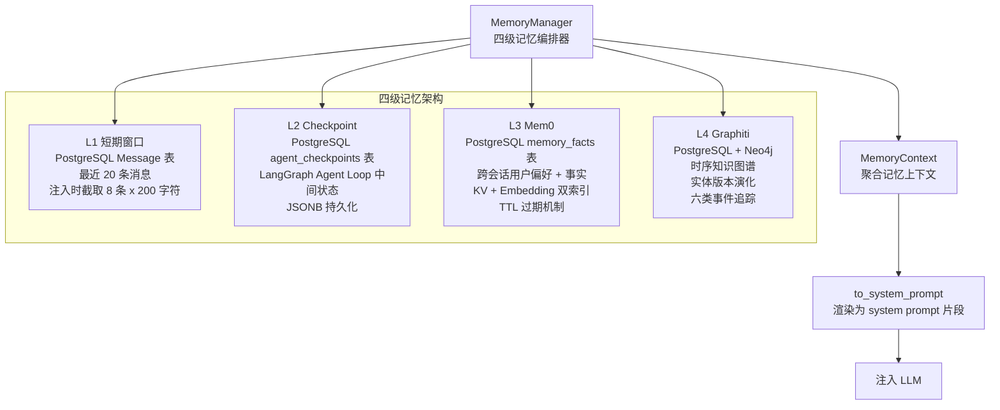
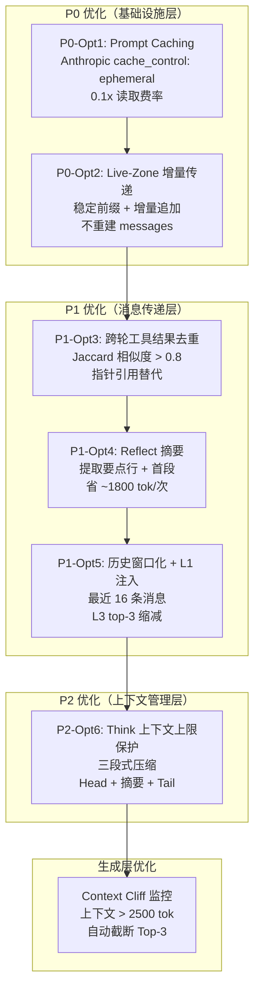
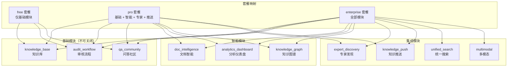
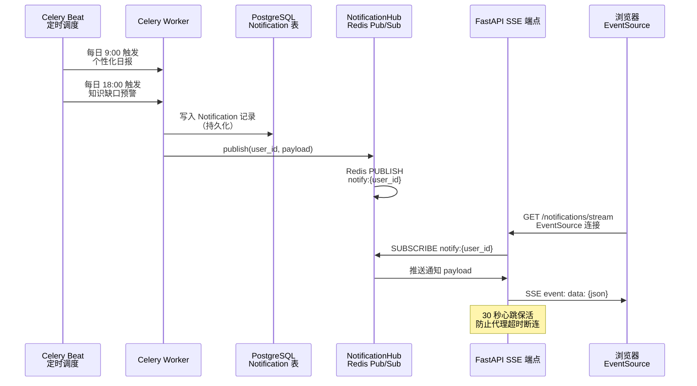
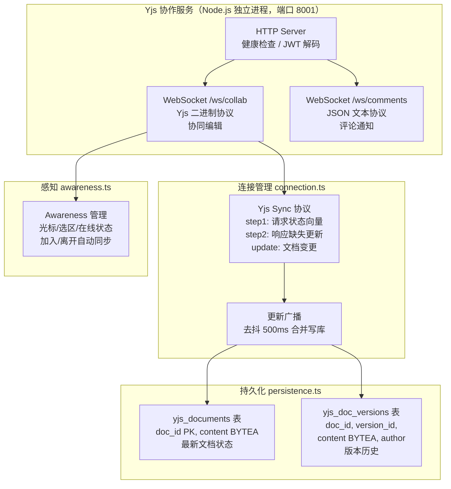
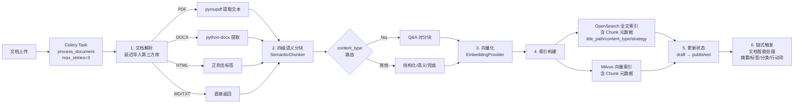
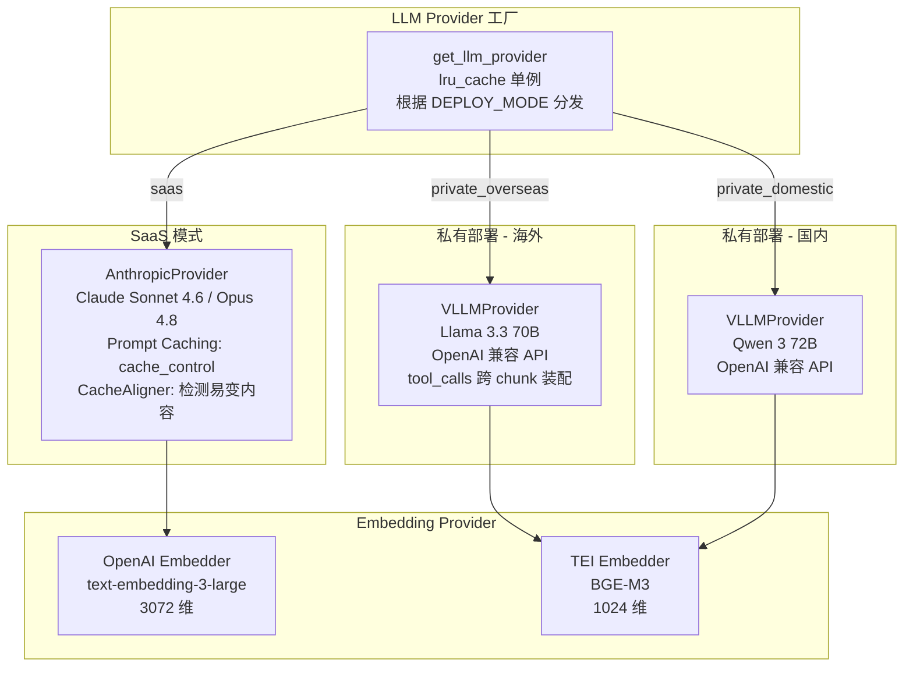

# 企业知识库大脑（Enterprise Knowledge Brain）

企业级知识库 SaaS 平台，基于 Agentic RAG 架构，支持多租户、多模态文档处理、智能问答、协同编辑与知识图谱分析。

## 目录

- [技术栈](#技术栈)
- [项目结构](#项目结构)
- [系统架构设计](#系统架构设计)
- [Agent Loop 工作原理](#agent-loop-工作原理)
- [四级语义分块策略](#四级语义分块策略)
- [混合检索管线](#混合检索管线)
- [四级记忆架构](#四级记忆架构)
- [Token 优化体系](#token-优化体系)
- [模块化门控系统](#模块化门控系统)
- [通知推送机制](#通知推送机制)
- [Yjs 协同编辑服务](#yjs-协同编辑服务)
- [文档处理流水线](#文档处理流水线)
- [LLM Provider 抽象层](#llm-provider-抽象层)
- [部署指南](#部署指南)
- [测试](#测试)

---

## 技术栈

| 层级 | 技术选型 | 说明 |
|------|----------|------|
| **后端框架** | FastAPI + SQLAlchemy(async) | 异步 API，Pydantic 数据校验 |
| **任务队列** | Celery + Redis | 异步文档处理、定时任务调度 |
| **Agent 框架** | LangGraph（可选）+ CrewAI | Agent Loop 状态图 + 多 Agent 协作 |
| **RAG 引擎** | LlamaIndex + 自研 Agentic RAG | 混合检索 + 重排 + 生成 |
| **LLM** | Anthropic Claude / vLLM（Llama 3.3 / Qwen 3） | SaaS / 私有双部署模式 |
| **向量数据库** | Milvus 2.4 | HNSW + COSINE 相似度检索 |
| **全文检索** | OpenSearch 2.18 | BM25 + multi_match |
| **图数据库** | Neo4j 5.26 | 知识图谱 + Graphiti 时序图谱 |
| **关系数据库** | PostgreSQL 16 | 主存储，JSONB + pgvector |
| **缓存** | Redis 7 | Token 缓存 + Pub/Sub 通知 |
| **对象存储** | MinIO | 文档附件 + 多模态资源 |
| **前端** | Astro 5 + React 19 + Tiptap | SSR + 协同编辑 |
| **协同服务** | Node.js + Yjs + WebSocket | CRDT 实时协同编辑 |
| **反向代理** | Caddy | 自动 HTTPS + HTTP/3 |

---

## 项目结构

```
EnterpriseKnowledge/
├── backend/                          # 后端（FastAPI + Celery）
│   ├── app/
│   │   ├── api/v1/                   # 内部 API（22 个路由模块，JWT 认证）
│   │   ├── api/openapi/v1/           # 开放接口（6 类能力，API Key 认证）
│   │   ├── agents/                   # 多 Agent 协作（CrewAI）
│   │   ├── connectors/               # 企业连接器（OA/ERP/CRM/Mail）
│   │   ├── core/                     # 模块注册表 + 权限
│   │   ├── llm/                      # LLM Provider 抽象层
│   │   ├── mcp/                      # MCP 工具协议
│   │   ├── memory/                   # 四级记忆引擎
│   │   ├── models/                   # SQLAlchemy ORM 模型
│   │   ├── observability/            # LangFuse 追踪 + LLM Judge
│   │   ├── rag/                      # Agentic RAG 引擎
│   │   ├── repositories/             # 数据访问层
│   │   ├── schemas/                  # Pydantic 数据模型
│   │   ├── services/                 # 业务逻辑层（21 个服务）
│   │   ├── utils/                    # 工具（crypto/logger/sse）
│   │   ├── vlm/                      # 视觉语言模型
│   │   ├── config.py                 # 配置管理
│   │   ├── database.py               # 数据库会话
│   │   ├── deps.py                   # 依赖注入
│   │   └── main.py                   # FastAPI 入口
│   ├── tasks/                        # Celery 异步任务
│   ├── tests/                        # 测试（371 项）
│   ├── celery_app.py                 # Celery 入口
│   └── requirements.txt
├── collab-service/                   # Yjs 协作服务（Node.js + TypeScript）
│   ├── src/
│   │   ├── index.ts                  # 服务入口
│   │   ├── connection.ts             # WebSocket 连接管理
│   │   ├── persistence.ts            # PostgreSQL 持久化
│   │   ├── awareness.ts              # 协作者状态管理
│   │   └── comments.ts               # 评论通知
│   └── package.json
├── frontend/                         # 前端（Astro + React）
│   ├── src/
│   │   ├── components/               # React 组件
│   │   ├── pages/                    # 页面
│   │   └── lib/                      # 工具库
│   └── package.json
├── docker-compose.yml                # 容器编排
└── README.md
```

---

## 系统架构设计

系统采用**模块化单体 + 选择性服务分离**架构。核心引擎为 FastAPI 模块化单体（含 Celery Worker），Yjs 协作服务因 Node.js 技术栈要求独立部署。所有服务共享同一 PostgreSQL 数据库。



### 架构设计原则

| 原则 | 实践 |
|------|------|
| **单一职责** | 每个模块只做一件事：ChatService 编排对话、RAG Engine 编排检索、MemoryManager 编排记忆 |
| **开闭原则** | LLM Provider / Embedder / Reranker / 模块注册表均使用注册表 + 装饰器模式，新增只需追加条目 |
| **依赖倒置** | LLM、检索器、重排器、权限过滤器均通过构造注入，可替换为 Mock |
| **优雅降级** | Redis / Neo4j / OpenSearch / Milvus 延迟初始化 + try/except 降级，PostgreSQL 为唯一强依赖 |
| **模块化单体** | 微服务不适合（共享数据库依赖），仅 Yjs 协作服务因技术栈原因独立部署 |

---

## Agent Loop 工作原理

`AgenticRAGEngine` 是整个系统的编排中枢，通过 `think → retrieve/tool_call → generate → reflect` 循环驱动 RAG 流程。默认使用纯 Python `while` 循环实现（零外部依赖），安装 LangGraph 后可切换为声明式状态图驱动（支持断点恢复）。


### Agent Loop 各节点职责

| 节点 | 方法 | 职责 | Token 优化 |
|------|------|------|------------|
| **think** | `_think()` | LLM 决策下一步动作，返回 `retrieve`/`tool_call`/`generate` | 稳定 system prompt（无动态内容）命中 KV Cache |
| **retrieve** | `_retrieve()` | 多路检索 → ABAC 权限过滤 → 重排 top-5 | 增量追加摘要，不重建 messages |
| **tool_call** | `_tool_call()` | MCP 工具调用 | 跨轮去重，重复结果替换为指针引用 |
| **generate** | `Generator.generate()` | 流式生成答案 | Context Cliff 监控，超限自动截断 |
| **reflect** | `_reflect()` | 评估答案质量 | 传摘要而非全文，省 ~1800 tok/次 |

### 权限过滤核心安全约束

**权限过滤在重排之前执行**：检索召回 → ABAC 权限过滤 → 重排 → 生成。权限过滤出错时保守处理（返回空列表），避免泄露越权文档。

---

## 四级语义分块策略

`SemanticChunker` 采用内容类型路由 + 四级优先级降级策略，保证总能产出有效分块。每个 `Chunk` 携带 `title_path`（标题路径锚点）、`content_type`（内容类型标签）、`chunk_strategy`（实际使用策略）等元数据。



### 分块策略优先级

| 优先级 | 策略 | 触发条件 | 特点 |
|--------|------|----------|------|
| P0 | Q&A 对分块 | `content_type="faq"` | 问答对不被拆散 |
| P1 | 结构化分块 | tutorial/specification/report | 标题路径锚点增强语义 |
| P2 | TextTiling 语义分块 | plain / auto 兜底 | 话题边界自动识别 |
| P3 | 父子索引 | 语义分块后自动构建 | 小块检索 + 父块上下文 |
| 兜底 | 固定长度 | 以上均无效 | 512 tokens 段落边界断开 |

---

## 混合检索管线

`HybridRetriever` 实现双路召回 + 合并去重，`Reranker` 通过工厂模式支持 SaaS（Cohere）和私有部署（TEI）双模式。



### 检索路对比

| 检索路 | 后端 | 算法 | 优势 |
|--------|------|------|------|
| 向量检索 | Milvus 2.x | HNSW + COSINE | 语义相似性匹配 |
| 全文检索 | OpenSearch | BM25 + multi_match | 关键词精确匹配，标题权重 x2 |

任一检索路不可用时优雅降级（返回空列表），不影响另一路。

### 重排器双模式

| 部署模式 | 实现 | 模型 |
|----------|------|------|
| SaaS | CohereReranker | rerank-multilingual-v3.0 |
| 私有部署 | TEIReranker | Jina-reranker-v2 / BGE-reranker-v2-m3 |

---

## 四级记忆架构

系统采用四级记忆编排器模式，`MemoryManager` 作为单一入口协调四个记忆层级，每层独立加载、优雅降级。



### 各层级职责

| 层级 | 存储 | 数据类型 | 读写频率 | TTL |
|------|------|----------|----------|-----|
| L1 短期窗口 | PostgreSQL Message 表 | 当前对话最近消息 | 高频读写 | 会话级 |
| L2 Checkpoint | PostgreSQL JSONB | Agent Loop 中间状态 | 中频 | 永久 |
| L3 Mem0 | PostgreSQL + Embedding | 用户偏好/历史摘要/工作记忆 | 中频 | working 24h / summary 7d / preference 永久 |
| L4 Graphiti | PostgreSQL + Neo4j | 实体关系演化/知识时间线 | 低频写 | 永久 |

### L3 Mem0 事实分类

| 类别 | 用途 | TTL |
|------|------|-----|
| `preference` | 用户偏好（"我喜欢简洁回答"） | 永不过期 |
| `working` | 工作记忆（当前任务上下文） | 24 小时 |
| `summary` | 对话摘要 | 7 天 |
| `entity` | 实体事实 | 永不过期 |

### L4 Graphiti 事件类型

`version_updated` / `status_changed` / `expired` / `deprecated` / `merged` / `split`

时间区间模型：`valid_from` / `valid_to`，新事件自动关闭前一事件的 `valid_to`。

---

## Token 优化体系

借鉴 Headroom 项目上下文压缩思路，实施 6 大优化方案，预期总节省 ~35%。



### Token 优化明细

| 优化项 | 模块 | 策略 | 节省效果 |
|--------|------|------|----------|
| P0-Opt1 | `cache_aligner.py` + `anthropic_provider.py` | system prompt 标记 cache_control，CacheAligner 检测易变内容 | 0.1x 读取费率 |
| P0-Opt2 | `engine.py` | 稳定 `_THINK_SYSTEM_STABLE` 前缀 + live zone 增量追加 | 命中 KV Cache |
| P1-Opt3 | `context_dedup.py` | Jaccard 词集相似度 > 0.8 时用指针引用替代 | 重复结果 ~300 tok/次 |
| P1-Opt4 | `engine.py` | `_reflect` 传摘要（前 3 要点 + 首段，700 字符） | ~1800 tok/次 |
| P1-Opt5 | `memory_manager.py` + `chat_service.py` | L1 渲染 8 条 x 200 字符，L3 top-3，历史 limit=16 | ~200 tok + 双重加载消除 |
| P2-Opt6 | `context_budget.py` | 超预算时三段式压缩，Head 不动 + Middle 摘要 + Tail 不动 | ~50%+ 中间消息 |
| Context Cliff | `generator.py` | 上下文 > 2500 tok 自动截断 Top-3 | 避免中间位置信息丢失 |

### 记忆不丢失保障

四层保障确保压缩不丢失信息：
1. **前缀稳定层**：KV Cache 保持 system + query 前缀不变
2. **增量传递层**：不覆盖早期消息，只追加新结果
3. **摘要替代层**：L2 Checkpoint 保存完整 AgentState 快照
4. **跨轮去重层**：原始内容物理存在于首次出现的轮次消息中

### 三级 Token 缓存

| 级别 | 介质 | 策略 | TTL |
|------|------|------|-----|
| L1 | Redis | 精确缓存，key = sha256(query) | 1h |
| L2 | 进程内 dict | 语义缓存，embedding 余弦相似度 > 0.95 | 24h |
| L3 | LLM Provider 原生 | Prompt Caching，session 级 | 由 Provider 处理 |

---

## 模块化门控系统

10 个功能模块分四类，基础模块永远启用，可选模块通过 `Tenant.settings.enabled_modules` JSONB 字段控制。API 端点使用 `require_module` 依赖注入实现门控。



### 门控实现

```python
# API 端点使用 require_module 替代通用认证
@router.get("/dashboard")
async def get_dashboard(
    user: User = Depends(require_module("analytics_dashboard")),
    db: AsyncSession = Depends(get_db_session),
):
    ...
```

41 个 API 端点已更新为模块门控。模块状态存储在 `Tenant.settings` JSONB 字段中（不建独立表，避免 JOIN 复杂度）。

---

## 通知推送机制

通知推送遵循 `Celery 任务 → PostgreSQL 写入 → Redis Pub/Sub → SSE 推送 → 浏览器 EventSource` 流程，不跨进程调用 Node.js 服务。



### 关键设计

- Redis 不可用时静默降级（通知仍写入 DB，只是不实时推送）
- 30 秒心跳保活（`: heartbeat\n\n`），防止代理超时断连
- 用户多标签页天然 fan-out（Redis Pub/Sub 每个订阅独立接收）
- EventSource API 原生支持自动重连

---

## Yjs 协同编辑服务

因 Yjs CRDT 生态在 Node.js/TypeScript 端更成熟，协作服务作为独立进程部署。与 FastAPI 核心引擎共享同一 PostgreSQL 数据库，无进程间通信协议。



### 双 WebSocket 端点

| 端点 | 协议 | 用途 |
|------|------|------|
| `/ws/collab` | Yjs 二进制 | 协同编辑（兼容 y-websocket） |
| `/ws/comments` | JSON 文本 | 评论通知（订阅/发布） |

### 持久化设计

- **合并写入**：`saveDoc()` 读取已有内容 → `Y.applyUpdate` 合并 → `Y.encodeStateAsUpdate` 编码全量 → 写回（事务保护，`FOR UPDATE` 行锁）
- **去抖持久化**：500ms 合并短时间内的多次更新为一次写库
- **降级模式**：PostgreSQL 不可用时切换内存模式（数据不持久化，重启丢失）

---

## 文档处理流水线

Celery 异步任务驱动文档处理流水线，从文档上传到索引构建全自动，支持 PDF/DOCX/HTML/Markdown 多格式。



### 设计要点

- **延迟导入**：pymupdf / python-docx / opensearchpy / pymilvus 延迟导入，未安装时优雅降级
- **Chunk 元数据**：每个 Chunk 携带 `title_path`、`content_type`、`chunk_strategy`、`parent_id`
- **重试机制**：`max_retries=3`，`default_retry_delay=60`
- **链式触发**：文档处理完成后自动触发智能处理（摘要/标签/分类/行动项/FAQ）

---

## LLM Provider 抽象层

通过注册表 + 装饰器工厂模式实现"环境变量切换，业务代码零改动"。三种部署模式映射不同 Provider 和模型。



### LangFuse 全链路追踪

Agent Loop 的每个节点（think/retrieve/tool_call/generate/reflect）通过 `@trace_node` 装饰器自动记录到 LangFuse，支持五节点 Agent Loop 追踪。LangFuse 未配置时静默降级为纯日志，不影响主流程。

---

## 部署指南

### 环境要求

- Docker + Docker Compose
- Python 3.12+（开发环境）
- Node.js 20+（协作服务开发环境）

### SaaS 模式部署

```bash
# 克隆仓库
git clone https://github.com/jamesfeng2009/KnowledgeBase.git
cd KnowledgeBase

# 配置环境变量
cp backend/.env.example backend/.env
# 编辑 .env 设置 ANTHROPIC_API_KEY、DATABASE_URL 等

# 启动所有服务
docker compose up -d
```

### 私有部署

```bash
# 设置部署模式为国内私有部署（使用 vLLM + TEI）
export DEPLOY_MODE=private_domestic

# 启动所有服务（含 GPU 模型服务）
docker compose --profile private up -d
```

### 服务端口

| 服务 | 端口 | 说明 |
|------|------|------|
| Frontend | 3000 → 80 | Astro SSR + Nginx |
| Core Engine (FastAPI) | 8000 | 后端 API |
| Yjs Server | 8001 | 协同编辑 WebSocket |
| PostgreSQL | 5432 | 主数据库 |
| Redis | 6379 | 缓存 + Pub/Sub |
| Milvus | 19530 | 向量数据库 |
| OpenSearch | 9200 | 全文检索 |
| Neo4j | 7687 | 知识图谱 |
| MinIO | 9000 | 对象存储 |

### Docker Compose 服务拓扑

| 层级 | 服务 |
|------|------|
| 基础设施 | postgres, redis, minio, opensearch, milvus (+etcd +minio), neo4j |
| 应用层 | core-engine, frontend, yjs-server, celery-worker, celery-beat |
| 私有模型 | llm-server (vLLM), embedding-server (TEI), reranker-server (TEI), vlm-server (vLLM) |

---

## 测试

```bash
cd backend

# 运行全部测试（371 项）
python -m pytest --tb=short -q

# 运行特定模块测试
python -m pytest tests/test_chunk_optimization.py -v    # RAG 分块优化
python -m pytest tests/test_token_optimization.py -v      # P0 Token 优化
python -m pytest tests/test_p1_token_optimization.py -v   # P1 Token 优化
python -m pytest tests/test_p2_token_optimization.py -v   # P2 Token 优化
python -m pytest tests/test_document_tasks_chunker.py -v  # 文档分块接入
```

### 测试覆盖

| 测试文件 | 测试数 | 覆盖范围 |
|----------|--------|----------|
| `test_chunk_optimization.py` | 32 | Q&A 分块、内容类型路由、标题路径、Context Cliff |
| `test_token_optimization.py` | 27 | CacheAligner、Prompt Caching、稳定 System Prompt、增量上下文 |
| `test_p1_token_optimization.py` | 32 | 跨轮去重、Reflect 摘要、L1 注入、历史窗口化 |
| `test_p2_token_optimization.py` | 35 | ContextBudgetManager、三段式压缩、引擎集成 |
| `test_document_tasks_chunker.py` | 30 | SemanticChunker 接入、索引元数据、端到端策略验证 |
| 其他测试 | 215 | API 端点、服务层、模型层、记忆引擎等 |
| **合计** | **371** | **全部通过，零回归** |

---

## License

Private - All Rights Reserved
