# 企业知识库大脑（Enterprise Knowledge Brain）

企业级知识库 SaaS 平台，基于 Agentic RAG 架构，支持多租户、多模态文档处理、智能问答、协同编辑与知识图谱分析。

## 目录

- [技术栈](#技术栈)
- [项目结构](#项目结构)
- [系统架构设计](#系统架构设计)
- [Agent Loop 工作原理](#agent-loop-工作原理)
- [四级语义分块策略](#四级语义分块策略)
- [混合检索管线](#混合检索管线)
- [四级记忆架构](#四级记忆架构)
- [Token 优化与上下文压缩设计](#token-优化与上下文压缩设计)
- [模块化门控系统](#模块化门控系统)
- [通知推送机制](#通知推送机制)
- [Yjs 协同编辑服务](#yjs-协同编辑服务)
- [文档处理流水线](#文档处理流水线)
- [LLM Provider 抽象层](#llm-provider-抽象层)
- [部署指南](#部署指南)
- [测试](#测试)

---

## 技术栈

| 层级 | 技术选型 | 说明 |
|------|----------|------|
| **后端框架** | FastAPI + SQLAlchemy(async) | 异步 API，Pydantic 数据校验 |
| **任务队列** | Celery + Redis | 异步文档处理、定时任务调度 |
| **Agent 框架** | LangGraph（可选）+ CrewAI | Agent Loop 状态图 + 多 Agent 协作 |
| **RAG 引擎** | LlamaIndex + 自研 Agentic RAG | 混合检索 + 重排 + 生成 |
| **LLM** | Anthropic Claude / vLLM（Llama 3.3 / Qwen 3） | SaaS / 私有双部署模式 |
| **向量数据库** | Milvus 2.4 | HNSW + COSINE 相似度检索 |
| **全文检索** | OpenSearch 2.18 | BM25 + multi_match |
| **图数据库** | Neo4j 5.26 | 知识图谱 + Graphiti 时序图谱 |
| **关系数据库** | PostgreSQL 16 | 主存储，JSONB + pgvector |
| **缓存** | Redis 7 | Token 缓存 + Pub/Sub 通知 |
| **对象存储** | MinIO | 文档附件 + 多模态资源 |
| **前端** | Astro 5 + React 19 + Tiptap | SSR + 协同编辑 |
| **协同服务** | Node.js + Yjs + WebSocket | CRDT 实时协同编辑 |
| **反向代理** | Caddy | 自动 HTTPS + HTTP/3 |

---

## 项目结构

```
EnterpriseKnowledge/
├── backend/                          # 后端（FastAPI + Celery）
│   ├── app/
│   │   ├── api/v1/                   # 内部 API（22 个路由模块，JWT 认证）
│   │   ├── api/openapi/v1/           # 开放接口（6 类能力，API Key 认证）
│   │   ├── agents/                   # 多 Agent 协作（CrewAI）
│   │   ├── connectors/               # 企业连接器（OA/ERP/CRM/Mail）
│   │   ├── core/                     # 模块注册表 + 权限
│   │   ├── llm/                      # LLM Provider 抽象层
│   │   ├── mcp/                      # MCP 工具协议
│   │   ├── memory/                   # 四级记忆引擎
│   │   ├── models/                   # SQLAlchemy ORM 模型
│   │   ├── observability/            # LangFuse 追踪 + LLM Judge
│   │   ├── rag/                      # Agentic RAG 引擎
│   │   ├── repositories/             # 数据访问层
│   │   ├── schemas/                  # Pydantic 数据模型
│   │   ├── services/                 # 业务逻辑层（21 个服务）
│   │   ├── utils/                    # 工具（crypto/logger/sse）
│   │   ├── vlm/                      # 视觉语言模型
│   │   ├── config.py                 # 配置管理
│   │   ├── database.py               # 数据库会话
│   │   ├── deps.py                   # 依赖注入
│   │   └── main.py                   # FastAPI 入口
│   ├── tasks/                        # Celery 异步任务
│   ├── tests/                        # 测试（371 项）
│   ├── celery_app.py                 # Celery 入口
│   └── requirements.txt
├── collab-service/                   # Yjs 协作服务（Node.js + TypeScript）
│   ├── src/
│   │   ├── index.ts                  # 服务入口
│   │   ├── connection.ts             # WebSocket 连接管理
│   │   ├── persistence.ts            # PostgreSQL 持久化
│   │   ├── awareness.ts              # 协作者状态管理
│   │   └── comments.ts               # 评论通知
│   └── package.json
├── frontend/                         # 前端（Astro + React）
│   ├── src/
│   │   ├── components/               # React 组件
│   │   ├── pages/                    # 页面
│   │   └── lib/                      # 工具库
│   └── package.json
├── docker-compose.yml                # 容器编排
└── README.md
```

---

## 系统架构设计

系统采用**模块化单体 + 选择性服务分离**架构。核心引擎为 FastAPI 模块化单体（含 Celery Worker），Yjs 协作服务因 Node.js 技术栈要求独立部署。所有服务共享同一 PostgreSQL 数据库。

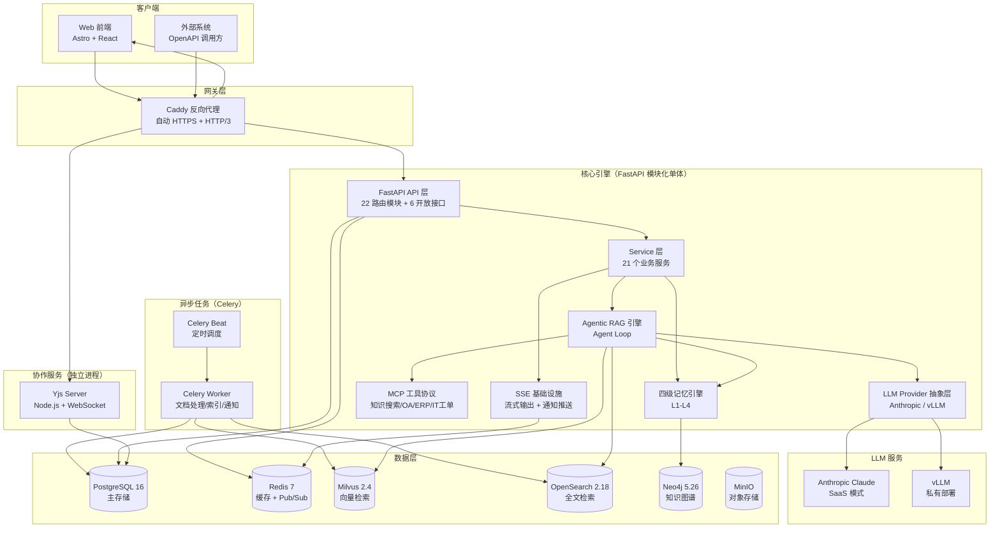

### 架构设计原则

| 原则 | 实践 |
|------|------|
| **单一职责** | 每个模块只做一件事：ChatService 编排对话、RAG Engine 编排检索、MemoryManager 编排记忆 |
| **开闭原则** | LLM Provider / Embedder / Reranker / 模块注册表均使用注册表 + 装饰器模式，新增只需追加条目 |
| **依赖倒置** | LLM、检索器、重排器、权限过滤器均通过构造注入，可替换为 Mock |
| **优雅降级** | Redis / Neo4j / OpenSearch / Milvus 延迟初始化 + try/except 降级，PostgreSQL 为唯一强依赖 |
| **模块化单体** | 微服务不适合（共享数据库依赖），仅 Yjs 协作服务因技术栈原因独立部署 |

---

## Agent Loop 工作原理

`AgenticRAGEngine` 是整个系统的编排中枢，通过 `think → retrieve/tool_call → generate → reflect` 循环驱动 RAG 流程。默认使用纯 Python `while` 循环实现（零外部依赖），安装 LangGraph 后可切换为声明式状态图驱动（支持断点恢复）。

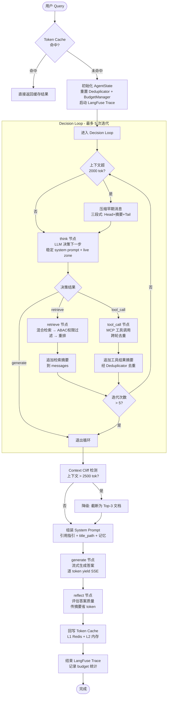

### Agent Loop 各节点职责

| 节点 | 方法 | 职责 | Token 优化 |
|------|------|------|------------|
| **think** | `_think()` | LLM 决策下一步动作，返回 `retrieve`/`tool_call`/`generate` | 稳定 system prompt（无动态内容）命中 KV Cache |
| **retrieve** | `_retrieve()` | 多路检索 → ABAC 权限过滤 → 重排 top-5 | 增量追加摘要，不重建 messages |
| **tool_call** | `_tool_call()` | MCP 工具调用 | 跨轮去重，重复结果替换为指针引用 |
| **generate** | `Generator.generate()` | 流式生成答案 | Context Cliff 监控，超限自动截断 |
| **reflect** | `_reflect()` | 评估答案质量 | 传摘要而非全文，省 ~1800 tok/次 |

### 权限过滤核心安全约束

**权限过滤在重排之前执行**：检索召回 → ABAC 权限过滤 → 重排 → 生成。权限过滤出错时保守处理（返回空列表），避免泄露越权文档。

---

## 四级语义分块策略

`SemanticChunker` 采用内容类型路由 + 四级优先级降级策略，保证总能产出有效分块。每个 `Chunk` 携带 `title_path`（标题路径锚点）、`content_type`（内容类型标签）、`chunk_strategy`（实际使用策略）等元数据。

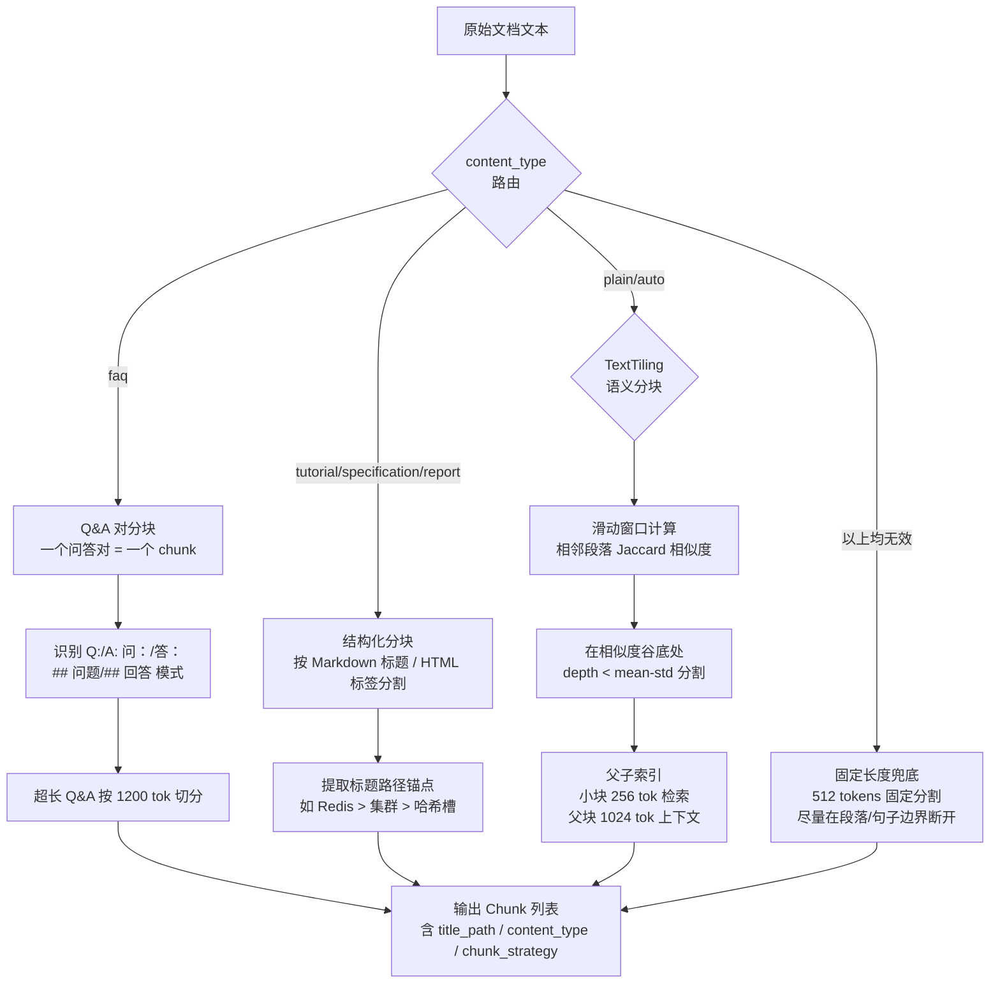

### 分块策略优先级

| 优先级 | 策略 | 触发条件 | 特点 |
|--------|------|----------|------|
| P0 | Q&A 对分块 | `content_type="faq"` | 问答对不被拆散 |
| P1 | 结构化分块 | tutorial/specification/report | 标题路径锚点增强语义 |
| P2 | TextTiling 语义分块 | plain / auto 兜底 | 话题边界自动识别 |
| P3 | 父子索引 | 语义分块后自动构建 | 小块检索 + 父块上下文 |
| 兜底 | 固定长度 | 以上均无效 | 512 tokens 段落边界断开 |

---

## 混合检索管线

`HybridRetriever` 实现双路召回 + 合并去重，`Reranker` 通过工厂模式支持 SaaS（Cohere）和私有部署（TEI）双模式。

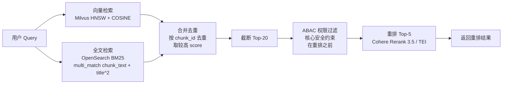

### 检索路对比

| 检索路 | 后端 | 算法 | 优势 |
|--------|------|------|------|
| 向量检索 | Milvus 2.x | HNSW + COSINE | 语义相似性匹配 |
| 全文检索 | OpenSearch | BM25 + multi_match | 关键词精确匹配，标题权重 x2 |

任一检索路不可用时优雅降级（返回空列表），不影响另一路。

### 重排器双模式

| 部署模式 | 实现 | 模型 |
|----------|------|------|
| SaaS | CohereReranker | rerank-multilingual-v3.0 |
| 私有部署 | TEIReranker | Jina-reranker-v2 / BGE-reranker-v2-m3 |

---

## 四级记忆架构

系统采用四级记忆编排器模式，`MemoryManager` 作为单一入口协调四个记忆层级，每层独立加载、优雅降级。

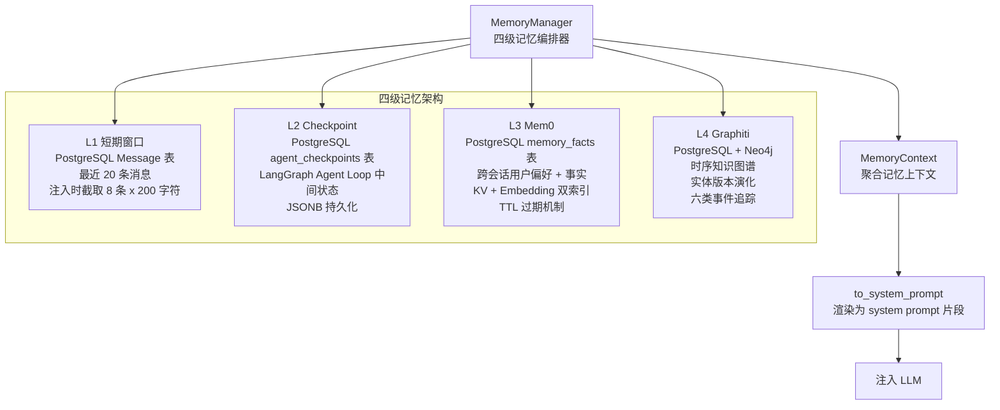

### 各层级职责

| 层级 | 存储 | 数据类型 | 读写频率 | TTL |
|------|------|----------|----------|-----|
| L1 短期窗口 | PostgreSQL Message 表 | 当前对话最近消息 | 高频读写 | 会话级 |
| L2 Checkpoint | PostgreSQL JSONB | Agent Loop 中间状态 | 中频 | 永久 |
| L3 Mem0 | PostgreSQL + Embedding | 用户偏好/历史摘要/工作记忆 | 中频 | working 24h / summary 7d / preference 永久 |
| L4 Graphiti | PostgreSQL + Neo4j | 实体关系演化/知识时间线 | 低频写 | 永久 |

### L3 Mem0 事实分类

| 类别 | 用途 | TTL |
|------|------|-----|
| `preference` | 用户偏好（"我喜欢简洁回答"） | 永不过期 |
| `working` | 工作记忆（当前任务上下文） | 24 小时 |
| `summary` | 对话摘要 | 7 天 |
| `entity` | 实体事实 | 永不过期 |

### L4 Graphiti 事件类型

`version_updated` / `status_changed` / `expired` / `deprecated` / `merged` / `split`

时间区间模型：`valid_from` / `valid_to`，新事件自动关闭前一事件的 `valid_to`。

---

## Token 优化与上下文压缩设计

### 设计背景：14 个 Token 浪费点

通过对比分析 [Headroom](https://github.com/headroomlabs-ai/headroom) 项目的上下文压缩思路，识别出本项目中 14 个 token 浪费点（W1-W14），并提出 6 大优化方案（P0-P2）：

| 编号 | 浪费点 | 位置 | 严重度 |
|------|--------|------|--------|
| W1 | system prompt 每轮重建（含动态迭代数/文档数） | `engine.py` `_think` | 高 |
| W2 | 用户 query 在每轮 think 中重复传递 | `engine.py` `_think` | 中 |
| W3 | 未启用 Anthropic Prompt Caching | `anthropic_provider.py` | 高 |
| W4 | ChatService 全量加载历史消息（无 limit） | `chat_service.py` `_build_llm_messages` | 高 |
| W5 | 工具结果在多轮迭代中累积，重复内容重复传 | `engine.py` `_run_decision_loop` | 高 |
| W6 | reflect 阶段回传完整答案全文（~2000 tok） | `engine.py` `_reflect` | 高 |
| W7 | L1 短期窗口加载后不渲染，ChatService 另从 DB 双重加载 | `memory_manager.py` + `chat_service.py` | 高 |
| W8 | 幽灵字段：AgentState 中的 `_decision` / `_stream_tokens` 在纯 Python 路径无用但仍占空间 | `engine.py` AgentState | 低 |
| W9 | L3 用户偏好注入 top-10（实际只需 top-3） | `memory_manager.py` `to_system_prompt` | 中 |
| W10 | 历史消息每条全量传递（无截断） | `chat_service.py` | 中 |
| W11 | 检索文档在 think 上下文中全量传递（只需摘要） | `engine.py` `_think` | 中 |
| W12 | system prompt 中嵌入 UUID / 时间戳等易变内容，破坏 KV Cache | `engine.py` + `anthropic_provider.py` | 高 |
| W13 | 多轮迭代后 messages 列表无限增长（无上限保护） | `engine.py` `_run_decision_loop` | 高 |
| W14 | 生成阶段注入过多检索文档（>2500 tok 导致 Context Cliff） | `generator.py` | 中 |

### 优化方案总览

针对上述 14 个浪费点，实施 6 大优化方案，分为三层：**基础设施层（P0）→ 消息传递层（P1）→ 上下文管理层（P2）**，预期总节省 ~35%。

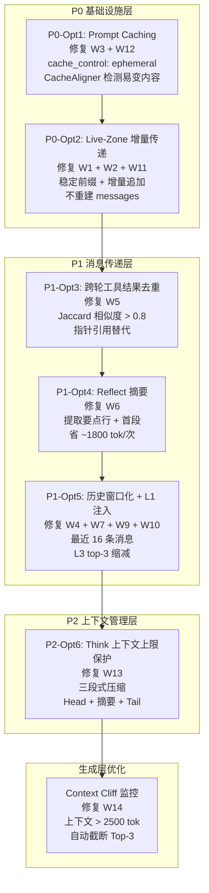

### 上下文压缩架构

以下流程图展示了一条用户 Query 在 Agent Loop 中经过的完整上下文压缩管线，每一层压缩都有对应的保障机制确保信息不丢失：

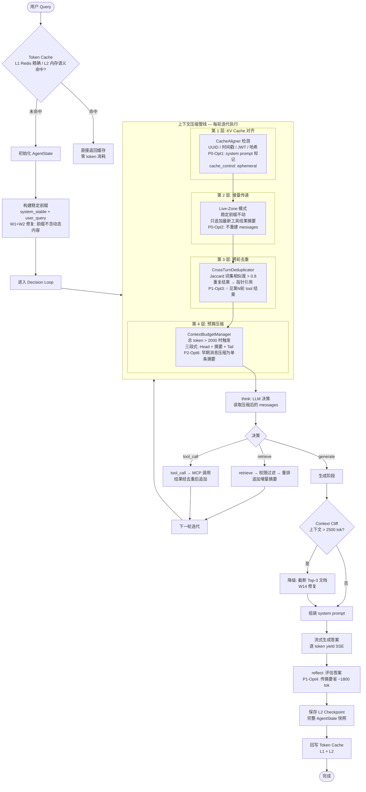

### P0-Opt1: Prompt Caching + CacheAligner

**解决的问题**：W3（未启用 Prompt Caching）+ W12（易变内容破坏 KV Cache）

**设计原理**：Anthropic Claude API 支持 Prompt Caching — 将 system prompt 标记 `cache_control: {"type": "ephemeral"}` 后，首次写入按 1.25x 费率计算，5 分钟内再次读取同一前缀仅按 0.1x 费率。但前提是前缀字节必须稳定，任何 UUID / 时间戳 / JWT 的变化都会导致缓存失效。

```mermaid
flowchart LR
    subgraph "CacheAligner 检测"
        INPUT[System Prompt 文本] --> DETECT_UUID[检测 UUID<br/>regex: [0-9a-f]{8}-...]
        DETECT_UUID --> DETECT_TS[检测 ISO8601 时间戳<br/>regex: \\d{4}-\\d{2}-\\d{2}T...]
        DETECT_TS --> DETECT_JWT[检测 JWT Token<br/>regex: eyJ...]
        DETECT_JWT --> DETECT_HASH[检测十六进制哈希<br/>regex: [0-9a-f]{40,64}]
        DETECT_HASH --> WARNINGS[返回警告列表]
    end

    subgraph "Anthropic Provider 集成"
        SYSTEM_TEXT[system prompt] --> CHECK[check_cache_alignment]
        CHECK --> |有警告| LOG[log.warning 记录]
        CHECK --> |无警告| WRAP[包装为 content block]
        WRAP --> CACHE_CONTROL["cache_control: {type: ephemeral}"]
        CACHE_CONTROL --> API[发送至 Anthropic API]
    end
```

**关键代码路径**：`app/llm/cache_aligner.py` → `app/llm/anthropic_provider.py._build_api_kwargs()`

**效果**：重复前缀读取费率从 1x 降至 0.1x，10 倍成本节省。

### P0-Opt2: Live-Zone 增量上下文传递

**解决的问题**：W1（system prompt 每轮重建）+ W2（query 重复传递）+ W11（检索文档全量传递）

**设计原理**：将 think 的上下文分为**稳定前缀**（system prompt + user query）和**增量 Live Zone**（每轮新追加的工具结果摘要）。稳定前缀在循环开始前一次性设置，后续每轮只追加增量消息，不重建 messages 列表。

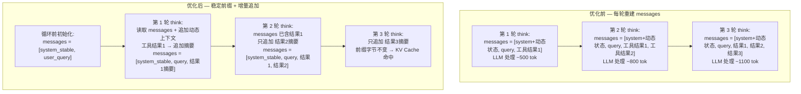

**关键设计**：
- `_THINK_SYSTEM_STABLE` 常量：不含迭代计数、文档数、工具数等动态内容
- 动态状态作为 "live zone" 消息追加：`{"role": "user", "content": "[系统] 当前状态：迭代 3/5..."}`
- 前缀字节稳定 → Anthropic KV Cache 命中 → 0.1x 读取费率

**关键代码路径**：`app/rag/engine.py` → `_run_decision_loop()` + `_think()`

### P1-Opt3: 跨轮工具结果去重

**解决的问题**：W5（工具结果在多轮迭代中累积，重复内容重复传）

**设计原理**：Agent 常在多轮迭代中调用同一工具获取相同或高度相似结果（如反复查同一 ERP 订单）。首次结果保留完整摘要，后续相似结果替换为指针引用 `"↑ [见第1轮 search_erp 结果]"`。

```mermaid
sequenceDiagram
    participant Loop as Decision Loop
    participant Dedup as CrossTurnDeduplicator
    participant Messages as messages 列表

    Note over Dedup: 已见列表 = []

    Loop->>Dedup: 第 1 轮: register(turn=1, "search_erp", "订单 BG2024001 金额 5000 元...")
    Dedup->>Dedup: Jaccard 比对: 已见列表为空
    Dedup->>Dedup: 注册到已见列表
    Dedup-->>Loop: 返回完整摘要 (300 字符)
    Loop->>Messages: 追加 "[系统] 工具结果：订单 BG2024001 金额 5000 元..."

    Loop->>Dedup: 第 2 轮: register(turn=2, "search_erp", "订单 BG2024001 金额 5000 元 备注：已审批")
    Dedup->>Dedup: Jaccard 比对: 与第 1 轮相似度 = 0.85 > 0.8
    Dedup-->>Loop: 返回指针引用 "↑ [见第1轮 search_erp 结果]"
    Loop->>Messages: 追加 "[系统] 工具结果：↑ [见第1轮 search_erp 结果]" (30 字符)

    Note over Messages: 节省 ~270 字符 (~77 tok)
```

**Jaccard 相似度算法**：
```python
set_a = set(text_a.split())  # 词集
set_b = set(text_b.split())
similarity = len(set_a & set_b) / len(set_a | set_b)
# similarity > 0.8 → 替换为指针引用
```

**两个硬不变量**（与 Headroom CrossTurnDedup 一致）：
1. **前缀单调性**：只匹配严格更早的块，追加轮次不修改早期轮次
2. **无信息离开窗口**：只有逐字出现的 span 才被反向引用，原始内容物理存在于首次轮次

**关键代码路径**：`app/rag/context_dedup.py` → `engine.py._run_decision_loop()`

### P1-Opt4: Reflect 摘要替代全文

**解决的问题**：W6（reflect 阶段回传完整答案全文，~2000 tok）

**设计原理**：reflect 节点只需评估答案质量（引用准确性 / 完整性 / 幻觉风险），不需要完整答案文本。将答案压缩为摘要（前 3 个要点行 + 首段引言，截断 700 字符），从 ~2000 tok 降至 ~200 tok。

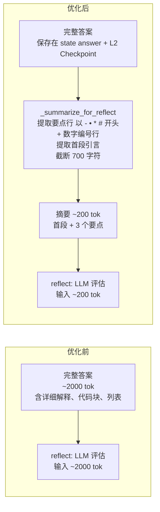

**摘要提取规则**：
- 要点行：以 `-`、`•`、`*`、`#` 开头的行，或以数字 + `.` / `、` / `)` 开头的行
- 首段引言：第一行文本
- 最多保留 3 个要点 + 首段，截断到 700 字符

**信息安全**：完整答案保存在 `state["answer"]` 和 L2 Checkpoint 中，reflect 只读取摘要。

**关键代码路径**：`app/rag/engine.py` → `_reflect()` + `_summarize_for_reflect()`

### P1-Opt5: ChatService 历史窗口化 + L1 实际注入

**解决的问题**：W4（全量加载历史无 limit）+ W7（L1 加载后不渲染，双重加载）+ W9（L3 top-10 过多）+ W10（历史消息无截断）

**设计原理**：ChatService 之前从 DB 全量加载对话历史，同时 MemoryManager 也加载了 L1 短期窗口但不渲染，导致双重加载。优化后 ChatService 优先使用 `memory_ctx.short_term`，L1 渲染到 system prompt（每条截断 200 字符），L3 从 top-10 缩减到 top-3。

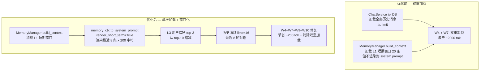

**关键参数**：
- `_SHORT_TERM_INJECT_SIZE = 8`：L1 注入最近 8 条消息（4 轮对话）
- `_SHORT_TERM_MSG_MAX_CHARS = 200`：每条消息截断到 200 字符
- `_L3_INJECT_TOP_N = 3`：L3 用户偏好从 top-10 缩减到 top-3
- `_HISTORY_WINDOW = 16`：历史消息最多 16 条（8 轮对话）

**关键代码路径**：`app/memory/memory_manager.py.to_system_prompt()` + `app/services/chat_service.py._build_llm_messages()`

### P2-Opt6: Think 上下文上限保护

**解决的问题**：W13（多轮迭代后 messages 无限增长）

**设计原理**：即使经过 P1-Opt3 跨轮去重，5 次迭代后 messages 仍可能累积到 2500+ tokens。借鉴 Headroom Memory Budget + Time Decay 设计，实施三段式压缩：Head（前 2 条不动）→ Middle（压缩为单条摘要）→ Tail（最近 2 条不动）。

```mermaid
flowchart TD
    CHECK{should_compress?<br/>总 token > 2000<br/>且消息数 > 4}

    CHECK -->|否| SKIP[不压缩<br/>直接进入 think]
    CHECK -->|是| SPLIT[三段式切分]

    SPLIT --> HEAD[Head: 前 2 条<br/>system + query<br/>永不压缩<br/>保持 KV Cache 前缀稳定]
    SPLIT --> MIDDLE[Middle: 中间消息<br/>压缩为单条摘要]
    SPLIT --> TAIL[Tail: 最近 2 条<br/>Live Zone<br/>保留原文]

    MIDDLE --> COMPRESS_MSG[_compress_single_message<br/>按消息类型智能压缩]

    subgraph COMPRESS_TYPES [压缩类型识别]
        RETRIEVE_MSG["[系统] 已检索到 15 篇文档<br/>→ 检索15篇"]
        TOOL_MSG["[系统] 工具结果：订单详情...<br/>→ 工具:订单详情...前80字"]
        POINTER_MSG["[系统] 工具结果：↑ 见第1轮...<br/>→ 重复结果(见1轮)"]
        CONTEXT_MSG["当前状态：迭代 3/5...<br/>→ 第3轮决策"]
        PLAIN_MSG["其他文本<br/>→ 截断到 80 字符"]
    end

    COMPRESS_MSG --> COMPRESS_TYPES
    COMPRESS_TYPES --> MERGE[合并为单条摘要消息<br/>"[系统] 早期上下文摘要：检索15篇；工具:订单...；重复结果(见1轮)"]

    HEAD --> RESULT[压缩后 messages:<br/>system + query + 摘要 + recent1 + recent2]
    MERGE --> RESULT
    TAIL --> RESULT

    RESULT --> STATS[更新统计<br/>compress_count + tokens_saved]
    STATS --> THINK[进入 think]
```

**两个硬不变量**（与 Headroom Memory Budget 一致）：
1. **Head 不变性**：system + query 始终保留，保证 KV Cache 命中
2. **信息保真**：压缩摘要保留每条消息的关键动作类型和核心数据指针，原始完整内容保存在 `state["retrieved_docs"]` 和 `state["tool_results"]` 中

**压缩效果示例**：

```
压缩前 (10 条消息, ~3500 tok):
  [system_stable, query, 检索结果1(500字), 工具结果1(800字), 检索结果2(500字),
   工具结果2(800字), 指针引用(30字), 检索结果3(500字), 工具结果3(800字), recent]

压缩后 (5 条消息, ~800 tok):
  [system_stable, query,
   "[系统] 早期上下文摘要：检索5篇；工具:订单BG2024...；检索8篇；工具:审批状态...；重复结果(见1轮)",
   工具结果3(800字), recent]

节省: ~2700 tok (77%)
```

**关键代码路径**：`app/rag/context_budget.py` → `engine.py._run_decision_loop()`

### Context Cliff 监控

**解决的问题**：W14（生成阶段注入过多检索文档导致 Context Cliff）

**设计原理**：当注入上下文总 token 超过 2500 时，LLM 对中间位置信息的提取能力会显著下降（"Context Cliff" 现象）。`_check_context_cliff()` 在组装 prompt 前自动检测并降级为 Top-3 文档。

```mermaid
flowchart LR
    DOCS[检索文档列表<br/>Top-5 after rerank] --> CALC[计算总 token<br/>sum(doc.token_count)]
    CALC --> CHECK{总 token > 2500?}
    CHECK -->|否| ALL[注入全部 5 篇文档]
    CHECK -->|是| DEGRADE[截断为 Top-3 文档<br/>记录 context_cliff_degraded 告警]
    ALL --> PROMPT[组装 system prompt]
    DEGRADE --> PROMPT
```

**关键代码路径**：`app/rag/generator.py._check_context_cliff()`

### 记忆不丢失四层保障

压缩不是丢弃，而是分层保真。四层保障确保任何压缩操作都不丢失关键信息：

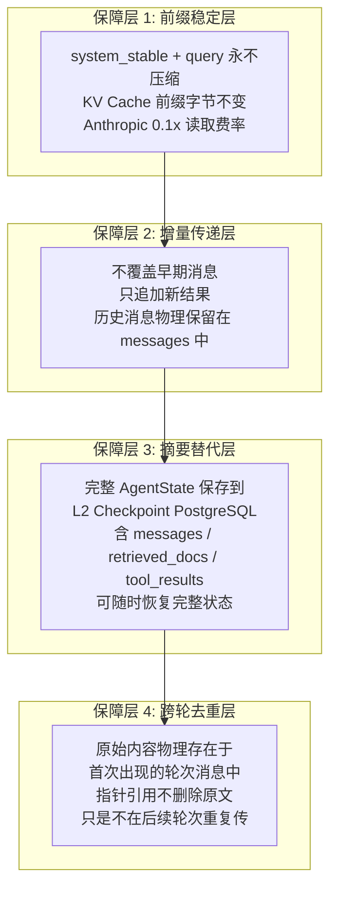

### 三级 Token 缓存

除了上下文压缩，系统还实现三级缓存避免重复 LLM 调用：

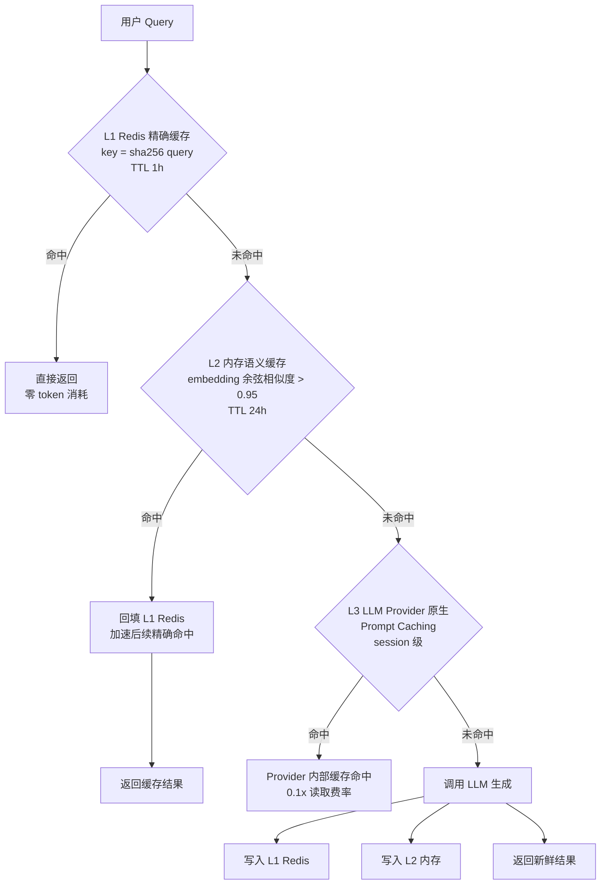

| 级别 | 介质 | 策略 | TTL | 命中效果 |
|------|------|------|-----|----------|
| L1 | Redis | 精确缓存，key = sha256(query) | 1h | 零 token 消耗 |
| L2 | 进程内 dict | 语义缓存，embedding 余弦相似度 > 0.95 | 24h | 零 token 消耗 |
| L3 | LLM Provider 原生 | Prompt Caching，session 级 | 5 min | 0.1x 读取费率 |

### Token 优化效果汇总

| 优化项 | 修复浪费点 | 模块 | 节省效果 | 层级 |
|--------|-----------|------|----------|------|
| P0-Opt1 | W3, W12 | `cache_aligner.py` + `anthropic_provider.py` | 0.1x 读取费率 | 基础设施 |
| P0-Opt2 | W1, W2, W11 | `engine.py` | 命中 KV Cache | 基础设施 |
| P1-Opt3 | W5 | `context_dedup.py` | 重复结果 ~300 tok/次 | 消息传递 |
| P1-Opt4 | W6 | `engine.py` | ~1800 tok/次 | 消息传递 |
| P1-Opt5 | W4, W7, W9, W10 | `memory_manager.py` + `chat_service.py` | ~200 tok + 消除双重加载 | 消息传递 |
| P2-Opt6 | W13 | `context_budget.py` | ~50%+ 中间消息 | 上下文管理 |
| Context Cliff | W14 | `generator.py` | 避免中间位置信息丢失 | 生成层 |
| 三级缓存 | — | `cache.py` | 命中时零 token 消耗 | 缓存 |

---

## 模块化门控系统

10 个功能模块分四类，基础模块永远启用，可选模块通过 `Tenant.settings.enabled_modules` JSONB 字段控制。API 端点使用 `require_module` 依赖注入实现门控。

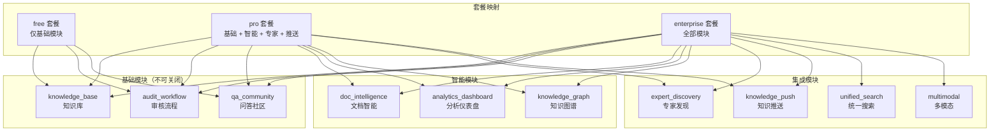

### 门控实现

```python
# API 端点使用 require_module 替代通用认证
@router.get("/dashboard")
async def get_dashboard(
    user: User = Depends(require_module("analytics_dashboard")),
    db: AsyncSession = Depends(get_db_session),
):
    ...
```

41 个 API 端点已更新为模块门控。模块状态存储在 `Tenant.settings` JSONB 字段中（不建独立表，避免 JOIN 复杂度）。

---

## 通知推送机制

通知推送遵循 `Celery 任务 → PostgreSQL 写入 → Redis Pub/Sub → SSE 推送 → 浏览器 EventSource` 流程，不跨进程调用 Node.js 服务。

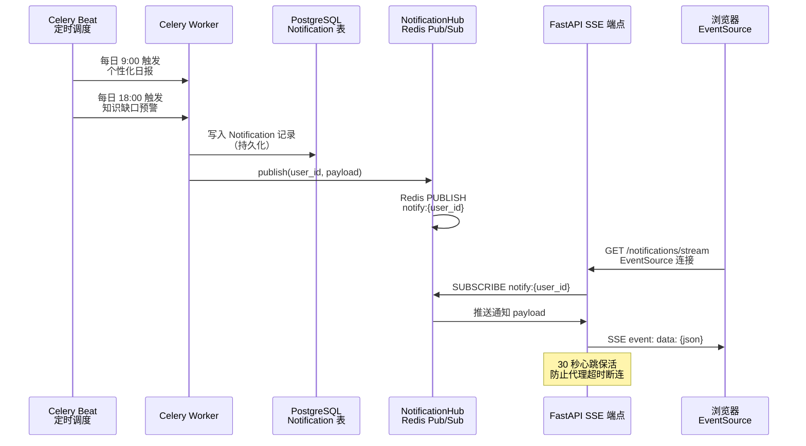

### 关键设计

- Redis 不可用时静默降级（通知仍写入 DB，只是不实时推送）
- 30 秒心跳保活（`: heartbeat\n\n`），防止代理超时断连
- 用户多标签页天然 fan-out（Redis Pub/Sub 每个订阅独立接收）
- EventSource API 原生支持自动重连

---

## Yjs 协同编辑服务

因 Yjs CRDT 生态在 Node.js/TypeScript 端更成熟，协作服务作为独立进程部署。与 FastAPI 核心引擎共享同一 PostgreSQL 数据库，无进程间通信协议。

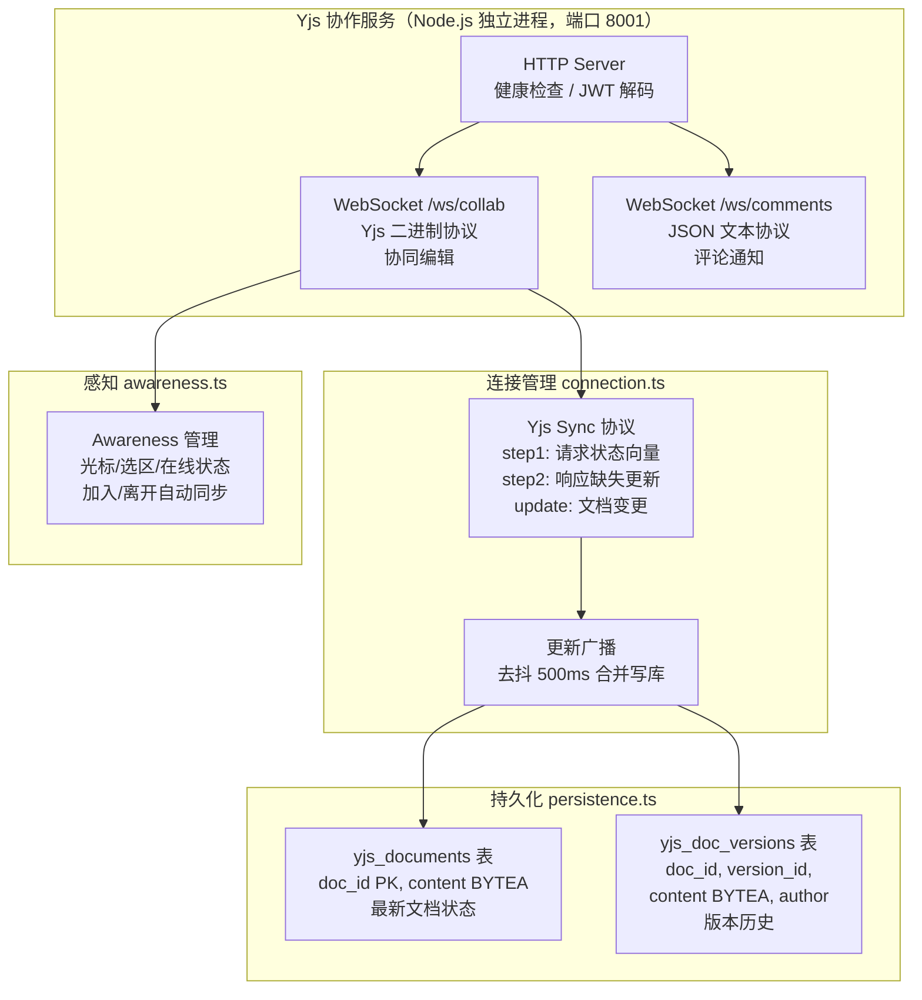

### 双 WebSocket 端点

| 端点 | 协议 | 用途 |
|------|------|------|
| `/ws/collab` | Yjs 二进制 | 协同编辑（兼容 y-websocket） |
| `/ws/comments` | JSON 文本 | 评论通知（订阅/发布） |

### 持久化设计

- **合并写入**：`saveDoc()` 读取已有内容 → `Y.applyUpdate` 合并 → `Y.encodeStateAsUpdate` 编码全量 → 写回（事务保护，`FOR UPDATE` 行锁）
- **去抖持久化**：500ms 合并短时间内的多次更新为一次写库
- **降级模式**：PostgreSQL 不可用时切换内存模式（数据不持久化，重启丢失）

---

## 文档处理流水线

Celery 异步任务驱动文档处理流水线，从文档上传到索引构建全自动，支持 PDF/DOCX/HTML/Markdown 多格式。

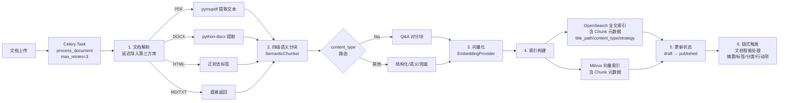

### 设计要点

- **延迟导入**：pymupdf / python-docx / opensearchpy / pymilvus 延迟导入，未安装时优雅降级
- **Chunk 元数据**：每个 Chunk 携带 `title_path`、`content_type`、`chunk_strategy`、`parent_id`
- **重试机制**：`max_retries=3`，`default_retry_delay=60`
- **链式触发**：文档处理完成后自动触发智能处理（摘要/标签/分类/行动项/FAQ）

---

## LLM Provider 抽象层

通过注册表 + 装饰器工厂模式实现"环境变量切换，业务代码零改动"。三种部署模式映射不同 Provider 和模型。

```mermaid
graph TB
    subgraph "LLM Provider 工厂"
        FACTORY[get_llm_provider<br/>lru_cache 单例<br/>根据 DEPLOY_MODE 分发]
    end

    subgraph "SaaS 模式"
        ANTHROPIC[AnthropicProvider<br/>Claude Sonnet 4.6 / Opus 4.8<br/>Prompt Caching: cache_control<br/>CacheAligner: 检测易变内容]
    end

    subgraph "私有部署 - 海外"
        VLLM_OVERSEAS[VLLMProvider<br/>Llama 3.3 70B<br/>OpenAI 兼容 API<br/>tool_calls 跨 chunk 装配]
    end

    subgraph "私有部署 - 国内"
        VLLM_DOMESTIC[VLLMProvider<br/>Qwen 3 72B<br/>OpenAI 兼容 API]
    end

    subgraph "Embedding Provider"
        EMBED_OPENAI[OpenAI Embedder<br/>text-embedding-3-large<br/>3072 维]
        EMBED_TEI[TEI Embedder<br/>BGE-M3<br/>1024 维]
    end

    FACTORY -->|saas| ANTHROPIC
    FACTORY -->|private_overseas| VLLM_OVERSEAS
    FACTORY -->|private_domestic| VLLM_DOMESTIC

    ANTHROPIC --> EMBED_OPENAI
    VLLM_OVERSEAS --> EMBED_TEI
    VLLM_DOMESTIC --> EMBED_TEI
```

### LangFuse 全链路追踪

Agent Loop 的每个节点（think/retrieve/tool_call/generate/reflect）通过 `@trace_node` 装饰器自动记录到 LangFuse，支持五节点 Agent Loop 追踪。LangFuse 未配置时静默降级为纯日志，不影响主流程。

---

## 部署指南

### 环境要求

- Docker + Docker Compose
- Python 3.12+（开发环境）
- Node.js 20+（协作服务开发环境）

### SaaS 模式部署

```bash
# 克隆仓库
git clone https://github.com/jamesfeng2009/KnowledgeBase.git
cd KnowledgeBase

# 配置环境变量
cp backend/.env.example backend/.env
# 编辑 .env 设置 ANTHROPIC_API_KEY、DATABASE_URL 等

# 启动所有服务
docker compose up -d
```

### 私有部署

```bash
# 设置部署模式为国内私有部署（使用 vLLM + TEI）
export DEPLOY_MODE=private_domestic

# 启动所有服务（含 GPU 模型服务）
docker compose --profile private up -d
```

### 服务端口

| 服务 | 端口 | 说明 |
|------|------|------|
| Frontend | 3000 → 80 | Astro SSR + Nginx |
| Core Engine (FastAPI) | 8000 | 后端 API |
| Yjs Server | 8001 | 协同编辑 WebSocket |
| PostgreSQL | 5432 | 主数据库 |
| Redis | 6379 | 缓存 + Pub/Sub |
| Milvus | 19530 | 向量数据库 |
| OpenSearch | 9200 | 全文检索 |
| Neo4j | 7687 | 知识图谱 |
| MinIO | 9000 | 对象存储 |

### Docker Compose 服务拓扑

| 层级 | 服务 |
|------|------|
| 基础设施 | postgres, redis, minio, opensearch, milvus (+etcd +minio), neo4j |
| 应用层 | core-engine, frontend, yjs-server, celery-worker, celery-beat |
| 私有模型 | llm-server (vLLM), embedding-server (TEI), reranker-server (TEI), vlm-server (vLLM) |

---

## 测试

```bash
cd backend

# 运行全部测试（371 项）
python -m pytest --tb=short -q

# 运行特定模块测试
python -m pytest tests/test_chunk_optimization.py -v    # RAG 分块优化
python -m pytest tests/test_token_optimization.py -v      # P0 Token 优化
python -m pytest tests/test_p1_token_optimization.py -v   # P1 Token 优化
python -m pytest tests/test_p2_token_optimization.py -v   # P2 Token 优化
python -m pytest tests/test_document_tasks_chunker.py -v  # 文档分块接入
```

### 测试覆盖

| 测试文件 | 测试数 | 覆盖范围 |
|----------|--------|----------|
| `test_chunk_optimization.py` | 32 | Q&A 分块、内容类型路由、标题路径、Context Cliff |
| `test_token_optimization.py` | 27 | CacheAligner、Prompt Caching、稳定 System Prompt、增量上下文 |
| `test_p1_token_optimization.py` | 32 | 跨轮去重、Reflect 摘要、L1 注入、历史窗口化 |
| `test_p2_token_optimization.py` | 35 | ContextBudgetManager、三段式压缩、引擎集成 |
| `test_document_tasks_chunker.py` | 30 | SemanticChunker 接入、索引元数据、端到端策略验证 |
| 其他测试 | 215 | API 端点、服务层、模型层、记忆引擎等 |
| **合计** | **371** | **全部通过，零回归** |

---

## License

Private - All Rights Reserved
