# 企业知识库大脑（Enterprise Knowledge Brain）

企业级知识库 SaaS 平台，基于 Agentic RAG 架构，支持多租户、多模态文档处理、智能问答、协同编辑与知识图谱分析。

## 目录

- [技术栈](#技术栈)
- [项目结构](#项目结构)
- [系统架构设计](#系统架构设计)
- [Agent Loop 工作原理](#agent-loop-工作原理)
- [四级语义分块策略](#四级语义分块策略)
- [混合检索管线](#混合检索管线)
- [四级记忆架构](#四级记忆架构)
- [Token 优化与上下文压缩设计](#token-优化与上下文压缩设计)
- [模块化门控系统](#模块化门控系统)
- [通知推送机制](#通知推送机制)
- [Yjs 协同编辑服务](#yjs-协同编辑服务)
- [文档处理流水线](#文档处理流水线)
- [LLM Provider 抽象层](#llm-provider-抽象层)
- [API 限流](#api-限流)
- [离线评测系统](#离线评测系统)
- [部署指南](#部署指南)
- [测试](#测试)

---

## 技术栈

| 层级 | 技术选型 | 说明 |
|------|----------|------|
| **后端框架** | FastAPI + SQLAlchemy(async) | 异步 API，Pydantic 数据校验 |
| **任务队列** | Celery + Redis | 异步文档处理、定时任务调度 |
| **Agent 框架** | LangGraph（可选）+ CrewAI | Agent Loop 状态图 + 多 Agent 协作 |
| **RAG 引擎** | LlamaIndex + 自研 Agentic RAG | 混合检索 + 重排 + 生成 |
| **LLM** | Anthropic Claude / DashScope 通义千问 / vLLM（Llama 3.3 / Qwen 3） | SaaS / SaaS·国内 / 私有三部署模式 |
| **向量存储** | OpenSearch k-NN（默认）/ Milvus 2.4（可选） | 适配器模式，按 VECTOR_STORE 切换；HNSW + COSINE |
| **全文检索** | OpenSearch 2.18 | BM25 + multi_match |
| **图数据库** | Neo4j 5.26 | 知识图谱 + Graphiti 时序图谱 |
| **关系数据库** | PostgreSQL 16 | 主存储，JSONB + pgvector |
| **缓存** | Redis 7 | Token 缓存 + Pub/Sub 通知 |
| **对象存储** | MinIO | 文档附件 + 多模态资源 |
| **VLM** | Anthropic Claude Vision / vLLM (Pixtral) | SaaS / 私有双部署模式 |
| **ASR** | OpenAI Whisper API / Faster-Whisper (私有) | 语音转写，视频 RAG |
| **视频处理** | ffmpeg | 音轨提取 + 关键帧抽取 |
| **文档解析** | Docling (IBM Granite-Docling-258M) + pymupdf + python-pptx + python-docx + openpyxl + pandas | Docling 统一解析 PDF/DOCX/PPTX/XLSX/HTML/图片/音频 → HTML（`<h1>`~`<h6>` 标题 + `<table>` 表格 + `<ul><li>` 列表），降级到原有解析器；图片上传 MinIO + 小图过滤 + VLM 描述；XLSX 双引擎降级（openpyxl → pandas）+ 列宽对齐 |
| **数据库迁移** | Alembic + asyncpg + aiosqlite | 异步迁移引擎，启动时自动 `alembic upgrade head`，27 张表首版迁移 |
| **配置校验** | Pydantic V2 (field_validator + model_validator) | DATABASE_URL 异步驱动校验、数值范围校验、CORS URL 校验、部署模式与 API Key 交叉校验 |
| **限流** | 自研令牌桶中间件 | 按客户端（API Key/IP）限流，突发 + 持续控制 |
| **协同服务** | Node.js + Yjs + WebSocket | CRDT 实时协同编辑 |
| **前端框架** | Astro 5 + React 19 + TypeScript 5.6 | SSR + React Island 混合渲染，34 页面 |
| **前端组件库** | 分层 Astro 组件（common/knowledge/admin/settings）+ React Island（management/chat） | CSS 变量驱动设计系统，20 个 API 封装模块 |
| **反向代理** | Caddy | 自动 HTTPS + HTTP/3 |

---

## 项目结构

```
EnterpriseKnowledge/
├── backend/                          # 后端（FastAPI + Celery）
│   ├── app/
│   │   ├── api/v1/                   # 内部 API（22 个路由模块，JWT 认证）
│   │   ├── api/openapi/v1/           # 开放接口（6 类能力，API Key 认证）
│   │   ├── agents/                   # 多 Agent 协作（CrewAI）
│   │   ├── connectors/               # 企业连接器（OA/ERP/CRM/Mail）
│   │   ├── core/                     # 模块注册表 + 权限
│   │   ├── llm/                      # LLM Provider 抽象层（Anthropic / DashScope / vLLM）
│   │   │   ├── dashscope_provider.py # 通义千问 Provider（saas_dashscope 模式，OpenAI 兼容）
│   │   │   └── ...                   # anthropic / vllm / embedder / factory 等
│   │   ├── mcp/                      # MCP 工具协议
│   │   ├── memory/                   # 四级记忆引擎
│   │   ├── models/                   # SQLAlchemy ORM 模型
│   │   ├── observability/            # LangFuse 追踪 + LLM Judge
│   │   ├── rag/                      # Agentic RAG 引擎（含 vector_store 适配层）
│   │   │   ├── engine.py             # Agent Loop（含 Find Skills 按需加载）
│   │   │   ├── skill_registry.py     # Skill 注册表（轻量索引 + 按需加载）
│   │   │   ├── skill_finder.py       # Find Skills 匹配引擎（中英文分词 + 多维评分）
│   │   │   ├── tool_guard.py         # MCP 工具调用守卫（HITL 三态守卫）
│   │   │   └── ...                   # chunker / retriever / reranker / generator 等
│   │   ├── repositories/             # 数据访问层
│   │   ├── schemas/                  # Pydantic 数据模型
│   │   ├── services/                 # 业务逻辑层（21 个服务）
│   │   ├── utils/                    # 工具（crypto/logger/sse/minio_client）
│   │   ├── asr/                      # ASR 语音转写（Whisper/FunASR）
│   │   ├── vlm/                      # 视觉语言模型
│   │   ├── video/                    # 视频处理（ffmpeg 音轨提取 + 关键帧抽取）
│   │   ├── document/                 # 文档解析器
│   │   │   ├── docling_parser.py     # Docling 统一解析（primary，MIT，→ HTML）
│   │   │   ├── pdf_parser.py         # PDF 解析（fallback，pymupdf + 表格 + 图片上传/小图过滤 + VLM + 扫描页 OCR）
│   │   │   ├── docx_parser.py        # DOCX 解析（fallback，python-docx + 标题层级 + 列表结构 + 表格 + 图片上传 + 页眉页脚 + 分页检测）
│   │   │   ├── pptx_parser.py        # PPTX 解析（fallback，python-pptx + GROUP 递归 + 图表数据 + 图片上传/小图过滤 + 备注）
│   │   │   ├── xlsx_parser.py        # XLSX 解析（fallback，openpyxl + pandas 降级 + sheet→HTML + 列宽对齐）
│   │   │   ├── image_storage.py      # 图片对象存储（零依赖尺寸解析 + 小图过滤 + MinIO 上传）
│   │   │   ├── factory.py            # 解析器工厂（Docling 优先 → 原有降级）
│   │   │   └── base.py              # 解析器基类（ParsedSection + sections_to_text + 分页分隔符）
│   │   ├── utils/                    # 工具模块
│   │   │   ├── migration.py          # Alembic 迁移运行器（run_migrations / stamp_head）
│   │   │   ├── minio_client.py       # MinIO 对象存储客户端
│   │   │   └── logger.py             # 结构化日志
│   │   ├── eval/                     # 离线评测系统（数据集+Runner+回归基线+CLI）
│   │   ├── config.py                 # 配置管理（Pydantic V2 + field_validator + model_validator）
│   │   ├── database.py               # 数据库会话
│   │   ├── deps.py                   # 依赖注入
│   │   └── main.py                   # FastAPI 入口（lifespan → alembic upgrade head）
│   ├── alembic/                      # Alembic 迁移脚本
│   │   ├── env.py                    # 异步引擎 + 自动导入模型 + compare_type
│   │   └── versions/                 # 迁移版本（init schema 27 张表 + parse_metadata + tenant_id/checkpoint/usage 元数据）
│   ├── tasks/                        # Celery 异步任务
│   ├── tests/                        # 测试（1100 项）
│   ├── celery_app.py                 # Celery 入口
│   └── requirements.txt
├── collab-service/                   # Yjs 协作服务（Node.js + TypeScript）
│   ├── src/
│   │   ├── index.ts                  # 服务入口
│   │   ├── connection.ts             # WebSocket 连接管理
│   │   ├── persistence.ts            # PostgreSQL 持久化
│   │   ├── awareness.ts              # 协作者状态管理
│   │   └── comments.ts               # 评论通知
│   └── package.json
├── frontend/                         # 前端（Astro 5 + React 19 + TypeScript 5.6）
│   ├── src/
│   │   ├── components/               # 组件库（分层架构，CSS 变量驱动）
│   │   │   ├── common/               # 通用组件（12 个）
│   │   │   │   ├── StatCard.astro    # 统计卡片（标题/数值/图标/趋势）
│   │   │   │   ├── PageHeader.astro  # 页面头部（标题/面包屑/操作区）
│   │   │   │   ├── EmptyState.astro  # 空状态（图标/标题/描述/操作按钮）
│   │   │   │   ├── Avatar.astro      # 头像（首字母/图片/尺寸变体）
│   │   │   │   ├── Badge.astro       # 徽章（颜色变体/圆点指示器）
│   │   │   │   ├── Button.astro      # 按钮（变体/尺寸/加载状态）
│   │   │   │   ├── Modal.astro       # 模态框（遮罩/关闭/尺寸变体）
│   │   │   │   ├── Tabs.astro        # 标签页（ARIA tablist 语义）
│   │   │   │   ├── Tag.astro         # 标签（可关闭/颜色变体）
│   │   │   │   ├── Toast.astro       # 轻提示（类型/自动关闭）
│   │   │   │   ├── NotificationActions.astro  # 通知操作按钮组
│   │   │   │   ├── NotificationTabs.astro     # 通知标签页（全部/未读）
│   │   │   │   └── index.ts          # 统一导出
│   │   │   ├── knowledge/            # 知识库组件（2 个）
│   │   │   │   ├── KbCard.astro      # 知识库卡片（文档数/可见性/操作菜单）
│   │   │   │   ├── DocItem.astro     # 文档列表项（图标/状态/解析进度）
│   │   │   │   └── index.ts
│   │   │   ├── admin/                # 管理后台组件（3 个）
│   │   │   │   ├── HealthRing.astro  # 健康度环形图（SVG 圆弧 + 渐变）
│   │   │   │   ├── AuditStep.astro   # 审核步骤（状态连线/时间轴）
│   │   │   │   ├── UserTableRow.astro # 用户表格行（角色徽章/状态切换）
│   │   │   │   └── index.ts
│   │   │   ├── settings/             # 设置组件（4 个）
│   │   │   │   ├── ApiKeyTable.astro # API 密钥表格（创建/撤销/复制）
│   │   │   │   ├── LlmConfigForm.astro # LLM 配置表单（Provider/模型/参数）
│   │   │   │   ├── SystemForm.astro  # 系统设置表单（站点名/上传限制/功能开关）
│   │   │   │   ├── TenantCard.astro  # 租户卡片（套餐/模块门控/用量）
│   │   │   │   └── index.ts
│   │   │   ├── management/           # React Island 组件（文档智能处理）
│   │   │   │   ├── ScanProcessor.tsx # 扫描件 OCR（上传 PDF → VLM 识别 → 入库）
│   │   │   │   ├── IntelligencePanel.tsx      # 智能处理面板（摘要/标签/分类）
│   │   │   │   ├── CollabEditor.tsx           # Yjs 协同编辑器
│   │   │   │   ├── ActionItemList.tsx         # 行动项列表
│   │   │   │   ├── AutoTagEditor.tsx          # 自动标签编辑器
│   │   │   │   ├── SummaryCard.tsx            # 摘要卡片
│   │   │   │   └── ...                        # ConnectionStatus / EditorToolbar 等
│   │   │   ├── chat/                 # 对话组件（React）
│   │   │   │   ├── ChatMessage.tsx   # 对话消息（用户/助手/引用标注）
│   │   │   │   ├── ChatInput.tsx     # 输入框（多行/快捷指令/附件）
│   │   │   │   └── CitationPanel.tsx # 引用面板（来源文档/高亮片段）
│   │   │   └── index.ts
│   │   ├── pages/                    # 页面（34 个，按域分目录）
│   │   │   ├── admin/                # 管理后台（7 页：仪表盘/审核/反馈/健康/报表/标签/用户）
│   │   │   ├── auth/                 # 认证（2 页：登录/注册）
│   │   │   ├── chat/                 # 对话（3 页：对话/历史/Agent）
│   │   │   ├── knowledge/            # 知识库（6 页：列表/详情/搜索/问答/专家/图谱/时间线）
│   │   │   ├── manage/               # 管理（5 页：编辑器/缺口/知识库/会议纪要/上传）
│   │   │   ├── scenes/               # 场景（2 页：IT 工单/新人入职）
│   │   │   ├── settings/             # 设置（6 页：API/LLM/MCP/系统/租户/Webhooks）
│   │   │   ├── index.astro           # 首页
│   │   │   └── notifications.astro   # 通知中心
│   │   ├── lib/
│   │   │   ├── apis/                 # API 封装层（20 个模块，统一错误处理 + Token 注入）
│   │   │   │   ├── knowledge.ts      # 知识库 + 文档 CRUD + 解析进度 + 搜索
│   │   │   │   ├── webhooks.ts       # Webhook 订阅管理 + OpenAPI Key 存储
│   │   │   │   ├── mcp.ts            # MCP 工具调用（复用 webhooks 的 Key 存储）
│   │   │   │   ├── intelligence.ts   # 文档智能处理（摘要/标签/分类）
│   │   │   │   ├── audit.ts          # 审核工作流
│   │   │   │   ├── users.ts          # 用户权限管理
│   │   │   │   ├── feedback.ts       # 反馈管理
│   │   │   │   ├── apikeys.ts        # API 密钥管理
│   │   │   │   ├── settings.ts       # 系统设置
│   │   │   │   ├── qa.ts             # 问答社区
│   │   │   │   ├── tickets.ts        # 工单系统
│   │   │   │   ├── agents.ts         # Agent 管理
│   │   │   │   ├── analytics.ts      # 知识健康度仪表盘
│   │   │   │   ├── comments.ts       # 文档评论
│   │   │   │   ├── connectors.ts     # 跨系统连接器
│   │   │   │   ├── experts.ts        # 专家发现
│   │   │   │   ├── graph.ts          # 知识图谱
│   │   │   │   ├── multimodal.ts     # 多模态处理
│   │   │   │   ├── notifications.ts  # 通知中心
│   │   │   │   └── tenants.ts        # 租户管理
│   │   │   ├── api.ts                # 基础 HTTP 客户端（getData/postData/putData/delData + 拦截器）
│   │   │   └── auth.ts               # 认证工具（Token 存储/刷新/路由守卫）
│   │   ├── layouts/
│   │   │   └── DefaultLayout.astro   # 主布局（侧边导航 + 面包屑 + Webhook/MCP 导航项）
│   │   └── styles/
│   │       └── global.css            # 全局样式（CSS 变量设计系统：颜色/间距/圆角/阴影）
│   └── package.json
├── docker-compose.yml                # 容器编排
└── README.md
```

---

## 系统架构设计

系统采用**模块化单体 + 选择性服务分离**架构。核心引擎为 FastAPI 模块化单体（含 Celery Worker），Yjs 协作服务因 Node.js 技术栈要求独立部署。所有服务共享同一 PostgreSQL 数据库。

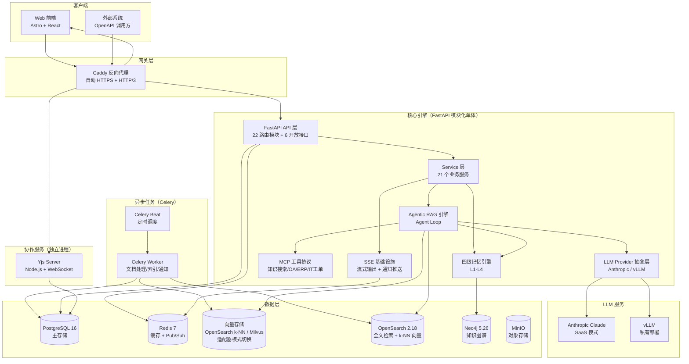

### 架构设计原则

| 原则 | 实践 |
|------|------|
| **单一职责** | 每个模块只做一件事：ChatService 编排对话、RAG Engine 编排检索、MemoryManager 编排记忆 |
| **开闭原则** | LLM Provider / Embedder / Reranker / 模块注册表均使用注册表 + 装饰器模式，新增只需追加条目 |
| **依赖倒置** | LLM、检索器、重排器、权限过滤器均通过构造注入，可替换为 Mock |
| **优雅降级** | Redis / Neo4j / OpenSearch / 向量存储 延迟初始化 + try/except 降级，PostgreSQL 为唯一强依赖 |
| **模块化单体** | 微服务不适合（共享数据库依赖），仅 Yjs 协作服务因技术栈原因独立部署 |

---

## Agent Loop 工作原理

`AgenticRAGEngine` 是整个系统的编排中枢，通过 `think → retrieve/tool_call → generate → reflect` 循环驱动 RAG 流程。默认使用纯 Python `while` 循环实现（零外部依赖），安装 LangGraph 后可切换为声明式状态图驱动（支持断点恢复）。


### Agent Loop 各节点职责

| 节点 | 方法 | 职责 | Token 优化 |
|------|------|------|------------|
| **think** | `_think()` | LLM 决策下一步动作，返回 `retrieve`/`tool_call`/`generate` | 稳定 system prompt（无动态内容）命中 KV Cache |
| **retrieve** | `_retrieve()` | 多路检索 → ABAC 权限过滤 → 重排 top-5 | 增量追加摘要，不重建 messages |
| **tool_call** | `_tool_call()` | MCP 工具调用 | 跨轮去重，重复结果替换为指针引用 |
| **generate** | `Generator.generate()` | 流式生成答案 | Context Cliff 监控，超限自动截断 |
| **reflect** | `_reflect()` | 评估答案质量 | 传摘要而非全文，省 ~1800 tok/次 |

### MCP 工具调用守卫（DangerousToolGuard）

借鉴 DECO 数仓 Agent 的 beforeTool Hook 设计，在 Agent 调用 MCP 工具前增加代码级强制确认机制。**prompt 是软约束，不是安全边界** — 任何不可逆操作都必须有框架层兜底。

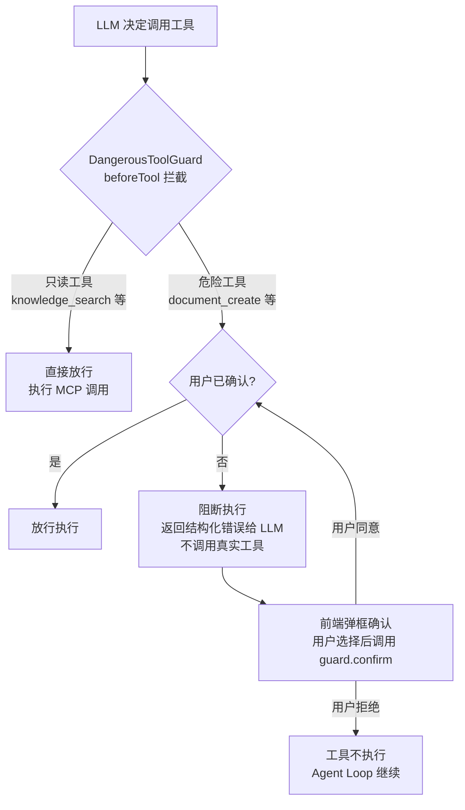

| 工具类别 | 示例 | 守卫行为 | 不可逆 |
|----------|------|----------|--------|
| 只读工具 | `knowledge_search`、`document_get`、`query_oa_approval` | 直接放行 | — |
| 写操作工具 | `document_create`、`create_it_ticket` | 需用户确认 | `create_it_ticket` 标记为不可逆 |
| 未知工具 | 未注册的新工具 | 默认放行 + 记录警告 | — |

守卫通过构造注入 `AgenticRAGEngine(tool_guard=...)`，支持自定义危险工具清单和确认管理（confirm / revoke / reset）。

### 权限过滤核心安全约束

**权限过滤在重排之前执行**：检索召回 → ABAC 权限过滤 → 重排 → 生成。权限过滤出错时保守处理（返回空列表），避免泄露越权文档。

### RAG 质量守卫（QualityGuard）

借鉴 CorrectiveRAG 思路，但不引入 RAGAS 全量评估（适合离线批量，不适合每次查询）。采用**双层自适应评估闭环**：

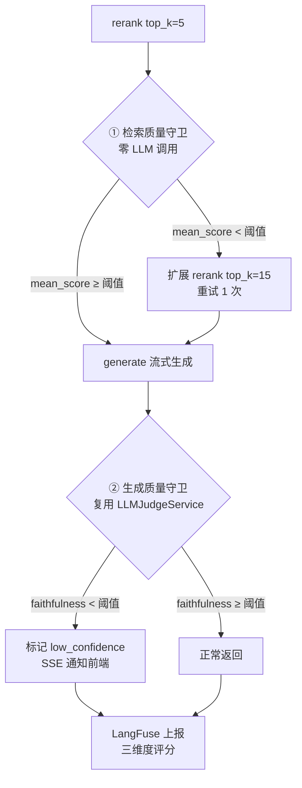

| 守卫层 | 检查方式 | 阈值 | 触发动作 | 额外 LLM 调用 |
|--------|----------|------|----------|--------------|
| 检索层 | `mean(rerank_score)` 纯数学 | `RAG_RETRIEVAL_SCORE_THRESHOLD=0.3` | 扩展 `top_k` 重排 1 次 | 0 |
| 生成层 | `LLMJudgeService.evaluate_single()` | `RAG_FAITHFULNESS_THRESHOLD=3.0` | 标记 `low_confidence` + SSE 通知 | 0（复用 reflect） |

**设计要点**：
- **检索层零 LLM 调用**：仅对重排分数做均值计算，低于阈值时扩展 rerank top_k（不重新检索），重试上限 1 次
- **生成层复用 Judge**：将原有 `_reflect()` 从内联简单 prompt 升级为调用 `LLMJudgeService`，LLM 调用次数不变
- **不阻断用户查询**：低置信度只标记不拦截，通过 SSE `quality` 事件通知前端，避免流式输出后二次循环
- **LangFuse 联动**：EvalResult 的三维度分数（citation_accuracy / completeness / faithfulness）上报到 trace metadata，支持质量监控面板
- **降级链**：LLMJudgeService 不可用时降级为原有内联 prompt（`_reflect_inline`），守卫关闭时完全跳过

---

## 四级语义分块策略

`SemanticChunker` 采用**内容格式智能检测** + 内容类型路由 + 四级优先级降级策略，保证总能产出有效分块。每个 `Chunk` 携带 `title_path`（标题路径锚点，作为 `[标题路径]` 前缀拼入 content 增强 embedding 上下文感知）、`content_type`（内容类型标签）、`chunk_strategy`（实际使用策略）等元数据。

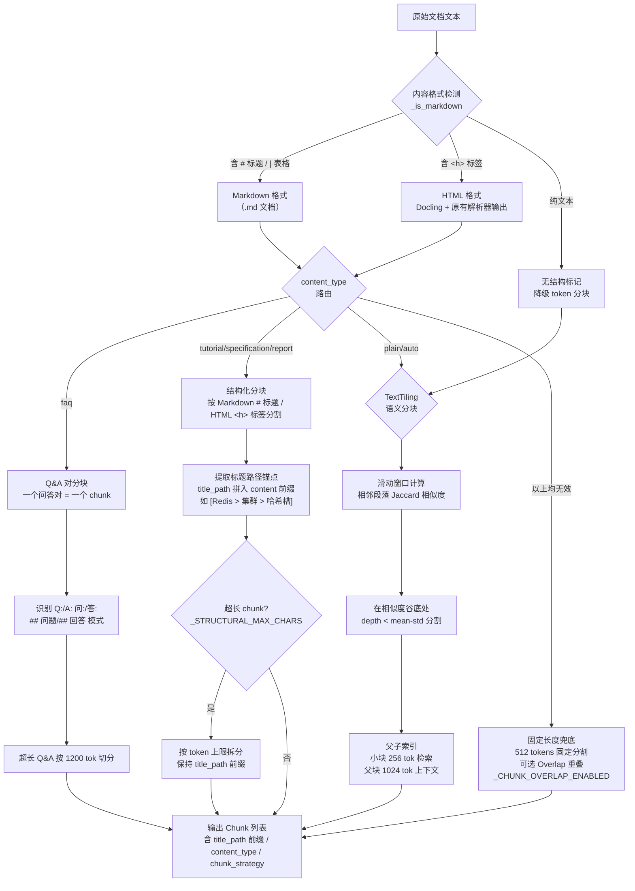

### 上下文保留机制

分块策略采用**分层上下文保留**，不同层级使用不同机制，避免一刀切的 Overlap：

| 层级 | 策略 | 上下文保留机制 | 说明 |
|------|------|----------------|------|
| P1 | 结构化分块 | `title_path` 拼入 content 前缀 | `[标题路径]` 前缀让 embedding 感知层级，如 `[系统架构 > 服务层]` |
| P2 | TextTiling 语义分块 | 话题边界天然完整 | 在相似度谷底分割，块内话题一致 |
| P3 | 父子索引 | `parent_id` 回取父块 | 小块命中后回取父块扩充上下文，优于 Overlap |
| 兜底 | 固定长度 | 可选 Overlap（`_CHUNK_OVERLAP_ENABLED`） | 仅硬切场景需要，默认关闭 |

> **设计决策**：Overlap 是"硬切"的补救措施。高级策略（结构化分块、TextTiling）在语义边界切分，天然保留上下文，不需要 Overlap。父子索引是比 Overlap 更优雅的机制——Overlap 是"预防性冗余"，父子索引是"按需回取"，后者精度更高、冗余更少。

### 内容格式智能检测

`_structural_split()` 不再依赖 `doc_type` 路由，而是通过 `_is_markdown()` 检测实际内容格式：

| 检测条件 | 正则 | 匹配示例 |
|----------|------|----------|
| Markdown 标题 | `^#{1,3}\s+` | `# 标题` / `## 章节` / `### 小节` |
| Markdown 表格 | `^\|.+\|\s*$` | `\| 列1 \| 列2 \|` |
| 表格分隔行 | `^\|[\s\-:|]+\|\s*$` | `\|---\|---\|` |

这确保所有解析器输出（Docling HTML + 原有解析器 HTML）都能正确路由到 `_split_html()` 分块策略，而 `.md` 文档走 `_split_markdown()`。统一 HTML 格式后，`<h1>`/`<h2>`/`<h3>` 标题标签直接用于结构化分块和标题路径提取。

### 分块策略优先级

| 优先级 | 策略 | 触发条件 | 特点 |
|--------|------|----------|------|
| P0 | Q&A 对分块 | `content_type="faq"` | 问答对不被拆散 |
| P1 | 结构化分块 | `_is_markdown()` 检测到 Markdown 标记或 HTML `<h>` 标签 | title_path 拼入 content 前缀增强 embedding；超长章节按 `_STRUCTURAL_MAX_CHARS` 拆分 |
| P2 | TextTiling 语义分块 | plain / auto 兜底 | 话题边界自动识别 |
| P3 | 父子索引 | 语义分块后自动构建 | 小块检索 + 父块上下文（优于 Overlap） |
| 视频/音频 | 视频语义分块 | doc_type 为视频/音频类型 | 时间窗口（120s）合并 ASR 片段 + 关键帧 VLM 描述对齐，`title_path` 存时间戳 |
| 兜底 | 固定长度 | 以上均无效 | 512 tokens 段落边界断开；可选 Overlap（`_CHUNK_OVERLAP_ENABLED`，默认关闭） |

### 视频语义分块（`chunk_video_transcript`）

视频文档不走四级兜底链，而是由 `SemanticChunker.chunk_video_transcript()` 专用方法处理：

- **输入**：ASR 转写片段列表（`{start, end, text}`）+ 关键帧 VLM 描述列表（`{timestamp, description}`，P1 可选）
- **合并**：按 120 秒时间窗口将转写片段合并为语义块，`title_path` 存时间戳范围（如 `00:00-02:15`）
- **关键帧对齐**：VLM 描述按时间戳对齐到最近的转写块，追加为视觉上下文（`[画面: 幻灯片显示三层架构图]`）
- **降级**：单块过长时回退到 TextTiling 语义分块；无转写片段时返回空列表，由调用方降级为普通文本分块

---

## 混合检索管线

`HybridRetriever` 实现双路召回 + 合并去重，`Reranker` 通过工厂模式支持 SaaS（Cohere）和私有部署（TEI）双模式。

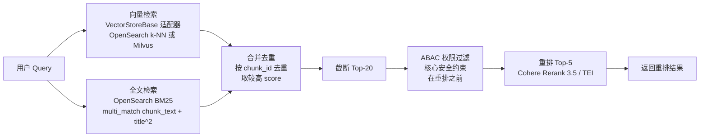

### 检索路对比

| 检索路 | 后端 | 算法 | 优势 |
|--------|------|------|------|
| 向量检索 | OpenSearch k-NN（默认）/ Milvus（可选） | HNSW + COSINE | 语义相似性匹配，按 VECTOR_STORE 切换 |
| 全文检索 | OpenSearch | BM25 + multi_match | 关键词精确匹配，标题权重 x2 |

任一检索路不可用时优雅降级（返回空列表），不影响另一路。

### 向量存储适配器

向量检索通过 `VectorStoreBase` 抽象接口实现，支持按客户体量切换后端，业务代码零改动。

| 后端 | 配置值 | 适用场景 | 优势 |
|------|--------|----------|------|
| OpenSearch k-NN | `VECTOR_STORE=os_knn`（默认） | < 500 万向量 | 与 BM25 共享集群，运维简单 |
| Milvus | `VECTOR_STORE=milvus` | > 500 万向量 | 专用向量引擎，IVF/PQ 压缩 |

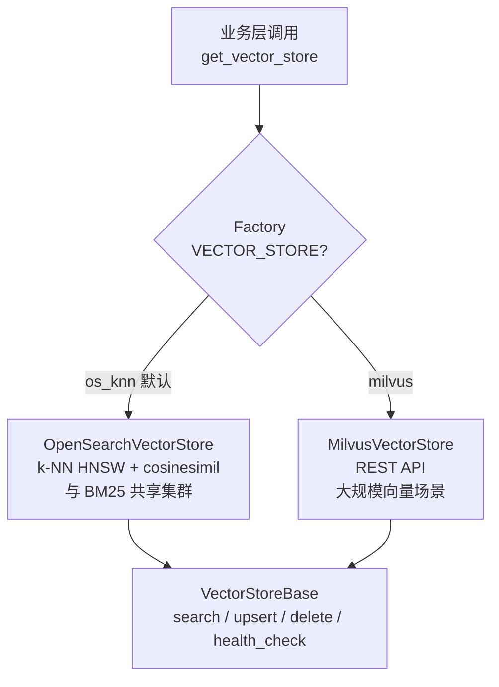

### 重排器双模式

| 部署模式 | 实现 | 模型 |
|----------|------|------|
| SaaS | CohereReranker | rerank-multilingual-v3.0 |
| 私有部署 | TEIReranker | Jina-reranker-v2 / BGE-reranker-v2-m3 |

---

## 四级记忆架构

系统采用四级记忆编排器模式，`MemoryManager` 作为单一入口协调四个记忆层级，每层独立加载、优雅降级。

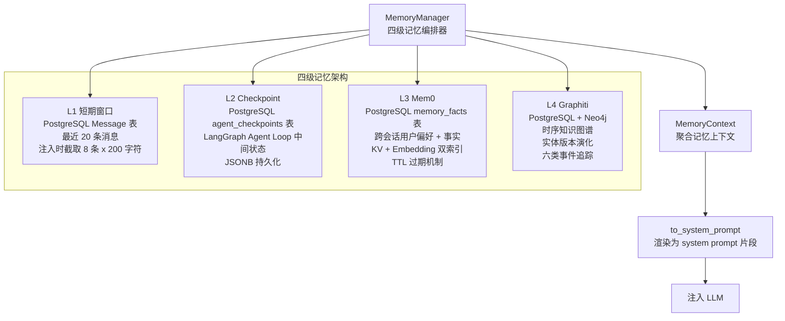

### 各层级职责

| 层级 | 存储 | 数据类型 | 读写频率 | TTL |
|------|------|----------|----------|-----|
| L1 短期窗口 | PostgreSQL Message 表 | 当前对话最近消息 | 高频读写 | 会话级 |
| L2 Checkpoint | PostgreSQL JSONB | Agent Loop 中间状态 | 中频 | 永久 |
| L3 Mem0 | PostgreSQL + Embedding | 用户偏好/历史摘要/工作记忆 | 中频 | working 24h / summary 7d / preference 永久 |
| L4 Graphiti | PostgreSQL + Neo4j | 实体关系演化/知识时间线 | 低频写 | 永久 |

### L3 Mem0 事实分类

| 类别 | 用途 | TTL |
|------|------|-----|
| `preference` | 用户偏好（"我喜欢简洁回答"） | 永不过期 |
| `working` | 工作记忆（当前任务上下文） | 24 小时 |
| `summary` | 对话摘要 | 7 天 |
| `entity` | 实体事实 | 永不过期 |

### L4 Graphiti 事件类型

`version_updated` / `status_changed` / `expired` / `deprecated` / `merged` / `split`

时间区间模型：`valid_from` / `valid_to`，新事件自动关闭前一事件的 `valid_to`。

---

## Token 优化与上下文压缩设计

### 设计背景：14 个 Token 浪费点

通过对比分析 [Headroom](https://github.com/headroomlabs-ai/headroom) 项目的上下文压缩思路，识别出本项目中 14 个 token 浪费点（W1-W14），并提出 6 大优化方案（P0-P2）：

| 编号 | 浪费点 | 位置 | 严重度 |
|------|--------|------|--------|
| W1 | system prompt 每轮重建（含动态迭代数/文档数） | `engine.py` `_think` | 高 |
| W2 | 用户 query 在每轮 think 中重复传递 | `engine.py` `_think` | 中 |
| W3 | 未启用 Anthropic Prompt Caching | `anthropic_provider.py` | 高 |
| W4 | ChatService 全量加载历史消息（无 limit） | `chat_service.py` `_build_llm_messages` | 高 |
| W5 | 工具结果在多轮迭代中累积，重复内容重复传 | `engine.py` `_run_decision_loop` | 高 |
| W6 | reflect 阶段回传完整答案全文（~2000 tok） | `engine.py` `_reflect` | 高 |
| W7 | L1 短期窗口加载后不渲染，ChatService 另从 DB 双重加载 | `memory_manager.py` + `chat_service.py` | 高 |
| W8 | 幽灵字段：AgentState 中的 `_decision` / `_stream_tokens` 在纯 Python 路径无用但仍占空间 | `engine.py` AgentState | 低 |
| W9 | L3 用户偏好注入 top-10（实际只需 top-3） | `memory_manager.py` `to_system_prompt` | 中 |
| W10 | 历史消息每条全量传递（无截断） | `chat_service.py` | 中 |
| W11 | 检索文档在 think 上下文中全量传递（只需摘要） | `engine.py` `_think` | 中 |
| W12 | system prompt 中嵌入 UUID / 时间戳等易变内容，破坏 KV Cache | `engine.py` + `anthropic_provider.py` | 高 |
| W13 | 多轮迭代后 messages 列表无限增长（无上限保护） | `engine.py` `_run_decision_loop` | 高 |
| W14 | 生成阶段注入过多检索文档（>2500 tok 导致 Context Cliff） | `generator.py` | 中 |

### 优化方案总览

针对上述 14 个浪费点，实施 6 大优化方案，分为三层：**基础设施层（P0）→ 消息传递层（P1）→ 上下文管理层（P2）**，预期总节省 ~35%。

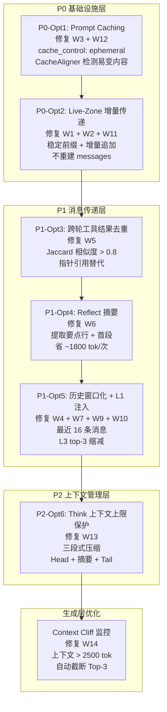

### 上下文压缩架构

以下流程图展示了一条用户 Query 在 Agent Loop 中经过的完整上下文压缩管线，每一层压缩都有对应的保障机制确保信息不丢失：


### P0-Opt1: Prompt Caching + CacheAligner

**解决的问题**：W3（未启用 Prompt Caching）+ W12（易变内容破坏 KV Cache）

**设计原理**：Anthropic Claude API 支持 Prompt Caching — 将 system prompt 标记 `cache_control: {"type": "ephemeral"}` 后，首次写入按 1.25x 费率计算，5 分钟内再次读取同一前缀仅按 0.1x 费率。但前提是前缀字节必须稳定，任何 UUID / 时间戳 / JWT 的变化都会导致缓存失效。

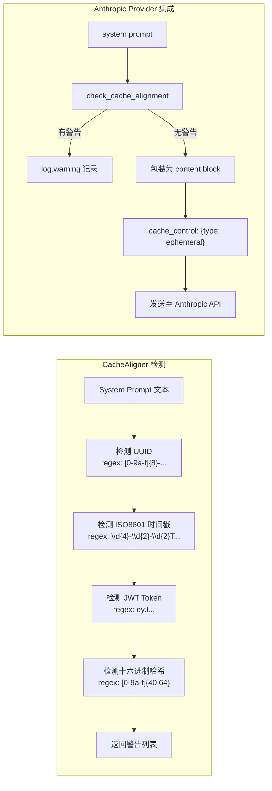

**关键代码路径**：`app/llm/cache_aligner.py` → `app/llm/anthropic_provider.py._build_api_kwargs()`

**效果**：重复前缀读取费率从 1x 降至 0.1x，10 倍成本节省。

### P0-Opt2: Live-Zone 增量上下文传递

**解决的问题**：W1（system prompt 每轮重建）+ W2（query 重复传递）+ W11（检索文档全量传递）

**设计原理**：将 think 的上下文分为**稳定前缀**（system prompt + user query）和**增量 Live Zone**（每轮新追加的工具结果摘要）。稳定前缀在循环开始前一次性设置，后续每轮只追加增量消息，不重建 messages 列表。

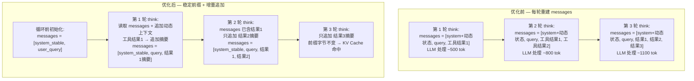

**关键设计**：
- `_THINK_SYSTEM_STABLE` 常量：不含迭代计数、文档数、工具数等动态内容
- 动态状态作为 "live zone" 消息追加：`{"role": "user", "content": "[系统] 当前状态：迭代 3/5..."}`
- 前缀字节稳定 → Anthropic KV Cache 命中 → 0.1x 读取费率

**关键代码路径**：`app/rag/engine.py` → `_run_decision_loop()` + `_think()`

### P1-Opt3: 跨轮工具结果去重

**解决的问题**：W5（工具结果在多轮迭代中累积，重复内容重复传）

**设计原理**：Agent 常在多轮迭代中调用同一工具获取相同或高度相似结果（如反复查同一 ERP 订单）。首次结果保留完整摘要，后续相似结果替换为指针引用 `"↑ [见第1轮 search_erp 结果]"`。

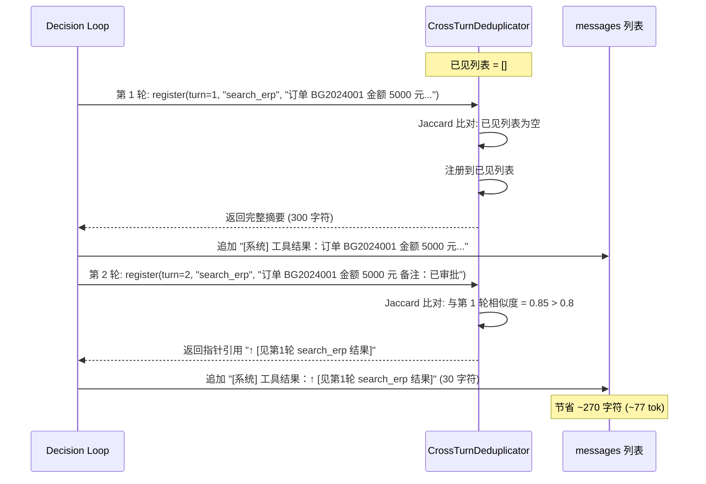

**Jaccard 相似度算法**：
```python
set_a = set(text_a.split())  # 词集
set_b = set(text_b.split())
similarity = len(set_a & set_b) / len(set_a | set_b)
# similarity > 0.8 → 替换为指针引用
```

**两个硬不变量**（与 Headroom CrossTurnDedup 一致）：
1. **前缀单调性**：只匹配严格更早的块，追加轮次不修改早期轮次
2. **无信息离开窗口**：只有逐字出现的 span 才被反向引用，原始内容物理存在于首次轮次

**关键代码路径**：`app/rag/context_dedup.py` → `engine.py._run_decision_loop()`

### P1-Opt4: Reflect 摘要替代全文

**解决的问题**：W6（reflect 阶段回传完整答案全文，~2000 tok）

**设计原理**：reflect 节点只需评估答案质量（引用准确性 / 完整性 / 幻觉风险），不需要完整答案文本。将答案压缩为摘要（前 3 个要点行 + 首段引言，截断 700 字符），从 ~2000 tok 降至 ~200 tok。

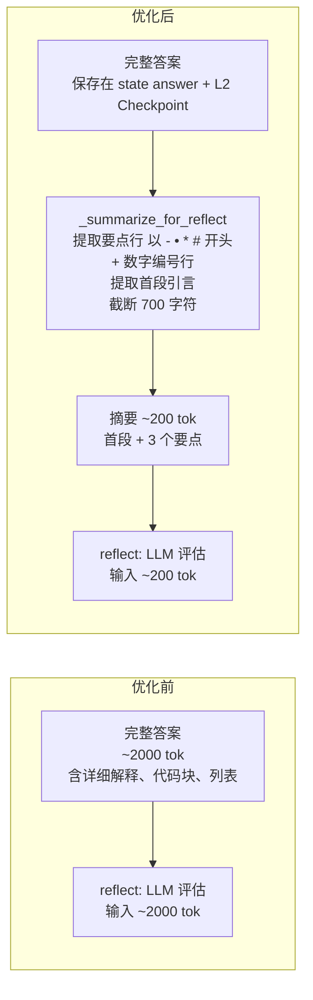

**摘要提取规则**：
- 要点行：以 `-`、`•`、`*`、`#` 开头的行，或以数字 + `.` / `、` / `)` 开头的行
- 首段引言：第一行文本
- 最多保留 3 个要点 + 首段，截断到 700 字符

**信息安全**：完整答案保存在 `state["answer"]` 和 L2 Checkpoint 中，reflect 只读取摘要。

**关键代码路径**：`app/rag/engine.py` → `_reflect()` + `_summarize_for_reflect()`

### P1-Opt5: ChatService 历史窗口化 + L1 实际注入

**解决的问题**：W4（全量加载历史无 limit）+ W7（L1 加载后不渲染，双重加载）+ W9（L3 top-10 过多）+ W10（历史消息无截断）

**设计原理**：ChatService 之前从 DB 全量加载对话历史，同时 MemoryManager 也加载了 L1 短期窗口但不渲染，导致双重加载。优化后 ChatService 优先使用 `memory_ctx.short_term`，L1 渲染到 system prompt（每条截断 200 字符），L3 从 top-10 缩减到 top-3。

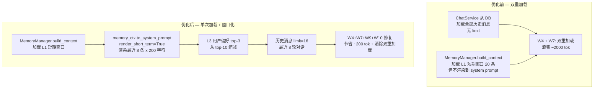

**关键参数**：
- `_SHORT_TERM_INJECT_SIZE = 8`：L1 注入最近 8 条消息（4 轮对话）
- `_SHORT_TERM_MSG_MAX_CHARS = 200`：每条消息截断到 200 字符
- `_L3_INJECT_TOP_N = 3`：L3 用户偏好从 top-10 缩减到 top-3
- `_HISTORY_WINDOW = 16`：历史消息最多 16 条（8 轮对话）

**关键代码路径**：`app/memory/memory_manager.py.to_system_prompt()` + `app/services/chat_service.py._build_llm_messages()`

### P2-Opt6: Think 上下文上限保护

**解决的问题**：W13（多轮迭代后 messages 无限增长）

**设计原理**：即使经过 P1-Opt3 跨轮去重，5 次迭代后 messages 仍可能累积到 2500+ tokens。借鉴 Headroom Memory Budget + Time Decay 设计，实施三段式压缩：Head（前 2 条不动）→ Middle（压缩为单条摘要）→ Tail（最近 2 条不动）。

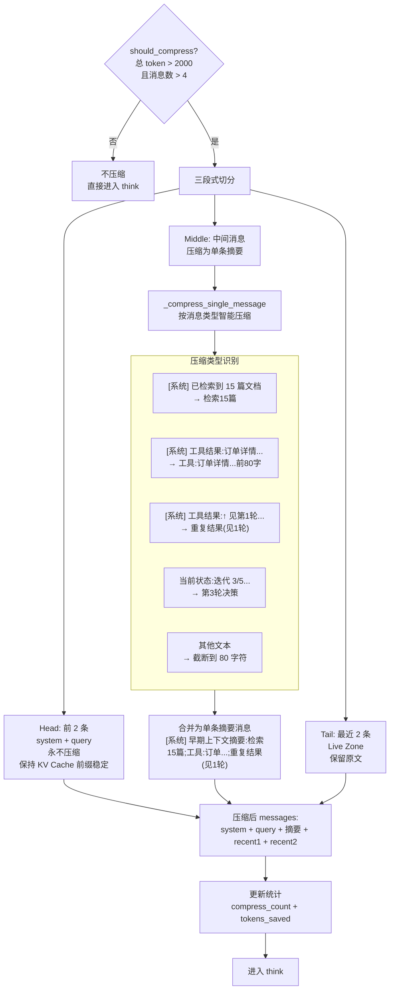

**两个硬不变量**（与 Headroom Memory Budget 一致）：
1. **Head 不变性**：system + query 始终保留，保证 KV Cache 命中
2. **信息保真**：压缩摘要保留每条消息的关键动作类型和核心数据指针，原始完整内容保存在 `state["retrieved_docs"]` 和 `state["tool_results"]` 中

**压缩效果示例**：

```
压缩前 (10 条消息, ~3500 tok):
  [system_stable, query, 检索结果1(500字), 工具结果1(800字), 检索结果2(500字),
   工具结果2(800字), 指针引用(30字), 检索结果3(500字), 工具结果3(800字), recent]

压缩后 (5 条消息, ~800 tok):
  [system_stable, query,
   "[系统] 早期上下文摘要：检索5篇；工具:订单BG2024...；检索8篇；工具:审批状态...；重复结果(见1轮)",
   工具结果3(800字), recent]

节省: ~2700 tok (77%)
```

**关键代码路径**：`app/rag/context_budget.py` → `engine.py._run_decision_loop()`

### Context Cliff 监控

**解决的问题**：W14（生成阶段注入过多检索文档导致 Context Cliff）

**设计原理**：当注入上下文总 token 超过 2500 时，LLM 对中间位置信息的提取能力会显著下降（"Context Cliff" 现象）。`_check_context_cliff()` 在组装 prompt 前自动检测并降级为 Top-3 文档。

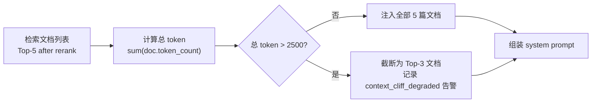

**关键代码路径**：`app/rag/generator.py._check_context_cliff()`

### 记忆不丢失四层保障

压缩不是丢弃，而是分层保真。四层保障确保任何压缩操作都不丢失关键信息：

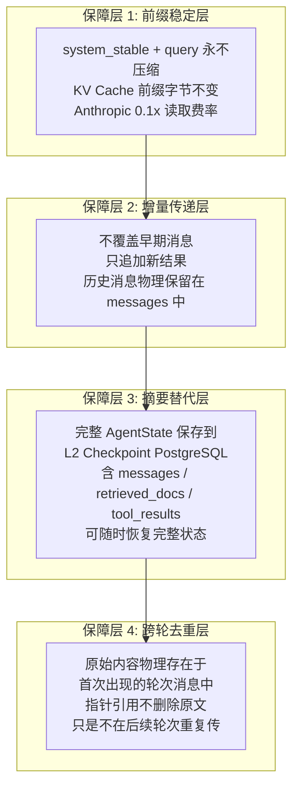

### 三级 Token 缓存

除了上下文压缩，系统还实现三级缓存避免重复 LLM 调用：

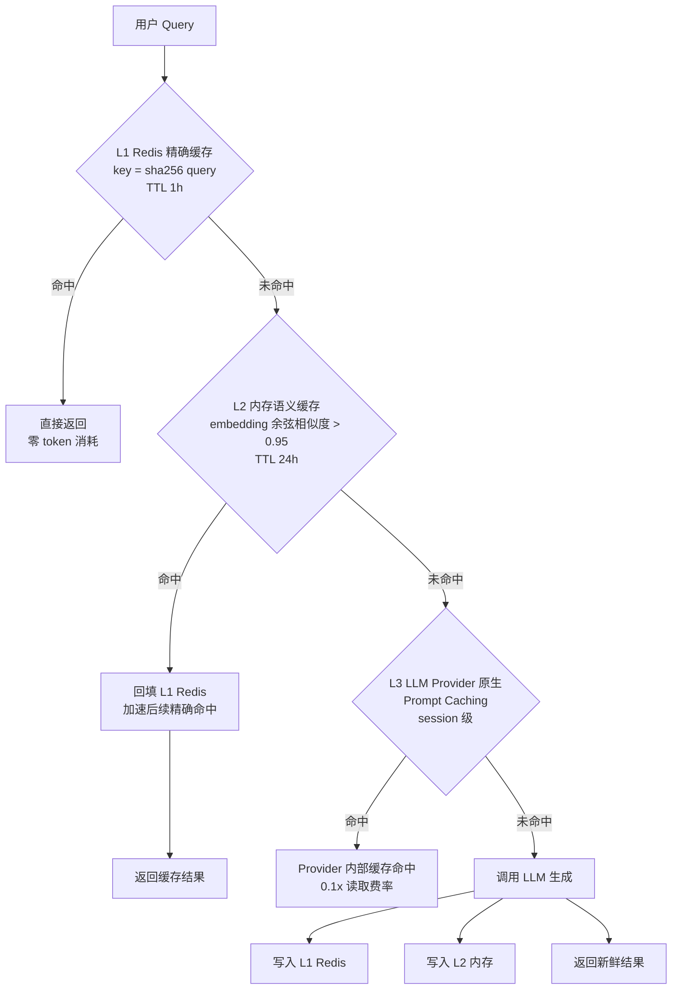

| 级别 | 介质 | 策略 | TTL | 命中效果 |
|------|------|------|-----|----------|
| L1 | Redis | 精确缓存，key = sha256(query) | 1h | 零 token 消耗 |
| L2 | 进程内 dict | 语义缓存，embedding 余弦相似度 > 0.95 | 24h | 零 token 消耗 |
| L3 | LLM Provider 原生 | Prompt Caching，session 级 | 5 min | 0.1x 读取费率 |

### Token 优化效果汇总

| 优化项 | 修复浪费点 | 模块 | 节省效果 | 层级 |
|--------|-----------|------|----------|------|
| P0-Opt1 | W3, W12 | `cache_aligner.py` + `anthropic_provider.py` | 0.1x 读取费率 | 基础设施 |
| P0-Opt2 | W1, W2, W11 | `engine.py` | 命中 KV Cache | 基础设施 |
| P1-Opt3 | W5 | `context_dedup.py` | 重复结果 ~300 tok/次 | 消息传递 |
| P1-Opt4 | W6 | `engine.py` | ~1800 tok/次 | 消息传递 |
| P1-Opt5 | W4, W7, W9, W10 | `memory_manager.py` + `chat_service.py` | ~200 tok + 消除双重加载 | 消息传递 |
| P2-Opt6 | W13 | `context_budget.py` | ~50%+ 中间消息 | 上下文管理 |
| Context Cliff | W14 | `generator.py` | 避免中间位置信息丢失 | 生成层 |
| 三级缓存 | — | `cache.py` | 命中时零 token 消耗 | 缓存 |

---

## 模块化门控系统

10 个功能模块分四类，基础模块永远启用，可选模块通过 `Tenant.settings.enabled_modules` JSONB 字段控制。API 端点使用 `require_module` 依赖注入实现门控。

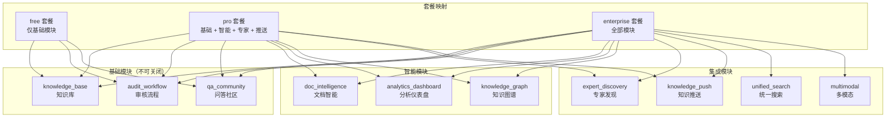

### 门控实现

```python
# API 端点使用 require_module 替代通用认证
@router.get("/dashboard")
async def get_dashboard(
    user: User = Depends(require_module("analytics_dashboard")),
    db: AsyncSession = Depends(get_db_session),
):
    ...
```

41 个 API 端点已更新为模块门控。模块状态存储在 `Tenant.settings` JSONB 字段中（不建独立表，避免 JOIN 复杂度）。

---

## 通知推送机制

通知推送遵循 `Celery 任务 → PostgreSQL 写入 → Redis Pub/Sub → SSE 推送 → 浏览器 EventSource` 流程，不跨进程调用 Node.js 服务。

```mermaid
sequenceDiagram
    participant Beat as Celery Beat<br/>定时调度
    participant Worker as Celery Worker
    participant DB as PostgreSQL<br/>Notification 表
    participant Hub as NotificationHub<br/>Redis Pub/Sub
    participant SSE as FastAPI SSE 端点
    participant Browser as 浏览器<br/>EventSource

    Beat->>Worker: 每日 9:00 触发<br/>个性化日报
    Beat->>Worker: 每日 18:00 触发<br/>知识缺口预警

    Worker->>DB: 写入 Notification 记录<br/>（持久化）
    Worker->>Hub: publish(user_id, payload)

    Hub->>Hub: Redis PUBLISH<br/>notify:{user_id}

    Browser->>SSE: GET /notifications/stream<br/>EventSource 连接
    SSE->>Hub: SUBSCRIBE notify:{user_id}

    Hub->>SSE: 推送通知 payload
    SSE->>Browser: SSE event: data: {json}

    Note over SSE: 30 秒心跳保活<br/>防止代理超时断连
```

### 关键设计

- Redis 不可用时静默降级（通知仍写入 DB，只是不实时推送）
- 30 秒心跳保活（`: heartbeat\n\n`），防止代理超时断连
- 用户多标签页天然 fan-out（Redis Pub/Sub 每个订阅独立接收）
- EventSource API 原生支持自动重连

---

## Yjs 协同编辑服务

因 Yjs CRDT 生态在 Node.js/TypeScript 端更成熟，协作服务作为独立进程部署。与 FastAPI 核心引擎共享同一 PostgreSQL 数据库，无进程间通信协议。

```mermaid
graph TB
    subgraph "Yjs 协作服务（Node.js 独立进程，端口 8001）"
        HTTP[HTTP Server<br/>健康检查 / JWT 解码]
        WS_COLLAB[WebSocket /ws/collab<br/>Yjs 二进制协议<br/>协同编辑]
        WS_COMMENTS[WebSocket /ws/comments<br/>JSON 文本协议<br/>评论通知]
    end

    subgraph "连接管理 connection.ts"
        SYNC[Yjs Sync 协议<br/>step1: 请求状态向量<br/>step2: 响应缺失更新<br/>update: 文档变更]
        BROADCAST[更新广播<br/>去抖 500ms 合并写库]
    end

    subgraph "持久化 persistence.ts"
        DOC_TABLE[yjs_documents 表<br/>doc_id PK, content BYTEA<br/>最新文档状态]
        VER_TABLE[yjs_doc_versions 表<br/>doc_id, version_id,<br/>content BYTEA, author<br/>版本历史]
    end

    subgraph "感知 awareness.ts"
        AWARE[Awareness 管理<br/>光标/选区/在线状态<br/>加入/离开自动同步]
    end

    WS_COLLAB --> SYNC
    SYNC --> BROADCAST
    BROADCAST --> DOC_TABLE
    BROADCAST --> VER_TABLE
    WS_COLLAB --> AWARE

    HTTP --> WS_COLLAB
    HTTP --> WS_COMMENTS
```

### 双 WebSocket 端点

| 端点 | 协议 | 用途 |
|------|------|------|
| `/ws/collab` | Yjs 二进制 | 协同编辑（兼容 y-websocket） |
| `/ws/comments` | JSON 文本 | 评论通知（订阅/发布） |

### 持久化设计

- **合并写入**：`saveDoc()` 读取已有内容 → `Y.applyUpdate` 合并 → `Y.encodeStateAsUpdate` 编码全量 → 写回（事务保护，`FOR UPDATE` 行锁）
- **去抖持久化**：500ms 合并短时间内的多次更新为一次写库
- **降级模式**：PostgreSQL 不可用时切换内存模式（数据不持久化，重启丢失）

---

## 文档处理流水线

Celery 异步任务驱动文档处理流水线，从文档上传到索引构建全自动，支持 PDF/DOCX/PPTX/XLSX/HTML/Markdown/图片/视频/音频 多格式。Docling 统一解析器优先处理（版面分析 + 表格 + 公式 + OCR → HTML），降级到原有专用解析器。

**P0-P2 解析增强**（对齐业界最佳实践）：
- **P0 上传端点 Celery 触发修复**：文件上传成功后自动调用 `process_document.delay(str(doc_id))` 触发异步解析，异常时降级记录日志（不影响文件入库）。修复前上传的文档永久停留在 `draft` 状态
- **P0 doc_type_map 格式扩展**：从 4 格式（md/html/docx/pdf）扩展到 11 格式（新增 markdown/htm/pptx/xlsx/xls/txt/csv），修复 PPTX/XLSX 被误分类为 `md` 的问题
- **DOCX 标题层级映射**：检测 `<w:pStyle>` 样式 → `<h1>`~`<h6>`，修复 chunker 结构化分块
- **DOCX 列表结构保留**：检测 `<w:numPr>` → `<ul><li>`，保留列表语义
- **PPTX GROUP 递归提取**：组合形状内的表格/图表/图片递归提取（修复数据丢失）
- **PPTX 图表数据提取**：`has_chart` → 数据点文本（柱状图/饼图/折线图）
- **图片上传 MinIO**：`PDF/DOCX/PPTX_IMAGE_UPLOAD_ENABLED` 开启后图片上传保留 URL + VLM 描述
- **小图过滤**：`PDF/DOCX/PPTX_IMAGE_MIN_SIZE=50` 剔除图标/装饰小图（零依赖 PNG/JPEG/WebP 尺寸解析）
- **XLSX 双引擎降级**：openpyxl 失败 → pandas.read_excel 兜底
- **XLSX/PPTX 列宽对齐**：合并单元格场景自动补齐短行为最大列数
- **DOCX 分页检测**：`<w:br type="page"/>` + `<w:lastRenderedPageBreak/>` → 真实页码
- **P0 文件大小校验**：`MAX_UPLOAD_SIZE_MB=50` 超限返回 413 Payload Too Large（对齐竞品 50MB 上限）
- **P1 解析摘要响应**：`GET /documents/{doc_id}/summary` 返回 preview/structure/warnings/pages/char_count/parse_status（对齐竞品草稿摘要 JSON）
- **P1 解析任务 warnings 收集**：解析/向量化/索引失败时收集警告，返回 parse_status（parsed/partial/failed）
- **P1 解析元数据持久化**：Document 表新增 `parse_status`/`parse_warnings`/`page_count`/`char_count` 4 字段，解析任务产物持久化，摘要端点优先读 DB（回退动态计算兼容历史数据）
- **P1 实时解析进度反馈**：Celery 任务通过 `_update_parse_progress()` 在 8 个阶段（queued/parsing/chunking/embedding/indexing/publishing/done/failed）写入 Redis（TTL 30 分钟），前端通过 `GET /documents/{doc_id}/progress` 轮询真实进度（替代模拟进度），`stage=unknown` 时优雅降级为估算

```mermaid
flowchart LR
    UPLOAD[文档上传] --> SIZE_CHECK{P0 文件大小校验<br/>MAX_UPLOAD_SIZE_MB=50}
    SIZE_CHECK -->|超限| REJECT413[返回 413<br/>Payload Too Large]
    SIZE_CHECK -->|通过| SAVE_MINIO[保存至 MinIO<br/>创建 Document 记录]
    SAVE_MINIO --> TRIGGER{P0 Celery 触发<br/>process_document.delay}
    TRIGGER -->|触发成功| CELERY[Celery Task<br/>process_document<br/>max_retries=3]
    TRIGGER -->|触发失败| LOG_WARN[记录警告日志<br/>文档停留 draft 状态<br/>不影响文件入库]
    LOG_WARN --> DRAFT_END[待手动重试]
    CELERY --> PROG_QUEUE[进度: queued<br/>写入 Redis]

    CELERY --> PARSE[1. 文档解析<br/>延迟导入第三方库]
    PARSE --> PROG_PARSE[进度: parsing<br/>写入 Redis]
    PARSE -->|PDF| PYMUPDF[pymupdf 文本<br/>+ find_tables → HTML<br/>+ 图片上传 MinIO / 小图过滤<br/>+ VLM 描述]
    PARSE -->|PPTX| PPTX[python-pptx 文本<br/>+ 表格 → HTML<br/>+ 内嵌图片 VLM]
    PARSE -->|PDF / DOCX / PPTX<br/>XLSX / HTML / 图片 / 音频| DOCLING["Docling 统一解析<br/>Granite-Docling-258M<br/>版面分析 + 表格 + 公式 + OCR<br/>→ HTML（&lt;h1&gt;~&lt;h6&gt;/&lt;table&gt;/&lt;ul&gt;）"]
    PARSE -->|Docling 不可用| PYMUPDF[pymupdf<br/>表格 → HTML<br/>图片上传 + VLM 描述<br/>小图过滤 + 扫描页 OCR]
    PARSE -->|Docling 不可用| PPTX[python-pptx<br/>GROUP 递归表格/图表/图片<br/>图片上传 + VLM 描述<br/>小图过滤 + 列宽对齐<br/>演讲者备注]
    PARSE -->|Docling 不可用| DOCX[python-docx<br/>标题层级 h1~h6<br/>列表结构 ul/li<br/>表格 → HTML<br/>图片上传 + VLM 描述<br/>分页检测 + 页眉页脚]
    PARSE -->|Docling 不可用| XLSX[openpyxl + pandas 降级<br/>每 sheet → HTML 表格<br/>列宽对齐]
    PARSE -->|HTML| REGEX[正则去标签]
    PARSE -->|MD/TXT| DIRECT[直接返回]
    PARSE -->|视频| VIDEO[ffmpeg 提取音轨<br/>→ ASR 转写<br/>→ 关键帧 VLM 描述]
    PARSE -->|音频| AUDIO[ffmpeg 转 WAV<br/>→ ASR 转写<br/>复用视频分块管线]

    DOCLING --> CHUNK[2. 四级语义分块<br/>SemanticChunker]
    PYMUPDF & PPTX & DOCX & XLSX & REGEX & DIRECT --> CHUNK
    VIDEO & AUDIO --> VCHUNK[2v. 视频/音频语义分块<br/>chunk_video_transcript<br/>时间窗口合并 + 关键帧对齐]

    CHUNK --> PROG_CHUNK[进度: chunking<br/>写入 Redis]
    PROG_CHUNK --> QA_CHECK{content_type<br/>路由}
    QA_CHECK -->|faq| QA_SPLIT["Q&amp;A 对分块"]
    QA_CHECK -->|其他| STRUCT[结构化/语义/兜底]

    QA_SPLIT & STRUCT & VCHUNK --> PARALLEL{并行编排<br/>asyncio.gather}

    PARALLEL -->|支线 A| EMBED[3. 向量化<br/>EmbeddingProvider]
    EMBED --> PROG_EMBED[进度: embedding<br/>写入 Redis]

    PROG_EMBED --> INDEX[4. 索引构建]
    INDEX --> PROG_INDEX[进度: indexing<br/>写入 Redis]
    INDEX --> OS_INDEX[OpenSearch 全文索引<br/>含 Chunk 元数据<br/>title_path/content_type/strategy]
    INDEX --> VEC_INDEX[向量索引<br/>VectorStoreBase 适配器<br/>os_knn 默认 / milvus 可选]

    PARALLEL -->|支线 B<br/>knowledge_graph 模块| GRAPH[3b. 知识图谱构建<br/>计算复用 chunk_objects]
    GRAPH --> TRIPLES[GraphService.extract_triples_from_chunks<br/>规则提取 + LLM 兜底]
    TRIPLES --> NEO4j[Neo4j 批量写入<br/>Document → Concept MENTIONS]

    OS_INDEX & VEC_INDEX & NEO4j --> CLASSIFY{密级路由}
    CLASSIFY -->|confidential/secret| REVIEW[5a. 待审核<br/>pending_review]
    CLASSIFY -->|public/internal| PUBLISH[5b. 直接发布<br/>published]

    REVIEW --> AUDIT_SUBMIT[提交审核<br/>AuditFlow 创建]
    AUDIT_SUBMIT --> AUDIT_WAIT[等待人工审核]
    AUDIT_WAIT -->|approve| PUBLISH_AFTER[审核通过<br/>pending_review → published]
    AUDIT_WAIT -->|reject| REJECTED[保持 pending_review<br/>记录驳回意见]

    PUBLISH & PUBLISH_AFTER & REJECTED --> PROG_PUBLISH[进度: publishing<br/>写入 Redis]
    PROG_PUBLISH --> INTEL[6. 链式触发<br/>文档智能处理<br/>摘要/标签/分类/行动项]
    INTEL --> PROG_DONE[进度: done<br/>写入 Redis]
    PROG_DONE --> SUMMARY[P1 解析摘要响应<br/>GET /documents/{doc_id}/summary<br/>preview/structure/warnings<br/>pages/char_count/parse_status]

    %% P1 实时进度反馈通道
    PROG_QUEUE & PROG_PARSE & PROG_CHUNK & PROG_EMBED & PROG_INDEX & PROG_PUBLISH & PROG_DONE -.->|Redis TTL 30min| REDIS_PROGRESS[(Redis<br/>ekb:parse_progress:{doc_id})]
    REDIS_PROGRESS -.->|前端轮询| PROGRESS_API[GET /documents/{doc_id}/progress<br/>stage/current/total/message]
    PROGRESS_API -.->|stage=unknown 降级| FRONTEND[前端 upload.astro<br/>真实进度 → 阶段指示器<br/>unknown → 估算进度]

    %% 失败路径
    CELERY -.->|异常| PROG_FAILED[进度: failed<br/>写入 Redis + 记录错误]
```

### 设计要点

- **P0 Celery 触发保障**：文件上传成功后自动调用 `process_document.delay(str(doc_id))`，`try/except` 包裹 ImportError（Celery 未安装）和通用异常，触发失败时记录日志但不影响文件入库。修复前文档永久停留在 `draft` 状态
- **P0 格式映射完整**：`doc_type_map` 覆盖 11 种格式（md/markdown/html/htm/docx/pdf/pptx/xlsx/xls/txt/csv），确保 PPTX/XLSX 不被误分类为 `md`
- **P1 实时进度反馈**：Celery 任务在每个阶段调用 `_update_parse_progress(doc_id, stage, current, total, message)` 写入 Redis（key=`ekb:parse_progress:{doc_id}`，TTL 1800 秒）。8 个阶段：`queued` → `parsing` → `chunking` → `embedding` → `indexing` → `publishing` → `done` / `failed`。Redis 不可用时静默降级（进度查询返回 `stage=unknown`）
- **P1 进度查询端点**：`GET /documents/{doc_id}/progress` 从 Redis 读取实时进度，返回 `{stage, current, total, message}`。无进度记录时返回 `stage=unknown`，前端降级为估算进度
- **P1 前端进度展示**：upload.astro 通过 `getDocumentProgress()` 轮询真实进度，`mapProgressToStage()` 将后端 8 阶段映射为前端 5 阶段指示器（等待/解析中/分块/向量化/完成），`stage=unknown` 时回退到 `Math.floor(i/3)` 估算
- **P1 前端重试机制**：上传失败和解析失败均提供重试按钮，上传重试重新走文件上传流程，解析重试调用后端重新触发 Celery 任务
- **P1 扫描件 OCR**：upload.astro 新增「扫描件 OCR」标签页，挂载 `ScanProcessor` React Island，通过 `window.dispatchEvent(new CustomEvent('ekb:ocr-text'))` 将 OCR 识别文本回传给主页面，作为新文档入库
- **P1 智能处理面板**：文档解析完成后自动触发 `processIntelligence(docId)`，轮询 `getIntelligenceStatus()` 展示摘要/标签/分类三项智能处理进度
- **延迟导入**：docling / pymupdf / python-docx / python-pptx / opensearchpy / pymilvus / ffmpeg / ASR / VLM 延迟导入，未安装时优雅降级
- **向量存储适配器**：通过 `VectorStoreBase` 抽象层，按 `VECTOR_STORE` 配置切换 OpenSearch k-NN（默认）或 Milvus，业务代码零改动
- **文档解析三级降级**：Docling 统一解析器（primary）→ 原有专用解析器（fallback）→ VLM 整页 OCR（兜底）。Docling 可用时统一输出 HTML（`<h1>`/`<h2>` 标题 + `<table>` 表格 + 版面分析 + 公式 + OCR），与原有解析器输出格式一致，chunker 的 `_split_html()` 直接按 `<h>` 标签分块，无需格式检测
- **关键帧 VLM 并发**：视频关键帧描述使用 `Semaphore(3)` + `asyncio.gather` 并发调用 VLM，替代串行逐帧处理，多关键帧场景延迟降低约 60%
- **Chunk 元数据**：每个 Chunk 携带 `title_path`（作为 `[标题路径]` 前缀拼入 content 增强 embedding 上下文感知）、`content_type`、`chunk_strategy`、`parent_id`
- **并行编排**：分块完成后，支线 A（向量化+索引）和支线 B（知识图谱构建）通过 `asyncio.gather` 并行执行，避免串行等待。支线 B 受 `knowledge_graph` 模块开关控制
- **知识图谱构建**：`_build_knowledge_graph()` 调用 `GraphService.extract_triples_from_chunks()` 从同一批 `chunk_objects` 提取三元组（计算复用，避免重复分块），写入 Neo4j。GraphService 不可用时降级，不影响主流程
- **计算复用**：支线 A 和支线 B 共享同一批 `chunk_objects`——向量化读取 chunk content 生成 embedding，知识图谱从同一批 chunks 抽取三元组，无需二次分块
- **Overlap 分层设计**：Overlap 仅用于固定长度兜底策略（`_CHUNK_OVERLAP_ENABLED`，默认关闭）。高级策略（结构化分块、TextTiling）在语义边界切分天然保留上下文，父子索引（`parent_id` 回取）优于 Overlap
- **视频 RAG 流程**：视频文档走专用管线 — ffmpeg 提取 16kHz mono 音轨 → ASR 转写为带时间戳片段 → ffmpeg 场景切换检测抽取关键帧 → VLM 逐帧描述 → `chunk_video_transcript` 按时间窗口（120s）合并转写片段并对齐关键帧描述，`title_path` 存时间戳标签（如 `00:00-02:15`）
- **Find Skills 渐进式技能加载**：Agent Loop 每轮按用户查询匹配相关技能，只加载匹配工具的完整 schema（按需加载），避免工具数量增长后全量加载浪费 token。`SkillRegistry` 维护轻量索引（name/category/tags/description，每个技能约 20-30 token），`SkillFinder` 用中英文分词 + 多维度评分（name +10 / category +5 / tag +8 / desc +3）匹配，阈值过滤 + `max_skills` 限制。无匹配时 fallback 到全量加载（零回归保证）。配置项：`SKILL_FINDER_ENABLED` / `SKILL_MATCH_THRESHOLD` / `SKILL_MAX_LOADED`
- **重试机制**：`max_retries=3`，`default_retry_delay=60`
- **链式触发**：文档处理完成后自动触发智能处理（摘要/标签/分类/行动项/FAQ）
- **审核流程串联**：按文档密级自动路由 — `confidential`/`secret` 进入 `pending_review` 状态并提交 AuditFlow 审核；`public`/`internal` 直接发布。审核通过后 `AuditService.approve` 自动触发 `_publish_document` 将状态更新为 `published`

---

## LLM Provider 抽象层

通过注册表 + 装饰器工厂模式实现"环境变量切换，业务代码零改动"。四种部署模式映射不同 Provider 和模型。

```mermaid
graph TB
    subgraph "LLM Provider 工厂"
        FACTORY[get_llm_provider<br/>lru_cache 单例<br/>根据 DEPLOY_MODE 分发]
    end

    subgraph "SaaS 模式"
        ANTHROPIC[AnthropicProvider<br/>Claude Sonnet 4.6 / Opus 4.8<br/>Prompt Caching: cache_control<br/>CacheAligner: 检测易变内容]
    end

    subgraph "SaaS·国内模式"
        DASHSCOPE[DashScopeProvider<br/>通义千问 Qwen<br/>OpenAI 兼容 API<br/>国内直连，Qwen-7B 免费]
    end

    subgraph "私有部署 - 海外"
        VLLM_OVERSEAS[VLLMProvider<br/>Llama 3.3 70B<br/>OpenAI 兼容 API<br/>tool_calls 跨 chunk 装配]
    end

    subgraph "私有部署 - 国内"
        VLLM_DOMESTIC[VLLMProvider<br/>Qwen 3 72B<br/>OpenAI 兼容 API]
    end

    subgraph "Embedding Provider"
        EMBED_OPENAI[OpenAI Embedder<br/>text-embedding-3-large<br/>3072 维]
        EMBED_DASHSCOPE[DashScope Embedder<br/>text-embedding-v3<br/>1024 维]
        EMBED_TEI[TEI Embedder<br/>BGE-M3<br/>1024 维]
    end

    FACTORY -->|saas| ANTHROPIC
    FACTORY -->|saas_dashscope| DASHSCOPE
    FACTORY -->|private_overseas| VLLM_OVERSEAS
    FACTORY -->|private_domestic| VLLM_DOMESTIC

    ANTHROPIC --> EMBED_OPENAI
    DASHSCOPE --> EMBED_DASHSCOPE
    VLLM_OVERSEAS --> EMBED_TEI
    VLLM_DOMESTIC --> EMBED_TEI
```

### LangFuse 全链路追踪

Agent Loop 的每个节点（think/retrieve/tool_call/generate/reflect）通过 `@trace_node` 装饰器自动记录到 LangFuse，支持五节点 Agent Loop 追踪。LangFuse 未配置时静默降级为纯日志，不影响主流程。

---

## API 限流

自研令牌桶限流中间件，按客户端维度（API Key 优先，IP 回退）隔离限流，保护后端服务不被突发流量打垮。

```mermaid
flowchart LR
    REQ[HTTP 请求] --> EXEMPT{路径豁免?}
    EXEMPT -->|/health /docs| PASS[直接放行]
    EXEMPT -->|API 路径| IDENTIFY[提取客户端标识<br/>X-API-Key → IP]
    IDENTIFY --> BUCKET[查找/创建令牌桶<br/>per_minute + burst]
    BUCKET --> CONSUME{try_consume}
    CONSUME -->|有令牌| PASS
    CONSUME -->|桶空| REJECT[429 Too Many Requests<br/>Retry-After: 60]
```

### 设计要点

- **令牌桶算法**：桶容量 = `RATE_LIMIT_BURST`（突发上限），每秒补充 `RATE_LIMIT_PER_MINUTE / 60` 个令牌，兼顾突发流量与持续速率控制
- **客户端隔离**：优先使用 `X-API-Key` / `Authorization` 头作为客户端标识（截断防内存溢出），无 Key 时回退到 `X-Forwarded-For` 或 `client.host`
- **路径豁免**：`/health`、`/docs`、`/openapi.json`、`/redoc` 不受限流影响，确保健康检查和文档访问正常
- **优雅降级**：`RATE_LIMIT_ENABLED=False` 时完全跳过限流；限流器初始化失败不影响请求处理
- **429 响应**：超限返回 `429 Too Many Requests` + `Retry-After: 60` 头，客户端可据此退避重试

---

## 离线评测系统

为搜索与问答链路建立可量化的质量指标和回归基线，防止模型/策略迭代造成质量回退。检索层使用纯数学指标（零 LLM 调用），生成层复用 `LLMJudgeService` 三维评分。

```mermaid
flowchart TB
    DATASET[评测数据集<br/>JSONL 格式<br/>query + expected_doc_ids] --> RUNNER[EvalRunner]
    RUNNER --> RETRIEVE[调用 engine._retrieve<br/>获取检索结果]
    RETRIEVE --> METRICS[检索指标计算<br/>Recall@5 / MRR / NDCG@5]
    METRICS --> GEN{with_generation?}
    GEN -->|是| ANSWER[调用 engine.answer<br/>获取生成答案]
    ANSWER --> JUDGE[LLMJudgeService<br/>citation/completeness/faithfulness]
    GEN -->|否| SKIP[跳过生成评测]
    JUDGE --> AGGREGATE[聚合结果<br/>EvalRunResult]
    SKIP --> AGGREGATE
    AGGREGATE --> REPO{有基线?}
    REPO -->|是| COMPARE[对比基线<br/>delta + 回归检测]
    REPO -->|否| SAVE[保存为基线]
    COMPARE -->|回归| EXIT[exit code 1<br/>CI 阻断]
    COMPARE -->|无回归| EXIT_OK[exit code 0]
    SAVE --> EXIT_OK
```

### 评测指标

| 层级 | 指标 | 说明 |
|------|------|------|
| **检索层** | Recall@K | 前 K 个结果中包含正确文档的比例 |
| **检索层** | MRR | 第一个正确文档的倒数排名 |
| **检索层** | NDCG@K | 考虑排序位置的归一化折损累计增益 |
| **生成层** | citation_accuracy | 答案引用来源的准确性（1-5 分） |
| **生成层** | completeness | 答案完整性（1-5 分） |
| **生成层** | faithfulness | 答案忠实度 / 幻觉倒数（1-5 分） |

### 回归检测

评测结果持久化到 PostgreSQL `eval_results` 表（含完整 JSON 结果），支持：
- `--set-baseline` 将某次结果设为回归基线
- 后续运行自动与基线对比，各指标相对下降超过 `EVAL_REGRESSION_THRESHOLD`（默认 5%）视为回归
- CLI 退出码 1 用于 CI 流水线阻断，防止质量回退的代码合并

### CLI 用法

```bash
# 运行评测（检索 + 生成）
python scripts/run_eval.py --dataset eval_datasets/sample.jsonl

# 只测检索指标（不调 LLM 生成）
python scripts/run_eval.py --dataset eval_datasets/ --no-generation

# 对比基线，回归时退出码 1
python scripts/run_eval.py --dataset eval_datasets/sample.jsonl --baseline <run_id>

# 设置本次结果为基线
python scripts/run_eval.py --dataset eval_datasets/sample.jsonl --set-baseline
```

---

## 部署指南

### 环境要求

- Docker + Docker Compose
- Python 3.12+（开发环境）
- Node.js 20+（协作服务开发环境）

### SaaS 模式部署

```bash
# 克隆仓库
git clone https://github.com/jamesfeng2009/KnowledgeBase.git
cd KnowledgeBase

# 配置环境变量
cp backend/.env.example backend/.env
# 编辑 .env 设置 ANTHROPIC_API_KEY、DATABASE_URL 等

# 启动所有服务
docker compose up -d
```

### SaaS·国内模式部署（通义千问，最省钱 demo 方案）

```bash
# 克隆仓库
git clone https://github.com/jamesfeng2009/KnowledgeBase.git
cd KnowledgeBase

# 配置环境变量
cp backend/.env.example backend/.env
# 编辑 .env：
#   DEPLOY_MODE=saas_dashscope
#   DASHSCOPE_API_KEY=sk-xxx  （阿里云百炼平台获取）
#   DASHSCOPE_LLM_MODEL=qwen-turbo  （或 qwen-plus / qwen-max）

# 启动精简服务（demo 只需 7 个容器，无 GPU）
docker compose up -d postgres redis minio opensearch core-engine frontend celery-worker
```

通义千问 Qwen-7B 无限制免费，qwen-turbo/qwen-plus 有新用户免费额度，demo 期间 API 费用接近 0 元。国内直连无需代理。

### 私有部署

```bash
# 设置部署模式为国内私有部署（使用 vLLM + TEI）
export DEPLOY_MODE=private_domestic

# 启动所有服务（含 GPU 模型服务）
docker compose --profile private up -d
```

### 数据库迁移（Alembic）

项目使用 Alembic 管理 PostgreSQL schema 迁移，启动时自动执行 `alembic upgrade head`。

```bash
# 修改 ORM 模型后生成新迁移
cd backend
alembic revision --autogenerate -m "add xxx table"

# 升级到最新版本
alembic upgrade head

# 回滚一步
alembic downgrade -1

# 已有 create_all 建的库切换到 migration — 标记当前为 head，跳过首次迁移
python -c "from app.utils.migration import stamp_head; stamp_head()"
```

**配置项**（`app/config.py`）：

| 配置 | 默认 | 说明 |
|------|------|------|
| `AUTO_MIGRATE` | `True` | 启动时自动 `alembic upgrade head` |
| `AUTO_CREATE_TABLES` | `False` | 兼容旧逻辑，直接 `create_all`（仅 demo） |
| `MAX_UPLOAD_SIZE_MB` | `50` | 单文件上传大小上限（MB），超限返回 413 Payload Too Large |
| `PPTX_IMAGE_UPLOAD_ENABLED` | `False` | PPTX 图片上传 MinIO（关闭时仅 VLM 描述） |
| `PPTX_IMAGE_MIN_SIZE` | `50` | PPTX 图片最小尺寸过滤（剔除图标/装饰小图） |

**Pydantic V2 配置校验**：
- `field_validator`：DATABASE_URL 必须用异步驱动（asyncpg/aiosqlite）、数值范围、CORS URL 格式
- `model_validator`：部署模式与 API Key 交叉校验、生产环境 SECRET_KEY 安全校验

### 服务端口

| 服务 | 端口 | 说明 |
|------|------|------|
| Frontend | 3000 → 80 | Astro SSR + Nginx |
| Core Engine (FastAPI) | 8000 | 后端 API |
| Yjs Server | 8001 | 协同编辑 WebSocket |
| PostgreSQL | 5432 | 主数据库 |
| Redis | 6379 | 缓存 + Pub/Sub |
| Milvus | 19530 | 向量数据库（可选，VECTOR_STORE=milvus 时启用） |
| OpenSearch | 9200 | 全文检索 |
| Neo4j | 7687 | 知识图谱 |
| MinIO | 9000 | 对象存储 |

### Docker Compose 服务拓扑

| 层级 | 服务 |
|------|------|
| 基础设施 | postgres, redis, minio, opensearch, neo4j（milvus 可选，VECTOR_STORE=milvus 时启用） |
| 应用层 | core-engine, frontend, yjs-server, celery-worker, celery-beat |
| 私有模型 | llm-server (vLLM), embedding-server (TEI), reranker-server (TEI), vlm-server (vLLM) |

---

## 测试

```bash
cd backend

# 运行全部测试（1135 项）
python -m pytest --tb=short -q

# 运行特定模块测试
python -m pytest tests/test_chunk_optimization.py -v    # RAG 分块优化（含 title_path 前缀 + Overlap）
python -m pytest tests/test_token_optimization.py -v      # P0 Token 优化
python -m pytest tests/test_p1_token_optimization.py -v   # P1 Token 优化
python -m pytest tests/test_p2_token_optimization.py -v   # P2 Token 优化
python -m pytest tests/test_document_tasks_chunker.py -v  # 文档分块接入（含并行编排 + 知识图谱构建）
python -m pytest tests/test_vector_store.py -v            # 向量存储适配器
python -m pytest tests/test_audit_workflow.py -v          # 审核流程串联
python -m pytest tests/test_graph_service.py -v           # 知识图谱（三元组抽取 + chunk 计算复用）
python -m pytest tests/test_tool_guard.py -v              # MCP 工具调用守卫
python -m pytest tests/test_skill_finder.py -v            # Find Skills 渐进式技能加载
python -m pytest tests/test_video_rag.py -v               # 视频 RAG（ASR + 关键帧 VLM 并发）
python -m pytest tests/test_document_parser.py -v         # 文档解析（Docling 统一解析 + PDF/DOCX/XLSX 表格+图片上传+小图过滤+VLM+扫描页OCR + 标题层级+列表结构+分页检测+XLSX降级+列宽对齐 + 独立音频 ASR + 旧格式兜底）
python -m pytest tests/test_migration.py -v               # Alembic 迁移 + Pydantic V2 配置校验（field_validator + model_validator + 迁移文件 + 端到端 SQLite）
python -m pytest tests/test_quality_guard.py -v           # RAG 质量守卫（检索+生成双层评估）
python -m pytest tests/test_rate_limiter.py -v            # API 限流（令牌桶+客户端隔离+FastAPI 集成）
python -m pytest tests/test_eval.py -v                    # 离线评测（数据集+Recall/MRR/NDCG+回归基线+CLI）
python -m pytest tests/test_upload_summary.py -v          # P0 上传大小校验 + P1 解析摘要响应 + DB 字段优先读取
python -m pytest tests/test_model_fields_p0p2.py -v       # P0-P2 字段补全（tenant_id/AgentCheckpoint/stream_agent_response/UsageRecord/Subscription/Response Schema）
```

### 测试覆盖

| 测试文件 | 测试数 | 覆盖范围 |
|----------|--------|----------|
| `test_chunk_optimization.py` | 45 | Q&A 分块、内容类型路由、标题路径、Context Cliff、格式智能检测（Docling Markdown vs Legacy HTML） |
| `test_token_optimization.py` | 27 | CacheAligner、Prompt Caching、稳定 System Prompt、增量上下文 |
| `test_p1_token_optimization.py` | 32 | 跨轮去重、Reflect 摘要、L1 注入、历史窗口化 |
| `test_p2_token_optimization.py` | 35 | ContextBudgetManager、三段式压缩、引擎集成 |
| `test_document_tasks_chunker.py` | 30 | SemanticChunker 接入、索引元数据、端到端策略验证 |
| `test_vector_store.py` | 44 | VectorStoreBase 抽象、OpenSearch k-NN / Milvus 双后端、工厂、检索器集成 |
| `test_audit_workflow.py` | 19 | 文档审核流程串联、密级路由、AuditService.approve 触发发布 |
| `test_tool_guard.py` | 30 | DangerousToolGuard 守卫拦截、确认管理、engine 集成 |
| `test_video_rag.py` | 34 | ASR Provider 工厂、视频处理器、视频转写分块、document_tasks 集成、关键帧 VLM 并发 |
| `test_document_parser.py` | 230 | Docling 统一解析、PDF 表格/图片上传/小图过滤/VLM/扫描页 OCR、PPTX GROUP 递归/图表数据/图片上传/小图过滤/列宽对齐/备注、DOCX 标题层级映射/列表结构/分页检测/图片上传/页眉页脚、XLSX 双引擎降级/列宽对齐、独立音频 ASR、旧格式兜底、factory 路由、document_tasks 集成、配置项 |
| `test_quality_guard.py` | 33 | 检索质量检查、重试决策、生成质量评估、低置信度标记、engine 集成 |
| `test_rate_limiter.py` | 16 | 令牌桶消费/补充、客户端隔离、API Key/IP 标识、429 响应、健康检查豁免 |
| `test_eval.py` | 55 | 数据集加载、Recall@K/MRR/NDCG 计算、Runner 集成、回归检测、DB 持久化、CLI 退出码 |
| `test_skill_finder.py` | 58 | SkillMetadata 匹配分数、SkillRegistry 加载/索引/按需加载、SkillFinder 中英文匹配/阈值/fallback/max_skills、分词器、config 配置项、Server/MCPClient/Engine 集成 |
| `test_dashscope_provider.py` | 27 | DashScopeProvider 继承 VLLMProvider、初始化、chat/tool_use、DashScopeEmbedder 维度/embed、factory 路由、config 配置项、向后兼容性 |
| `test_minio_client.py` | 8 | MinIO upload/download/delete/exists、懒初始化、bucket 自动创建与缓存 |
| `test_migration.py` | 46 | Pydantic V2 field_validator（DATABASE_URL/数值/CORS）、model_validator（部署模式/SECRET_KEY）、迁移文件存在性/upgrade/downgrade、alembic env.py 配置、迁移 runner 端到端 SQLite |
| `test_upload_summary.py` | 53 | P0 文件大小校验（MAX_UPLOAD_SIZE_MB 超限 413/MagicMock 回退）、P1 解析摘要响应（preview/structure/warnings/pages/char_count/parse_status）、结构标签提取、页数推断、解析状态推断、解析任务 warnings 收集、旧格式警告、认证强制、**DB 字段优先读取（page_count/char_count/parse_status/parse_warnings）**、**任务持久化解析元数据**、**迁移文件验证（4 字段 add_column/drop_column）** |
| `test_model_fields_p0p2.py` | 63 | P0-P2 字段补全：P0-1 tenant_id（KnowledgeBase/Document）、P0-2 MessageRepository limit 参数、P0-3 AgentCheckpoint ORM 模型、P0-4 stream_agent_response 异步生成器、P0-5 ApiKeyResponse expires_at/tenant_id、P1 DocResponse 8 字段、Notification.read_at DateTime 类型、10 模型 tenant_id、UsageRecord duration_ms/success/request_id、Subscription 6 字段补全、P2 Response Schema（7 个）+ updated_at（4 个）、迁移文件验证 |
| 其他测试 | 215 | API 端点、服务层、模型层、记忆引擎等 |
| **合计** | **1100** | **全部通过，零回归** |

---

## License

Private - All Rights Reserved
