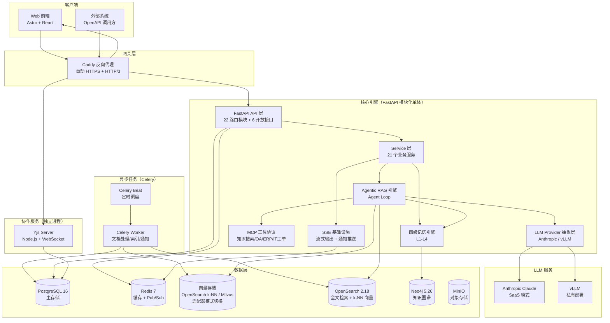
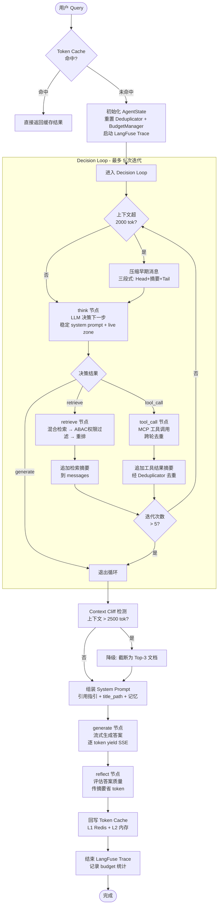

# 系统架构与 Agent Loop 设计

## 系统架构设计

系统采用**模块化单体 + 选择性服务分离**架构。核心引擎为 FastAPI 模块化单体（含 Celery Worker），Yjs 协作服务因 Node.js 技术栈要求独立部署。所有服务共享同一 PostgreSQL 数据库。



### 架构设计原则

| 原则 | 实践 |
|------|------|
| **单一职责** | 每个模块只做一件事：ChatService 编排对话、RAG Engine 编排检索、MemoryManager 编排记忆 |
| **开闭原则** | LLM Provider / Embedder / Reranker / 模块注册表均使用注册表 + 装饰器模式，新增只需追加条目 |
| **依赖倒置** | LLM、检索器、重排器、权限过滤器均通过构造注入，可替换为 Mock |
| **优雅降级** | Redis / Neo4j / OpenSearch / 向量存储 延迟初始化 + try/except 降级，PostgreSQL 为唯一强依赖 |
| **模块化单体** | 微服务不适合（共享数据库依赖），仅 Yjs 协作服务因技术栈原因独立部署 |

---

## Agent Loop 工作原理

`AgenticRAGEngine` 是整个系统的编排中枢，通过 `think → retrieve/tool_call → generate → reflect` 循环驱动 RAG 流程。默认使用纯 Python `while` 循环实现（零外部依赖），安装 LangGraph 后可切换为声明式状态图驱动（支持断点恢复）。



### Agent Loop 各节点职责

| 节点 | 方法 | 职责 | Token 优化 |
|------|------|------|------------|
| **think** | `_think()` | LLM 决策下一步动作，返回 `retrieve`/`tool_call`/`generate` | 稳定 system prompt（无动态内容）命中 KV Cache |
| **retrieve** | `_retrieve()` | 多路检索 → ABAC 权限过滤 → 重排 top-5 | 增量追加摘要，不重建 messages |
| **tool_call** | `_tool_call()` | MCP 工具调用 | 跨轮去重，重复结果替换为指针引用 |
| **generate** | `Generator.generate()` | 流式生成答案 | Context Cliff 监控，超限自动截断 |
| **reflect** | `_reflect()` | 评估答案质量 | 传摘要而非全文，省 ~1800 tok/次 |

### MCP 工具调用守卫（DangerousToolGuard）

借鉴 DECO 数仓 Agent 的 beforeTool Hook 设计，在 Agent 调用 MCP 工具前增加代码级强制确认机制。**prompt 是软约束，不是安全边界** — 任何不可逆操作都必须有框架层兜底。**未知工具默认阻断（deny-by-default）** — 未在安全/危险清单中注册的工具一律阻断，消除潜在风险。

P1 升级：从内存级确认升级为**持久化审批恢复机制** — 审批记录入库（`tool_approvals` 表），支持服务重启恢复、AgentState JSONB 快照、会话级确认缓存。

```mermaid
flowchart TD
    LLM_DECIDE[LLM 决定调用工具] --> GUARD{DangerousToolGuard<br/>beforeTool 拦截<br/>P1: session_id 隔离}
    GUARD -->|只读工具<br/>knowledge_search 等| ALLOW[直接放行<br/>执行 MCP 调用]
    GUARD -->|危险工具<br/>document_create 等| SESSION{会话级已确认?}
    SESSION -->|是| ALLOW_CONFIRMED[放行执行]
    SESSION -->|否| BLOCK[阻断执行<br/>返回结构化错误给 LLM]
    BLOCK --> CREATE[P1: 创建 ToolApproval 记录<br/>含 AgentState JSONB 快照<br/>TTL 1 小时]
    CREATE --> SSE[yield approval_required SSE 事件]
    SSE --> FRONTEND[前端渲染审批卡片<br/>显示参数/原因/不可逆标记]
    FRONTEND -->|用户批准| REST_APPROVE[POST /api/v1/approvals/&#123;id&#125;/approve]
    FRONTEND -->|用户拒绝| REST_REJECT[POST /api/v1/approvals/&#123;id&#125;/reject]
    REST_APPROVE --> CACHE[会话级确认缓存<br/>同会话内不再拦截]
    REST_REJECT --> REJECTED[工具不执行<br/>Agent Loop 继续]
    CACHE --> ALLOW_CONFIRMED
```



| 工具类别 | 示例 | 守卫行为 | 不可逆 |
|----------|------|----------|--------|
| 只读工具 | `knowledge_search`、`document_get`、`query_oa_approval` | 直接放行 | — |
| 写操作工具 | `document_create`、`create_it_ticket` | 需用户确认 | `create_it_ticket` 标记为不可逆 |
| 未知工具 | 未注册的新工具 | **默认阻断（deny-by-default）** + 记录警告 | — |

**P1 持久化审批恢复机制**：

| 组件 | 文件 | 职责 |
|------|------|------|
| ORM 模型 | `app/models/approval.py` | `tool_approvals` 表（JSONB 状态快照 + 1 小时 TTL + status 索引） |
| Schema | `app/schemas/approval.py` | Pydantic 请求/响应序列化 |
| 服务层 | `app/services/approval_service.py` | CRUD + 会话级缓存（`dict[session_id → set]`）+ 重启恢复 |
| REST 端点 | `app/api/v1/approvals.py` | `GET pending` / `POST approve` / `POST reject` / `GET /{id}` |
| 引擎集成 | `app/rag/engine.py` `_execute_tool_use` | 危险工具拦截时创建审批记录 + yield `approval_required` SSE 事件 |
| 启动恢复 | `app/main.py` lifespan | 调用 `restore_pending_approvals()`（标记过期 + 加载活跃审批） |
| 前端弹窗 | `frontend/src/pages/chat/index.astro` | `approval_required` 事件 → 审批卡片（参数/原因/批准/拒绝按钮） |

**会话级确认缓存**：用户批准某工具后，同一会话内再次调用该工具自动放行（`confirm_session_tool(session_id, tool_name)`），避免重复弹窗。不同会话间隔离，`clear_session(session_id)` 在会话结束时清理。

**服务重启恢复**：FastAPI 启动时扫描 `tool_approvals` 表，将过期未处理的审批标记为 `expired`，活跃审批重新加载到内存缓存，确保服务重启不丢失待审批请求。

守卫通过构造注入 `AgenticRAGEngine(tool_guard=...)`，支持自定义危险工具清单和确认管理（`confirm_session_tool` / `is_session_confirmed` / `clear_session` / 兼容旧版 `confirm` / `revoke` / `reset`）。

### 权限过滤核心安全约束

**权限过滤在重排之前执行**：检索召回 → ABAC 权限过滤 → 重排 → 生成。权限过滤出错时保守处理（返回空列表），避免泄露越权文档。

### RAG 质量守卫（QualityGuard）

借鉴 CorrectiveRAG 思路，但不引入 RAGAS 全量评估（适合离线批量，不适合每次查询）。采用**双层自适应评估闭环** + **幻觉防护四层拦截流水线**：

```mermaid
flowchart TD
    RERANK[rerank top_k=5] --> RGUARD{① 检索质量守卫<br/>零 LLM 调用}
    RGUARD -->|mean_score ≥ 阈值| GEN[generate 流式生成]
    RGUARD -->|mean_score < 阈值| EXPAND[扩展 rerank top_k=15<br/>重试 1 次]
    EXPAND --> GEN

    GEN --> FAITH{② 忠实度拦截<br/>check_and_regenerate}
    FAITH -->|faithfulness ≥ 阈值| CITE{③ 引用强制校验<br/>validate_citations}
    FAITH -->|faithfulness < 阈值| REGEN[使用增强 prompt 重生成<br/>禁止编造 + 强制 [n] 引用]
    REGEN --> CITE

    CITE -->|有 [n] 引用标注| CONTRA{④ 矛盾检测<br/>check_answer_consistency}
    CITE -->|无引用标注 + 有来源| CITE_FAIL[标记 citation_invalid<br/>SSE 通知前端]
    CITE_FAIL --> CONTRA

    CONTRA -->|无矛盾| RISK{⑤ 高风险信息核验<br/>verify_against_sources}
    CONTRA -->|检测到矛盾<br/>action=block| CONTRA_BLOCK[标记 contradiction_blocked<br/>标记 low_confidence]
    CONTRA_BLOCK --> RISK

    RISK -->|全部核验通过| NORMAL[正常返回]
    RISK -->|未核验比例 > 50%| RISK_BLOCK[标记 high_risk_blocked<br/>标记 low_confidence]
    RISK -->|部分未核验| RISK_WARN[标记 high_risk_warning<br/>SSE 通知前端]
    RISK_BLOCK --> NORMAL
    RISK_WARN --> NORMAL

    NORMAL --> TRACE[LangFuse 上报<br/>三维度评分 + 幻觉防护结果]
```

| 守卫层 | 检查方式 | 阈值 | 触发动作 | 额外 LLM 调用 |
|--------|----------|------|----------|--------------|
| 检索层 | `mean(rerank_score)` 纯数学 | `RAG_RETRIEVAL_SCORE_THRESHOLD=0.3` | 扩展 `top_k` 重排 1 次 | 0 |
| 生成层 | `LLMJudgeService.evaluate_single()` | `RAG_FAITHFULNESS_THRESHOLD=3.0` | **重生成答案**（增强 prompt 禁止编造） | 1（重生成时） |
| 引用校验 | `CitationExtractor.validate_citations()` 正则 | 有来源但无 [n] 标注 | 标记 `citation_invalid` + SSE 通知 | 0 |
| 矛盾检测 | `ContradictionDetector.check_answer_consistency()` | LLM 判断 answer vs KB | `action=block` 时标记 `contradiction_blocked` | 1 |
| 高风险核验 | `HighRiskDetector.verify_against_sources()` 规则匹配 | 未核验比例 > 50% | `action=block` 时标记 `high_risk_blocked` | 0 |

**设计要点**：
- **检索层零 LLM 调用**：仅对重排分数做均值计算，低于阈值时扩展 rerank top_k（不重新检索），重试上限 1 次
- **生成层复用 Judge**：将原有 `_reflect()` 从内联简单 prompt 升级为调用 `LLMJudgeService`，LLM 调用次数不变
- **忠实度拦截（check_and_regenerate）**：faithfulness 低于阈值时不再仅标记，而是使用增强 prompt（强调禁止编造 + 强制 [n] 引用标注）重生成答案，最多重生成 1 次，避免无限循环
- **引用强制校验**：有检索来源但答案无 [n] 引用标注时标记 `citation_invalid`，供 SSE 事件和拦截使用；无来源时跳过（非 RAG 场景）
- **矛盾检测接线**：`check_answer_consistency` 从"代码存在但未接线"升级为在 `_reflect` 中调用，检测到矛盾且 `action=block` 时标记 `contradiction_blocked` + `low_confidence`
- **高风险信息二次核验**：检测答案中的金额/日期/法律条款，与来源文档核对一致性，未核验比例 > 50% 时标记 `high_risk_blocked`
- **LangFuse 联动**：EvalResult 三维度分数 + 幻觉防护结果（citation/contradiction/high_risk）上报到 trace metadata
- **降级链**：LLMJudgeService 不可用时降级为原有内联 prompt（`_reflect_inline`），守卫关闭时完全跳过

---