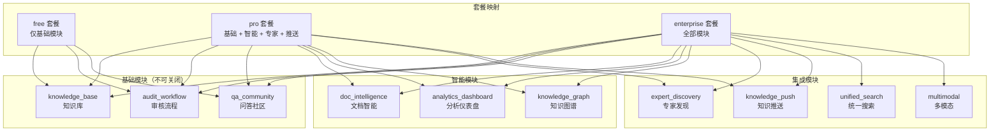
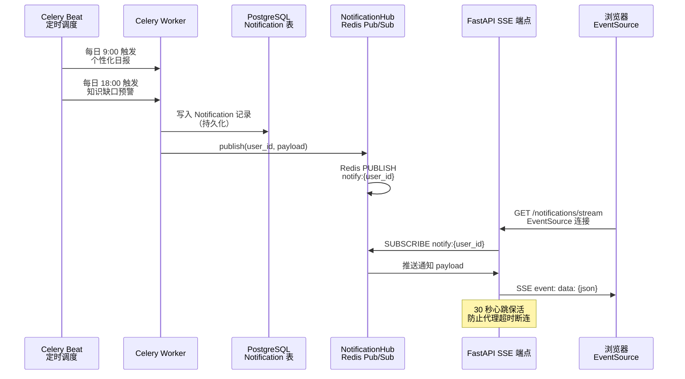
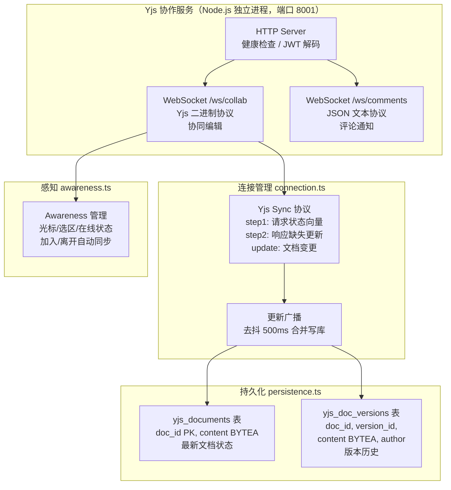
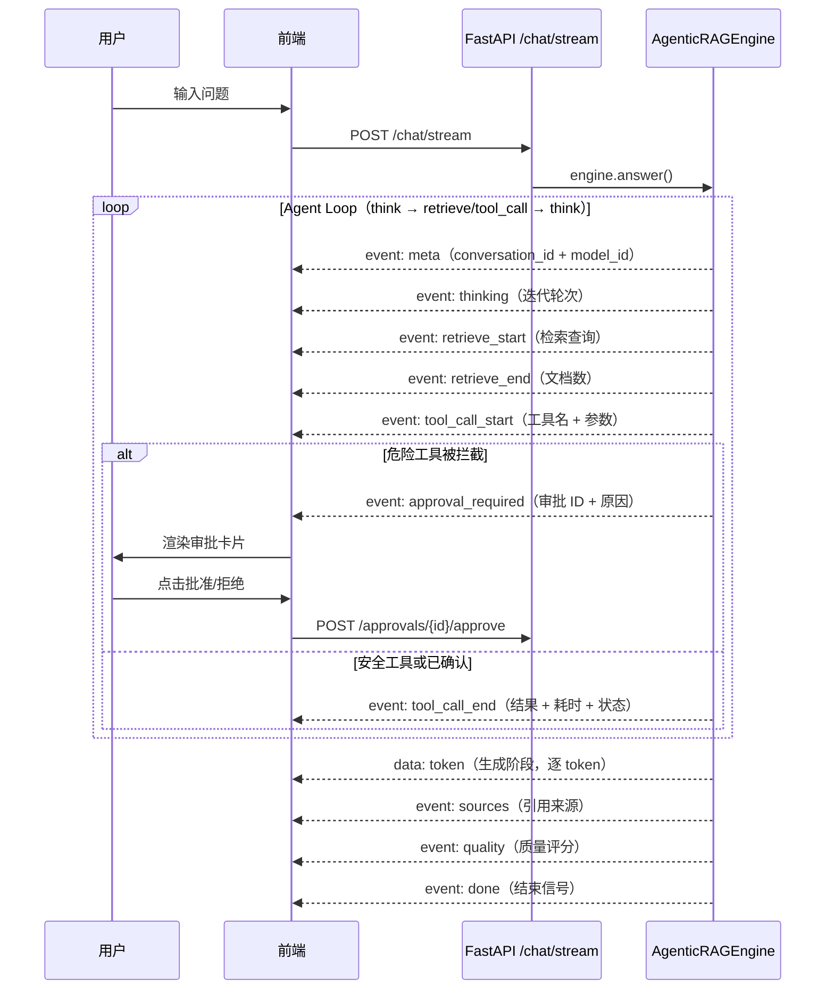
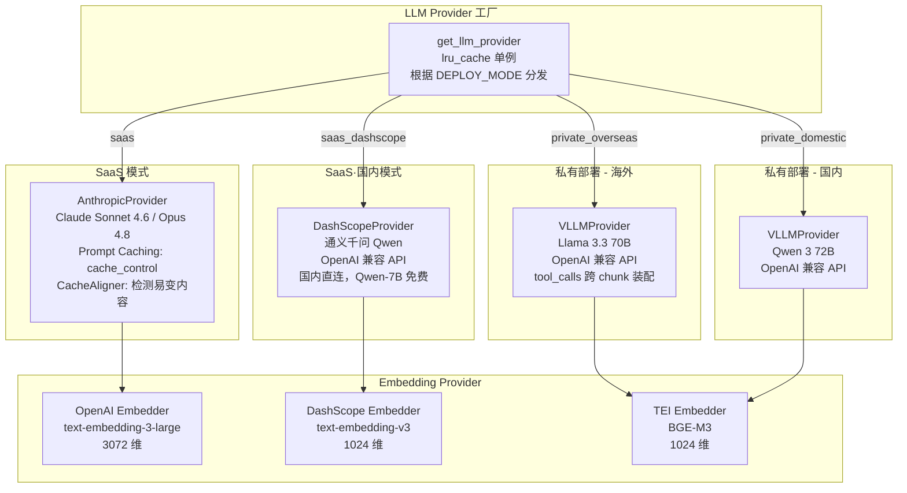
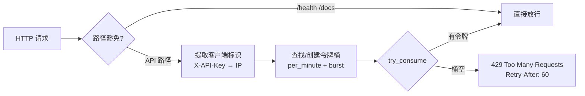
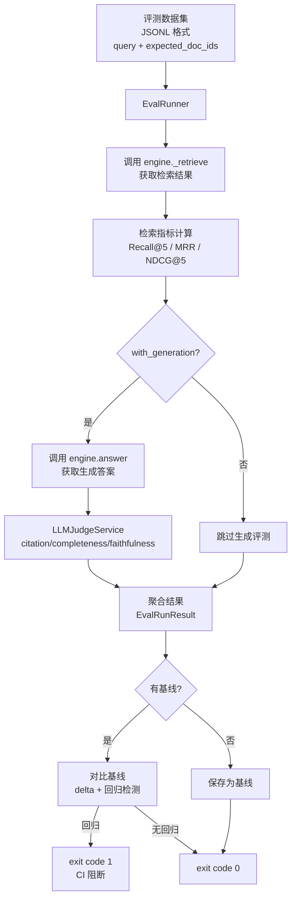

# 核心功能设计

## 模块化门控系统

10 个功能模块分四类，基础模块永远启用，可选模块通过 `Tenant.settings.enabled_modules` JSONB 字段控制。API 端点使用 `require_module` 依赖注入实现门控。



### 门控实现

```python
# API 端点使用 require_module 替代通用认证
@router.get("/dashboard")
async def get_dashboard(
    user: User = Depends(require_module("analytics_dashboard")),
    db: AsyncSession = Depends(get_db_session),
):
    ...
```

41 个 API 端点已更新为模块门控。模块状态存储在 `Tenant.settings` JSONB 字段中（不建独立表，避免 JOIN 复杂度）。

---

## 通知推送机制

通知推送遵循 `Celery 任务 → PostgreSQL 写入 → Redis Pub/Sub → SSE 推送 → 浏览器 EventSource` 流程，不跨进程调用 Node.js 服务。



### 关键设计

- Redis 不可用时静默降级（通知仍写入 DB，只是不实时推送）
- 30 秒心跳保活（`: heartbeat\n\n`），防止代理超时断连
- 用户多标签页天然 fan-out（Redis Pub/Sub 每个订阅独立接收）
- EventSource API 原生支持自动重连

---

## Yjs 协同编辑服务

因 Yjs CRDT 生态在 Node.js/TypeScript 端更成熟，协作服务作为独立进程部署。与 FastAPI 核心引擎共享同一 PostgreSQL 数据库，无进程间通信协议。



### 双 WebSocket 端点

| 端点 | 协议 | 用途 |
|------|------|------|
| `/ws/collab` | Yjs 二进制 | 协同编辑（兼容 y-websocket） |
| `/ws/comments` | JSON 文本 | 评论通知（订阅/发布） |

### 持久化设计

- **合并写入**：`saveDoc()` 读取已有内容 → `Y.applyUpdate` 合并 → `Y.encodeStateAsUpdate` 编码全量 → 写回（事务保护，`FOR UPDATE` 行锁）
- **去抖持久化**：500ms 合并短时间内的多次更新为一次写库
- **降级模式**：PostgreSQL 不可用时切换内存模式（数据不持久化，重启丢失）

---

## SSE 流式事件

Agentic RAG 引擎从「仅生成阶段流式」升级为**全流程 SSE 事件流** — 用户在 think / retrieve / tool_call 阶段就能看到 Agent 实时进度，而非等待 30 秒后才看到第一个 token。



| SSE 事件 | 触发时机 | 数据 | 阶段 |
|----------|----------|------|------|
| `meta` | 会话开始 | `conversation_id`、`agent_type`、`model_id` | 初始化 |
| `thinking` | 每轮 think 开始 | `content`、`iteration` | Agent Loop |
| `retrieve_start` | 检索开始 | `query`、`iteration` | Agent Loop |
| `retrieve_end` | 检索完成 | `doc_count`、`iteration` | Agent Loop |
| `tool_call_start` | 工具调用开始 | `tool_name`、`tool_use_id`、`arguments` | Agent Loop |
| `approval_required` | 危险工具被拦截 | `approval_id`、`tool_name`、`reason`、`irreversible` | Agent Loop（P1） |
| `tool_call_end` | 工具调用完成 | `tool_use_id`、`result`、`duration_ms`、`status` | Agent Loop |
| `data: token` | 生成阶段 | 逐 token 文本 | 生成 |
| `sources` | 生成完成 | 引用来源列表 | 生成后 |
| `quality` | 反思完成 | `citation_accuracy`、`completeness`、`total_score` | 反思 |
| `done` | 全流程结束 | `token_count`、`iterations` | 结束 |
| `context_resolved` | 指代消解完成 | `original_query`、`resolved_query`、`focus` | P3-A 上下文 |
| `drift_detected` | 话题漂移检测 | `is_drift`、`drift_score`、`detection_method`、`action` | P4-A 对话智能 |
| `contradiction_detected` | 矛盾检测 | `contradiction_type`、`description`、`severity`、`action` | P4-B 对话智能 |
| `retrieval_mismatch` | 检索不匹配 | `is_match`、`match_score`、`action` | P4-D 对话智能 |
| `preference_changed` | 偏好偏移 | `preference_type`、`new_value` | P4-F 对话智能 |
| `repetition_detected` | 重复提问 | `similarity_score`、`previous_query`、`repetition_count`、`action` | P4-G 对话智能 |

**实现要点**：
- `app/utils/sse.py`：`SSEEventType` 枚举 + `sse_response()` 封装 + `_to_sse_stream()` 去重 done 事件
- `app/rag/engine.py`：`answer()` 返回 `AsyncIterator[SSEEvent | str]`，`_run_decision_loop_streaming()` yield 全流程事件
- `frontend/src/lib/sse.ts`：`streamChat()` 支持 `onToolCallStart` / `onToolCallEnd` / `onApprovalRequired` 等回调
- `frontend/src/pages/chat/index.astro`：`handleSSEEvent()` 渲染 ToolCallCard 组件 + 审批卡片

---

## 工具审批恢复机制

P1 核心功能 — 当 `DangerousToolGuard` 拦截危险工具时，将审批请求**持久化到数据库**（而非仅内存级确认），支持服务重启恢复、AgentState 快照恢复、会话级确认缓存。

**数据流**：

```
引擎拦截危险工具
    ↓
创建 ToolApproval 记录（含 AgentState JSONB 快照，TTL 1 小时）
    ↓
yield approval_required SSE 事件 → 前端渲染审批卡片
    ↓
用户批准 → POST /api/v1/approvals/{id}/approve
    ↓
ApprovalService.approve() → 会话级确认缓存（同会话内不再拦截）
    ↓
Agent Loop 从快照恢复继续执行
```

**服务重启恢复**：FastAPI 启动时调用 `ApprovalService.restore_pending_approvals()`，将过期未处理的审批标记为 `expired`，活跃审批重新加载到内存缓存。

**REST 端点**：

| 方法 | 路径 | 说明 |
|------|------|------|
| GET | `/api/v1/approvals/pending` | 查询待审批列表（可选 `session_id` 过滤） |
| POST | `/api/v1/approvals/{id}/approve` | 批准工具执行 |
| POST | `/api/v1/approvals/{id}/reject` | 拒绝工具执行 |
| GET | `/api/v1/approvals/{id}` | 查询审批详情 |

详见 [MCP 工具调用守卫](#mcp-工具调用守卫dangeroustoolguard) 章节。

---

## 文档处理流水线

Celery 异步任务驱动文档处理流水线，从文档上传到索引构建全自动，支持 PDF/DOCX/PPTX/XLSX/HTML/Markdown/图片/视频/音频 多格式。Docling 统一解析器优先处理（版面分析 + 表格 + 公式 + OCR → HTML），降级到原有专用解析器。

**P0-P2 解析增强**（对齐业界最佳实践）：
- **P0 上传端点 Celery 触发修复**：文件上传成功后自动调用 `process_document.delay(str(doc_id))` 触发异步解析，异常时降级记录日志（不影响文件入库）。修复前上传的文档永久停留在 `draft` 状态
- **P0 doc_type_map 格式扩展**：从 4 格式（md/html/docx/pdf）扩展到 11 格式（新增 markdown/htm/pptx/xlsx/xls/txt/csv），修复 PPTX/XLSX 被误分类为 `md` 的问题
- **DOCX 标题层级映射**：检测 `<w:pStyle>` 样式 → `<h1>`~`<h6>`，修复 chunker 结构化分块
- **DOCX 列表结构保留**：检测 `<w:numPr>` → `<ul><li>`，保留列表语义
- **PPTX GROUP 递归提取**：组合形状内的表格/图表/图片递归提取（修复数据丢失）
- **PPTX 图表数据提取**：`has_chart` → 数据点文本（柱状图/饼图/折线图）
- **图片上传 MinIO**：`PDF/DOCX/PPTX_IMAGE_UPLOAD_ENABLED` 开启后图片上传保留 URL + VLM 描述
- **小图过滤**：`PDF/DOCX/PPTX_IMAGE_MIN_SIZE=50` 剔除图标/装饰小图（零依赖 PNG/JPEG/WebP 尺寸解析）
- **XLSX 双引擎降级**：openpyxl 失败 → pandas.read_excel 兜底
- **XLSX/PPTX 列宽对齐**：合并单元格场景自动补齐短行为最大列数
- **DOCX 分页检测**：`<w:br type="page"/>` + `<w:lastRenderedPageBreak/>` → 真实页码
- **P0 文件大小校验**：`MAX_UPLOAD_SIZE_MB=50` 超限返回 413 Payload Too Large（对齐竞品 50MB 上限）
- **P1 解析摘要响应**：`GET /documents/{doc_id}/summary` 返回 preview/structure/warnings/pages/char_count/parse_status（对齐竞品草稿摘要 JSON）
- **P1 解析任务 warnings 收集**：解析/向量化/索引失败时收集警告，返回 parse_status（parsed/partial/failed）
- **P1 解析元数据持久化**：Document 表新增 `parse_status`/`parse_warnings`/`page_count`/`char_count` 4 字段，解析任务产物持久化，摘要端点优先读 DB（回退动态计算兼容历史数据）
- **P1 实时解析进度反馈**：Celery 任务通过 `_update_parse_progress()` 在 8 个阶段（queued/parsing/chunking/embedding/indexing/publishing/done/failed）写入 Redis（TTL 30 分钟），前端通过 `GET /documents/{doc_id}/progress` 轮询真实进度（替代模拟进度），`stage=unknown` 时优雅降级为估算

```mermaid
flowchart LR
    UPLOAD[文档上传] --> SIZE_CHECK{"P0 文件大小校验<br/>MAX_UPLOAD_SIZE_MB=50"}
    SIZE_CHECK -->|超限| REJECT413["返回 413<br/>Payload Too Large"]
    SIZE_CHECK -->|通过| SAVE_MINIO["保存至 MinIO<br/>创建 Document 记录"]
    SAVE_MINIO --> TRIGGER{"P0 Celery 触发<br/>process_document.delay"}
    TRIGGER -->|触发成功| CELERY["Celery Task<br/>process_document<br/>max_retries=3"]
    TRIGGER -->|触发失败| LOG_WARN["记录警告日志<br/>文档停留 draft 状态<br/>不影响文件入库"]
    LOG_WARN --> DRAFT_END["待手动重试"]
    CELERY --> PROG_QUEUE["进度: queued<br/>写入 Redis"]

    CELERY --> PARSE["1. 文档解析<br/>延迟导入第三方库"]
    PARSE --> PROG_PARSE["进度: parsing<br/>写入 Redis"]
    PARSE -->|PDF| PYMUPDF["pymupdf 文本<br/>+ find_tables → HTML<br/>+ 图片上传 MinIO / 小图过滤<br/>+ VLM 描述"]
    PARSE -->|PPTX| PPTX["python-pptx 文本<br/>+ 表格 → HTML<br/>+ 内嵌图片 VLM"]
    PARSE -->|PDF / DOCX / PPTX<br/>XLSX / HTML / 图片 / 音频| DOCLING["Docling 统一解析<br/>Granite-Docling-258M<br/>版面分析 + 表格 + 公式 + OCR<br/>→ HTML（&lt;h1&gt;~&lt;h6&gt;/&lt;table&gt;/&lt;ul&gt;）"]
    PARSE -->|Docling 不可用| PYMUPDF["pymupdf<br/>表格 → HTML<br/>图片上传 + VLM 描述<br/>小图过滤 + 扫描页 OCR"]
    PARSE -->|Docling 不可用| PPTX["python-pptx<br/>GROUP 递归表格/图表/图片<br/>图片上传 + VLM 描述<br/>小图过滤 + 列宽对齐<br/>演讲者备注"]
    PARSE -->|Docling 不可用| DOCX["python-docx<br/>标题层级 h1~h6<br/>列表结构 ul/li<br/>表格 → HTML<br/>图片上传 + VLM 描述<br/>分页检测 + 页眉页脚"]
    PARSE -->|Docling 不可用| XLSX["openpyxl + pandas 降级<br/>每 sheet → HTML 表格<br/>列宽对齐"]
    PARSE -->|HTML| REGEX["正则去标签"]
    PARSE -->|MD/TXT| DIRECT["直接返回"]
    PARSE -->|视频| VIDEO["ffmpeg 提取音轨<br/>→ ASR 转写<br/>→ 关键帧 VLM 描述"]
    PARSE -->|音频| AUDIO["ffmpeg 转 WAV<br/>→ ASR 转写<br/>复用视频分块管线"]

    DOCLING --> CHUNK["2. 四级语义分块<br/>SemanticChunker"]
    PYMUPDF & PPTX & DOCX & XLSX & REGEX & DIRECT --> CHUNK
    VIDEO & AUDIO --> VCHUNK["2v. 视频/音频语义分块<br/>chunk_video_transcript<br/>时间窗口合并 + 关键帧对齐"]

    CHUNK --> PROG_CHUNK["进度: chunking<br/>写入 Redis"]
    PROG_CHUNK --> QA_CHECK{"content_type<br/>路由"}
    QA_CHECK -->|faq| QA_SPLIT["Q&amp;A 对分块"]
    QA_CHECK -->|其他| STRUCT["结构化/语义/兜底"]

    QA_SPLIT & STRUCT & VCHUNK --> PARALLEL{"chord 编排<br/>group() 并行"}

    PARALLEL -->|支线 A<br/>indexing 队列| EMBED["3. 向量化<br/>EmbeddingProvider"]
    EMBED --> PROG_EMBED["进度: embedding<br/>写入 Redis"]

    PROG_EMBED --> INDEX["4. 索引构建"]
    INDEX --> PROG_INDEX["进度: indexing<br/>写入 Redis"]
    INDEX --> OS_INDEX["OpenSearch 全文索引<br/>含 Chunk 元数据<br/>title_path/content_type/strategy"]
    INDEX --> VEC_INDEX["向量索引<br/>VectorStoreBase 适配器<br/>os_knn 默认 / milvus 可选"]

    PARALLEL -->|支线 B<br/>documents 队列<br/>knowledge_graph 模块| GRAPH["3b. 知识图谱构建<br/>计算复用 chunk_objects"]
    GRAPH --> TRIPLES["GraphService.extract_triples_from_chunks<br/>规则提取 + LLM 兜底"]
    TRIPLES --> NEO4j["Neo4j 批量写入<br/>Document → Concept MENTIONS"]

    OS_INDEX & VEC_INDEX & NEO4j --> CLASSIFY{"密级路由"}
    CLASSIFY -->|confidential/secret| REVIEW["5a. 待审核<br/>pending_review"]
    CLASSIFY -->|public/internal| PUBLISH["5b. 直接发布<br/>published"]

    REVIEW --> AUDIT_SUBMIT["提交审核<br/>AuditFlow 创建"]
    AUDIT_SUBMIT --> AUDIT_WAIT["等待人工审核"]
    AUDIT_WAIT -->|approve| PUBLISH_AFTER["审核通过<br/>pending_review → published"]
    AUDIT_WAIT -->|reject| REJECTED["保持 pending_review<br/>记录驳回意见"]

    PUBLISH & PUBLISH_AFTER & REJECTED --> PROG_PUBLISH["进度: publishing<br/>写入 Redis"]
    PROG_PUBLISH --> INTEL["6. 链式触发<br/>文档智能处理<br/>摘要/标签/分类/行动项"]
    INTEL --> PROG_DONE["进度: done<br/>写入 Redis"]
    PROG_DONE --> SUMMARY["P1 解析摘要响应<br/>GET /documents/{doc_id}/summary<br/>preview/structure/warnings<br/>pages/char_count/parse_status"]

    %% P1 实时进度反馈通道
    PROG_QUEUE & PROG_PARSE & PROG_CHUNK & PROG_EMBED & PROG_INDEX & PROG_PUBLISH & PROG_DONE -.->|Redis TTL 30min| REDIS_PROGRESS[("Redis<br/>ekb:parse_progress:{doc_id}")]
    REDIS_PROGRESS -.->|前端轮询| PROGRESS_API["GET /documents/{doc_id}/progress<br/>stage/current/total/message"]
    PROGRESS_API -.->|stage=unknown 降级| FRONTEND["前端 upload.astro<br/>真实进度 → 阶段指示器<br/>unknown → 估算进度"]

    %% 失败路径
    CELERY -.->|异常| PROG_FAILED["进度: failed<br/>写入 Redis + 记录错误"]
```



### 设计要点

- **P0 Celery 触发保障**：文件上传成功后自动调用 `process_document.delay(str(doc_id))`，`try/except` 包裹 ImportError（Celery 未安装）和通用异常，触发失败时记录日志但不影响文件入库。修复前文档永久停留在 `draft` 状态
- **P0 格式映射完整**：`doc_type_map` 覆盖 11 种格式（md/markdown/html/htm/docx/pdf/pptx/xlsx/xls/txt/csv），确保 PPTX/XLSX 不被误分类为 `md`
- **P1 实时进度反馈**：Celery 任务在每个阶段调用 `_update_parse_progress(doc_id, stage, current, total, message)` 写入 Redis（key=`ekb:parse_progress:{doc_id}`，TTL 1800 秒）。8 个阶段：`queued` → `parsing` → `chunking` → `embedding` → `indexing` → `publishing` → `done` / `failed`。Redis 不可用时静默降级（进度查询返回 `stage=unknown`）
- **P1 进度查询端点**：`GET /documents/{doc_id}/progress` 从 Redis 读取实时进度，返回 `{stage, current, total, message}`。无进度记录时返回 `stage=unknown`，前端降级为估算进度
- **P1 前端进度展示**：upload.astro 通过 `getDocumentProgress()` 轮询真实进度，`mapProgressToStage()` 将后端 8 阶段映射为前端 5 阶段指示器（等待/解析中/分块/向量化/完成），`stage=unknown` 时回退到 `Math.floor(i/3)` 估算
- **P1 前端重试机制**：上传失败和解析失败均提供重试按钮，上传重试重新走文件上传流程，解析重试调用后端重新触发 Celery 任务
- **P1 扫描件 OCR**：upload.astro 新增「扫描件 OCR」标签页，挂载 `ScanProcessor` React Island，通过 `window.dispatchEvent(new CustomEvent('ekb:ocr-text'))` 将 OCR 识别文本回传给主页面，作为新文档入库
- **P1 智能处理面板**：文档解析完成后自动触发 `processIntelligence(docId)`，轮询 `getIntelligenceStatus()` 展示摘要/标签/分类三项智能处理进度
- **延迟导入**：docling / pymupdf / python-docx / python-pptx / opensearchpy / pymilvus / ffmpeg / ASR / VLM 延迟导入，未安装时优雅降级
- **向量存储适配器**：通过 `VectorStoreBase` 抽象层，按 `VECTOR_STORE` 配置切换 OpenSearch k-NN（默认）或 Milvus，业务代码零改动
- **文档解析三级降级**：Docling 统一解析器（primary）→ 原有专用解析器（fallback）→ VLM 整页 OCR（兜底）。Docling 可用时统一输出 HTML（`<h1>`/`<h2>` 标题 + `<table>` 表格 + 版面分析 + 公式 + OCR），与原有解析器输出格式一致，chunker 的 `_split_html()` 直接按 `<h>` 标签分块，无需格式检测
- **关键帧 VLM 并发**：视频关键帧描述使用 `Semaphore(3)` + `asyncio.gather` 并发调用 VLM，替代串行逐帧处理，多关键帧场景延迟降低约 60%
- **Chunk 元数据**：每个 Chunk 携带 `title_path`（作为 `[标题路径]` 前缀拼入 content 增强 embedding 上下文感知）、`content_type`、`chunk_strategy`、`parent_id`
- **chord 拆分编排**：`process_document` 入口解析分块后，通过 `chord(group(build_index_task, build_graph_task))` 并行执行支线 A（向量化+索引，indexing 队列）和支线 B（知识图谱，documents 队列），回调 `finalize_document_task` 完成密级路由+发布。与 `video_tasks.py` 已有的 chord 模式一致。支线 B 受 `knowledge_graph` 模块开关控制
- **计算复用**：入口 task 将 `chunk_objects` 序列化存入 Redis（TTL 1h），支线 A 和支线 B 从 Redis 反序列化读取，避免重复分块计算。向量化读取 chunk content 生成 embedding，知识图谱从同一批 chunks 抽取三元组
- **独立扩容**：支线 A 走 `indexing` 队列，支线 B 走 `documents` 队列，索引密集时只扩 indexing worker，图谱密集时只扩 documents worker。对标竞品的三链并行架构，我们额外有融合检索优势
- **降级机制**：Redis 不可用时（chunk_objects 持久化失败）自动降级为 `_process_document_async` 串行模式；Celery 未安装时同样降级。保证单机部署和测试环境正常工作
- **故障隔离**：索引 task 和图谱 task 独立重试（`max_retries=3`），一个失败不影响另一个。重试耗尽进入死信队列
- **Overlap 分层设计**：Overlap 仅用于固定长度兜底策略（`_CHUNK_OVERLAP_ENABLED`，默认关闭）。高级策略（结构化分块、TextTiling）在语义边界切分天然保留上下文，父子索引（`parent_id` 回取）优于 Overlap
- **视频 RAG 流程**：视频文档走专用管线 — ffmpeg 提取 16kHz mono 音轨 → ASR 转写为带时间戳片段 → ffmpeg 场景切换检测抽取关键帧 → VLM 逐帧描述 → `chunk_video_transcript` 按时间窗口（120s）合并转写片段并对齐关键帧描述，`title_path` 存时间戳标签（如 `00:00-02:15`）
- **Find Skills 渐进式技能加载**：Agent Loop 每轮按用户查询匹配相关技能，只加载匹配工具的完整 schema（按需加载），避免工具数量增长后全量加载浪费 token。`SkillRegistry` 维护轻量索引（name/category/tags/description，每个技能约 20-30 token），`SkillFinder` 用中英文分词 + 多维度评分（name +10 / category +5 / tag +8 / desc +3）匹配，阈值过滤 + `max_skills` 限制。无匹配时 fallback 到全量加载（零回归保证）。配置项：`SKILL_FINDER_ENABLED` / `SKILL_MATCH_THRESHOLD` / `SKILL_MAX_LOADED`
- **重试机制**：`max_retries=3`，`default_retry_delay=60`
- **可靠性 5 层保障**：
  1. **消息不丢失**：`task_acks_late=True`（任务完成后才 ACK）+ `task_reject_on_worker_lost=True`（worker 被 OOM 强杀时任务重投回队列）+ `worker_prefetch_multiplier=1`（一次只预取 1 个任务，崩溃时最多丢失 1 个）
  2. **Redis 持久化**：`redis-server --appendonly yes --appendfsync everysec`（AOF 每秒刷盘）+ `redis_data` volume 挂载，容器重启后队列和结果不丢失
  3. **超时保护**：`task_time_limit=1800`（硬超时 30 分钟，强制杀进程）+ `task_soft_time_limit=1500`（软超时 25 分钟，可捕获 `SoftTimeLimitExceeded` 做清理）
  4. **可见性超时**：`broker_transport_options={"visibility_timeout": 21600}`（6 小时，覆盖长任务如视频处理，防止任务因 broker 超时被重复消费）
  5. **死信队列**：重试耗尽的任务通过 `_send_to_dead_letter()` 发送到 `dead_letter` 队列（无消费者，仅存储），保留 `original_task` / `task_id` / `args` / `error` / `failed_at` 供人工排查。`document_tasks` 和 `index_tasks` 的所有 task 均已接入
- **Beat 单实例锁（P1 分布式预备）**：多实例部署时 Beat 必须单实例运行，否则定时任务会重复执行。通过 `acquire_beat_lock()` 实现 Redis SETNX 单实例锁——Beat 启动时获取锁（`celery:beat:lock`，TTL 60s），获取不到则 `SystemExit` 退出。锁有 TTL，Beat 崩溃后锁自动过期，备用实例可接管。通过 `CELERY_BEAT_SINGLE_INSTANCE=1` 环境变量触发。Redis 不可用时放行（单机模式不需要锁）。docker-compose 中 `celery-beat` 已配置为独立服务 + `CELERY_BEAT_SINGLE_INSTANCE=1`
- **链式触发**：文档处理完成后自动触发智能处理（摘要/标签/分类/行动项/FAQ）
- **审核流程串联**：按文档密级自动路由 — `confidential`/`secret` 进入 `pending_review` 状态并提交 AuditFlow 审核；`public`/`internal` 直接发布。审核通过后 `AuditService.approve` 自动触发 `_publish_document` 将状态更新为 `published`

---

## LLM Provider 抽象层

通过注册表 + 装饰器工厂模式实现"环境变量切换，业务代码零改动"。四种部署模式映射不同 Provider 和模型。



### P2 用户级模型选择

P2 新增**会话级模型切换**能力 — 用户可在聊天界面选择当前部署模式下的可用模型，选择结果持久化到数据库，后续对话使用所选模型。

**两级优先级**（简化设计，不引入 user default 层）：

```
session 级（user_model_preferences 表）  >  system 默认（models.json is_default）
```

| 组件 | 文件 | 职责 |
|------|------|------|
| 模型配置 | `config/models.json` | 7 个模型定义 × 4 种部署模式，Git 管理，运维通过 PR 修改 |
| 配置加载 | `app/llm/model_config.py` | `lru_cache` 缓存 + `deploy_mode` 过滤 + 默认模型查找 |
| 偏好持久化 | `app/models/user_model_preference.py` | `user_model_preferences` 表（`user_id` + `session_id` 唯一约束） |
| 选择服务 | `app/services/model_selection_service.py` | 两级优先级解析 + upsert + 模型有效性校验 |
| Provider 工厂 | `app/llm/factory.py` `get_llm_provider_by_model()` | 按 `model_id` 创建 Provider（按 model_id 缓存） |
| RAG 引擎工厂 | `app/rag/factory.py` `get_rag_engine_by_model()` | 复用共享 MCP/Retriever/Reranker，仅替换 LLM/Generator |
| ChatService | `app/services/chat_service.py` | `resolve_model()` 解析 → 选择引擎 → meta 事件携带 `model_id` |
| REST 端点 | `app/api/v1/models.py` | `GET models` / `GET session/{id}` / `PUT session/{id}` |
| 前端选择器 | `frontend/src/pages/chat/index.astro` | 页头下拉框 + `loadModels()` + `setSessionModel()` |

**models.json 示例**：

```json
{
  "models": [
    {
      "id": "claude-sonnet-4.6",
      "display_name": "Claude Sonnet 4.6",
      "provider_type": "anthropic",
      "deploy_mode": "saas",
      "model_id": "claude-sonnet-4-6-20250514",
      "tier": "premium",
      "is_default": true,
      "supports_tool_use": true
    },
    {
      "id": "qwen-turbo",
      "display_name": "通义千问 Turbo",
      "provider_type": "dashscope",
      "deploy_mode": "saas_dashscope",
      "model_id": "qwen-turbo",
      "tier": "standard",
      "is_default": true
    }
  ]
}
```

**REST 端点**：

| 方法 | 路径 | 说明 |
|------|------|------|
| GET | `/api/v1/models` | 获取当前部署模式可用模型列表（可选 `session_id` 参数返回当前选中模型） |
| GET | `/api/v1/models/session/{session_id}` | 获取会话当前使用的模型（两级优先级解析） |
| PUT | `/api/v1/models/session/{session_id}` | 设置会话级模型选择（`model_id` 请求体） |

### LangFuse 全链路追踪

Agent Loop 的每个节点（think/retrieve/tool_call/generate/reflect）通过 `@trace_node` 装饰器自动记录到 LangFuse，支持五节点 Agent Loop 追踪。LangFuse 未配置时静默降级为纯日志，不影响主流程。

---


## API 限流

自研令牌桶限流中间件，按客户端维度（API Key 优先，IP 回退）隔离限流，保护后端服务不被突发流量打垮。



### 设计要点

- **令牌桶算法**：桶容量 = `RATE_LIMIT_BURST`（突发上限），每秒补充 `RATE_LIMIT_PER_MINUTE / 60` 个令牌，兼顾突发流量与持续速率控制
- **客户端隔离**：优先使用 `X-API-Key` / `Authorization` 头作为客户端标识（截断防内存溢出），无 Key 时回退到 `X-Forwarded-For` 或 `client.host`
- **路径豁免**：`/health`、`/docs`、`/openapi.json`、`/redoc` 不受限流影响，确保健康检查和文档访问正常
- **优雅降级**：`RATE_LIMIT_ENABLED=False` 时完全跳过限流；限流器初始化失败不影响请求处理
- **429 响应**：超限返回 `429 Too Many Requests` + `Retry-After: 60` 头，客户端可据此退避重试
- **分布式预备（P0）**：`RedisRateLimiter` 通过 Lua 脚本原子化取令牌，多 API 实例共享 Redis 中的令牌桶状态，限流精度为单实例配额（而非 N × 单实例）。Redis 不可用时自动降级为内存令牌桶（`RateLimiter`），保证限流功能始终可用。`setup_middleware` 优先初始化 `RedisRateLimiter`，无 `REDIS_URL` 时回退到内存模式

### 双模式限流架构

| 模式 | 类 | 计数存储 | 多实例精度 | 触发条件 |
|------|-----|---------|-----------|----------|
| Redis-backed | `RedisRateLimiter` | Redis（Lua 原子化） | 单实例配额（精确） | 配置了 `REDIS_URL` |
| 内存降级 | `RateLimiter` | 进程内存 dict | N × 单实例（不精确） | Redis 不可用或无 `REDIS_URL` |

> **设计决策**：即使当前单机部署也使用 Redis-backed 模式——这是正确性问题而非性能问题。多 API 实例时内存限流会形同虚设（用户实际可发 N × 配额的请求），Redis-backed 确保限流始终精确。

---


## 离线评测系统

为搜索与问答链路建立可量化的质量指标和回归基线，防止模型/策略迭代造成质量回退。检索层使用纯数学指标（零 LLM 调用），生成层复用 `LLMJudgeService` 三维评分。



### 评测指标

| 层级 | 指标 | 说明 |
|------|------|------|
| **检索层** | Recall@K | 前 K 个结果中包含正确文档的比例 |
| **检索层** | MRR | 第一个正确文档的倒数排名 |
| **检索层** | NDCG@K | 考虑排序位置的归一化折损累计增益 |
| **生成层** | citation_accuracy | 答案引用来源的准确性（1-5 分） |
| **生成层** | completeness | 答案完整性（1-5 分） |
| **生成层** | faithfulness | 答案忠实度 / 幻觉倒数（1-5 分） |

### 回归检测

评测结果持久化到 PostgreSQL `eval_results` 表（含完整 JSON 结果），支持：
- `--set-baseline` 将某次结果设为回归基线
- 后续运行自动与基线对比，各指标相对下降超过 `EVAL_REGRESSION_THRESHOLD`（默认 5%）视为回归
- CLI 退出码 1 用于 CI 流水线阻断，防止质量回退的代码合并

### CLI 用法

```bash
# 运行评测（检索 + 生成）
python scripts/run_eval.py --dataset eval_datasets/sample.jsonl

# 只测检索指标（不调 LLM 生成）
python scripts/run_eval.py --dataset eval_datasets/ --no-generation

# 对比基线，回归时退出码 1
python scripts/run_eval.py --dataset eval_datasets/sample.jsonl --baseline <run_id>

# 设置本次结果为基线
python scripts/run_eval.py --dataset eval_datasets/sample.jsonl --set-baseline
```

---


## 能力增强（P0-P2）

### P0: LangFuse 全链路可观测性

LangFuse v2 全链路追踪，覆盖 Agent Loop 五节点 + HTTP request_id 关联 + 真实 Token 用量采集。

- **追踪激活**：`@trace_node` 装饰器自动记录 think/retrieve/tool_call/generate/reflect 节点；`flush_langfuse()` 在应用关闭时确保数据不丢失
- **真实 Token 用量**：Provider 层（Anthropic/VLLM/DashScope）yield `{"type": "usage", ...}` 用量字典 → Generator 捕获 → Engine 累加 → `UsageRecord` 写入 DB；报表从 DB 读取真实 `avg_duration_ms`，不再使用硬编码估计值
- **request_id 关联**：中间件生成 `X-Request-ID` → contextvar 传播 → LangFuse trace metadata + UsageRecord.request_id，实现 HTTP 请求→LLM 调用→用量记录三级关联
- **前端面板**：治理后台「可观测性」页面展示用量统计（按模型/日期聚合）、最近调用记录（含 request_id、token 数、耗时、费用）
- **配置**：`LANGFUSE_PUBLIC_KEY` / `LANGFUSE_SECRET_KEY` / `LANGFUSE_HOST`，未配置时静默降级

### P1: TTS 语音输出

基于 edge-tts 的 AI 对话语音播报，支持 6 种中英文音色，无需 API Key。

- **后端**：`tts_service.py` 封装 edge-tts `Communicate.stream()`；`/tts/synthesize` POST 接口返回 audio/mpeg 流；`/tts/voices` 获取音色列表
- **前端**：每条 AI 回复附带 TTS 按钮，点击播放/暂停；支持流式回复完成后动态追加按钮
- **配置**：`TTS_ENABLED`（总开关）/ `TTS_VOICE`（默认音色）/ `TTS_RATE`（语速）/ `TTS_VOLUME`（音量）

### P2: 原生跨模态向量检索

修复两个已有 bug 并实现 jina-clip-v2 跨模态向量检索（独立索引隔离架构）。

- **Bug 1 修复 — 全文索引字段名不匹配**：写入方使用 `content` / `title_path`，查询方原查询 `chunk_text` / `title` 导致 BM25 静默失效；已对齐为 `content` / `title_path`，并补充 `kb_id` 字段写入与过滤
- **Bug 2 修复 — SaaS embedding 维度不匹配**：`VectorStoreBase.dimension` 从硬编码 1024 改为动态从 Embedder 获取；SaaS 模式 OpenAI 3072 维自动适配，私有部署 TEI 1024 维不受影响
- **跨模态检索（独立索引隔离）**：`MultimodalEmbeddingProvider`（jina-clip-v2, 1024 维）支持文本+图片向量生成；文本查询使用文本 Embedder（与文档索引一致），跨模态图片检索使用独立索引 `ekb_cross_modal` + `dimension_override=1024`，两路结果合并去重；`CrossModalService` 将文档图片向量化入库（`content_type="image"`）
- **配置**：`CROSS_MODAL_ENABLED`（总开关）/ `JINA_API_KEY` / `JINA_CLIP_MODEL` / `JINA_CLIP_DIM` / `OPENSEARCH_CROSS_MODAL_INDEX`

### 安全与稳定性加固（C1-C6）

全面代码审查后修复的 6 个 Critical 级问题：

- **C1/C2 跨模态向量空间隔离**：文本查询回退为文本 Embedder（不再切换到多模态），跨模态检索使用独立 `_cross_modal_search()` + 独立索引 + `dimension_override`，避免 SaaS 3072 维 vs jina-clip-v2 1024 维冲突
- **C3 Celery 任务 session 工厂**：6 个任务文件（`index_tasks` / `scheduled_tasks` / `notification_tasks` / `intelligence_tasks` / `compounding_tasks` / `testing_tasks`）的 `async_session_factory` 全部替换为 `task_db_session()`（NullPool），修复跨事件循环连接崩溃
- **C5 kb_id 回退修复**：`_build_opensearch_index` 中 `kb_id` 为 None 时不再回退为 `doc_id`，避免知识库过滤失效
- **C6 租户隔离加固**：`_get_current_tenant` 按 `user.tenant_id` 过滤；用户列表/存储统计按租户过滤；`_get_tenant_settings` 接受 `user` 参数；SaaS 模式默认关闭开放注册（`REGISTRATION_ENABLED=false`）

---