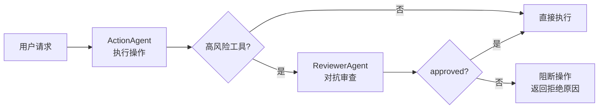

# 对话智能与多 Agent 协作

## P1: 意图路由（IntentRouter）

规则 + LLM 混合意图识别引擎，在 Agent Loop 之前完成意图判断，支持快捷路径短路（无需检索直接回答）。

- **规则优先**：关键词 + 正则匹配 7 种意图（greeting / simple_qa / chitchat / complaint / clarification / follow_up / off_topic），零 Token 开销
- **LLM 兜底**：规则无法判定时调用 LLM（max_tokens=50），输出结构化 JSON 意图分类
- **快捷路径短路**：greeting / chitchat / off_topic 等意图直接返回预设回答，跳过 Agent Loop，首 token < 100ms
- **集成点**：`chat_service.prepare_chat()` 中在焦点追踪之前执行，结果传入 `PreparedChat.intent_info`
- **优雅降级**：LLM 不可用时回退到纯规则，不阻断对话
- **设计文档**：`docs/P1_P2_Intent_Entity_Design.md`

---

## P2: 实体注册表（EntityRegistry）

实体识别 + 查询扩展 + 本体谓词推理，让 RAG 引擎"理解"用户查询中的领域实体。

- **实体识别**：规则匹配 + LLM 提取双策略，支持自定义实体词典
- **查询扩展**：`expand_query()` 将实体别名、同义词、上位词注入查询，提升召回率
- **本体谓词**：支持 `is_a` / `part_of` / `related_to` 三种关系推理，自动发现隐含关联实体
- **集成点**：`chat_service.prepare_chat()` 中在意图路由之后执行，扩展后的查询传入 CoreferenceResolver 和引擎
- **设计文档**：`docs/P1_P2_Intent_Entity_Design.md`

---

## P3: 上下文工程（Context Engineering）

六组件全量实现，系统化管理多轮对话的上下文窗口，确保 LLM 在长对话中不丢失关键信息。

### P3-A: 焦点追踪 + 指代消解

- **TopicTracker**：从对话历史中提取当前焦点（topic / entity / intent），规则优先 → LLM 兜底 → 继承上次焦点
- **ConversationFocus**：焦点数据结构，含 `to_context_str()` 和 `to_dict()` 序列化
- **CoreferenceResolver**：检测省略句 → 规则补全（零 Token）→ LLM 补全（1 次轻量调用），P4-C 增强后注入对话历史 + 焦点栈
- **焦点历史栈**（P4-C 增强）：`TopicTracker` 保留最近 5 个焦点，`get_focus_history(n)` 供指代消解回溯

### P3-B: 上下文选择器

- **ContextSelector**：从全量历史中选择最相关的上下文片段，语义相似度（embedding）+ 时间衰减 + 去重
- 懒加载 Embedder，不可用时回退到最近 N 条消息

### P3-C: 对话摘要

- **ConversationSummarizer**：分层压缩策略，保留关键信息（实体、数字、决策），LLM 生成摘要
- 旧消息 → 摘要替代，新消息 → 原文保留，Token 预算可控

### P3-E: 上下文预算 + Scratchpad

- **ContextBudgetManager**：三段式压缩（system prompt → 历史摘要 → 当前对话），确保不超 LLM Token 上限
- **Scratchpad**：`AgentState.scratchpad` 累积每轮推理笔记，`_think()` 注入最近 300 字高密度信息

### P3-F: LLM 事实提取

- **MemoryManager 事实提取**：LLM 从对话中提取持久化事实（用户偏好、项目决策、关键信息），写入 Mem0
- 与 P4-F 偏好偏移检测联动：提取的偏好用于 `current_preferences` 参数，避免重复检测

---

## P4: 实时对话智能（Realtime Conversation Intelligence）

7 种实时检测器 + 混合执行模型，让 AI 对话具备"感知力" — 话题漂移、矛盾、偏好变化、重复提问等场景实时检测。

### 执行模型

```
prepare_chat（同步关键路径）                    stream_chat（异步非关键路径）
┌─────────────────────────────┐              ┌──────────────────────────────┐
│ DriftDetector       ~50ms   │              │ asyncio.create_task(          │
│ PreferenceDriftDetector ~0ms│              │   ContradictionDetector      │
│ RepetitionDetector  ~100ms  │              │ )  ← 后台运行，不阻塞首 token │
│ CoreferenceResolver ~400ms  │              │   完成后 push SSE 事件        │
└─────────────────────────────┘              └──────────────────────────────┘
         ↓ 首 token ≈ 500-700ms                       ↓ 延迟到达
```

### P4-A: 漂移检测（DriftDetector）

三级策略，逐级递进，零到轻量 Token 开销：

1. **规则检查**（零 Token）：话题关键词域比较，topic/entity 不在 query 中 → 可能漂移
2. **Embedding 检查**（零 LLM Token）：cosine(query, focus) < 0.4 = 漂移，0.4-0.6 = 可能漂移
3. **置信度衰减**（零 Token）：连续 3 轮低置信度（< 0.4）→ 漂移

漂移时 `reset_focus()` 清空焦点栈，重新提取。检测结果通过 SSE `drift_detected` 事件推送前端。

### P4-B: 矛盾检测（ContradictionDetector）

三种检测场景，共同实体预筛省 Token：

1. **用户陈述矛盾**（prepare_chat 后台）：当前陈述 vs 历史陈述，共同时体预筛 → 1 次 LLM 调用
2. **回答-知识库矛盾**（_reflect 阶段）：AI 回答 vs 检索文档，`check_answer_consistency()`
3. **文档间矛盾**（_retrieve 后）：检索结果两两比对，最多前 5 篇避免 O(n²) 爆炸

LLM 不可用时全部优雅降级为无矛盾。结果通过 SSE `contradiction_detected` 事件推送。

### P4-C: 指代消解增强

P3-A CoreferenceResolver 的增强版：

- **焦点历史栈注入**：`resolve()` 接收 `focus_stack` 参数，LLM prompt 包含最近 3 个焦点（轮0/轮1/轮2）
- **对话历史注入**：`resolve()` 接收 `history` 参数，LLM prompt 包含最近 6 条对话原文
- **向后兼容**：不传新参数时行为与 P3 一致

### P4-D: 检索匹配检测（RetrievalMatcher）

检索完成后检测结果是否与查询匹配：

- 对 query 和每篇 doc 的 title+snippet 做 embedding，计算 cosine 相似度
- top-1 相似度 < 0.3 → 不匹配，建议 `expand_retrieval`
- Embedder 不可用时跳过（视为匹配），不阻断对话

### P4-E: 焦点注入引擎

AgentState 新增 `conversation_focus` 和 `drift_info` 字段，`_think()` 动态上下文注入：

- 有焦点时：注入"当前对话焦点：主题=X, 实体=Y, 意图=Z"
- 有漂移时：注入"注意：用户可能切换了话题，请关注当前问题的独立完整性"
- `answer()` 方法签名新增 `conversation_focus` / `drift_info` 参数

### P4-F: 偏好偏移检测（PreferenceDriftDetector）

纯规则，零 LLM Token，零延迟：

- 扫描 6 类偏好关键词：`concise`（简单点/太长了）、`detailed`（详细点/展开）、`en`（用英文）、`zh`（用中文）、`no_code`（不要代码）、`with_code`（给代码）
- 检测到偏好变化 → `get_system_prompt_modifier()` 生成风格指令 → 追加到 `memory_context`
- 支持已有偏好去重（`current_preferences` 参数）

### P4-G: 重复提问检测（RepetitionDetector）

复用 Embedding，零额外 LLM 成本：

- cosine(current_query, last_query) > 0.85 → 重复
- 连续重复 >= 2 次 → `action="expand_retrieval"`（上轮回答未满足需求，扩大检索范围）
- 支持 `current_embedding` 参数复用 DriftDetector 已计算的向量

### 集成架构

`chat_service.py` 中的集成点：

| 阶段 | 检测器 | 执行方式 | SSE 事件 |
|------|--------|----------|----------|
| `prepare_chat` | DriftDetector | 同步 | `drift_detected` |
| `prepare_chat` | PreferenceDriftDetector | 同步 | `preference_changed` |
| `prepare_chat` | RepetitionDetector | 同步 | `repetition_detected` |
| `prepare_chat` | CoreferenceResolver（增强） | 同步 | `context_resolved` |
| `stream_chat` | ContradictionDetector（用户陈述） | `asyncio.create_task` 后台 | `contradiction_detected` |
| `stream_chat` | 偏好指令注入 memory_context | 同步 | — |
| `stream_chat` | focus + drift 传入 engine.answer() | 同步 | — |

- **设计文档**：`docs/P4_Realtime_Conversation_Intelligence_Design.md`

---

## 多 Agent 协作与记忆增强（P0-P2）

针对多 Agent 通信损耗、记忆检索精度、关键决策遗忘、高风险操作缺审查等问题，按优先级分三批完成。

### P0: 记忆检索精度与上下文压缩

| 优化项 | 位置 | 说明 |
|--------|------|------|
| Mem0 语义检索 | `mem0_manager.py` `search_facts()` | 从关键词匹配升级为 cosine similarity 语义检索：生成 query 向量 → 与已存储 embedding 计算余弦相似度 → top-k 排序。阈值 `similarity_threshold=0.3`，无匹配时降级到关键词匹配，Embedder 不可用时降级到时间排序 |
| ConversationSummarizer 接入 | `chat_service.py` `_build_engine_memory_context()` | 旧历史超阈值时自动压缩为摘要 + 保留近期原文，从 `memory_facts` 的 `summary` 类别读取已有摘要做增量压缩，失败时降级到原始历史 |

### P1: 多 Agent 结构化通信

| 优化项 | 位置 | 说明 |
|--------|------|------|
| 原始需求透传 | `crew.py` `_build_crew_tasks()` | 防传话游戏：每个子任务描述中注入 `original_query`（标注"不可修改，必须参考"），确保下游 Agent 拿到用户原始需求而非经过多次转述的版本 |
| 结构化输出 | `crew.py` `_build_crew_tasks()` | 要求 Agent 以结构化 JSON 输出（`action_type` / `result_data` / `status`），而非自然语言总结，减少每次转述的信息漂移 |
| 关键决策持久化 | `memory_manager.py` `extract_and_save_key_decisions()` | 防中间遗忘：启发式检测决策性关键词 → LLM 提取关键决策 → 持久化到 working memory（TTL 24h）→ 下一轮 `build_context` 自动注入到 prompt 的"当前任务上下文"段落 |

### P2: 高风险操作对抗审查

| 优化项 | 位置 | 说明 |
|--------|------|------|
| ReviewerAgent | `agents/reviewer_agent.py` | 独立于 ActionAgent 的安全审查 Agent，从权限合规/参数合理性/不可逆性/上下文一致性四个维度审查高风险操作（`create_it_ticket` / `document_create` / `document_delete` / `system_config_change`）。LLM 不可用时默认放行（不阻断业务），审查失败时默认放行 |



设计原理（来自 Q8 多 Agent 对抗设计）：「写代码」和「审查代码」需要的视角是对抗性的，合并在一个 Agent 里容易自己检查不出自己的问题。ReviewerAgent 独立于执行逻辑，提供安全/合规视角的二次核验。

---

## 工具治理与选择优化（P0-P2）

针对工具选择精度差、全量塞入 token 浪费、漏检隐蔽化等问题，按优先级分三批完成。核心原则：**工具选择的瓶颈从来不是检索算法不够先进，而是工具本身的设计太粗糙。先把工具的"内功"练好，收益远大于折腾模型和检索。**

### P0: 工具描述源头治理

每个工具描述补齐三要素：明确核心功能、触发关键词埋点、负向边界约束。

| 工具 | 正向描述 | 负向边界 | 新增 tags |
|------|----------|----------|-----------|
| `knowledge_search` | 搜索知识库返回文档列表 | 不适用于已知文档 ID 查询（用 `document_get`）；不适用于查审批状态（用 `query_oa_approval`） | 查找、了解 |
| `document_get` | 获取文档详情 | 不适用于关键词搜索（用 `knowledge_search`）；不适用于创建文档（用 `document_create`） | 内容 |
| `document_create` | 创建新文档 | 不适用于搜索已有文档；不适用于查看已有文档；不适用于修改/删除 | 编写、新增 |
| `query_oa_approval` | 查询 OA 审批状态 | 不适用于搜索知识库文档；不适用于创建 IT 工单（用 `create_it_ticket`） | 进度、报销 |
| `create_it_ticket` | 创建 IT 服务台工单 | 不适用于查询已有工单状态；不适用于查询 OA 审批进度；不适用于搜索文档 | 提单、支持 |

### P1: CrewAI 路径工具分层注入

| Agent 类型 | 允许的工具 | 设计原理 |
|------------|-----------|----------|
| QA Agent | `knowledge_search` / `document_get` / `query_oa_approval`（只读） | 只负责回答问题，不应有写操作权限 |
| Workflow Agent | `knowledge_search` / `document_get` / `query_oa_approval`（只读） | 引导流程，不直接执行写操作 |
| Action Agent | 全部工具（含 `document_create` / `create_it_ticket`） | 负责执行操作，可拿到写工具 |

新增 `get_mcp_tools_for_agent_type()` 函数（`agents/mcp_tools.py`），按 Agent 类型筛选工具。`crew.py` 的 `_build_crew_agents()` 从全量塞入改为按类型分别加载，消除 QA Agent 误调用写操作工具的风险。

### P2: 引擎「无匹配工具」强制选项

`engine.py` 的 `_tool_call` 阶段，在 system prompt 中注入「无匹配工具」强制选项指令：

```
重要：如果以上候选工具都无法满足用户需求，
请不要硬凑工具调用，直接回复原文并说明无可用工具。
当前可用工具：knowledge_search, document_get, ...
```

这是发现检索漏检的核心机制 — 把隐性的"看不见"错误变成显性信号，让 LLM 在候选工具都不适用时显式声明而非硬凑一个错误调用。

---