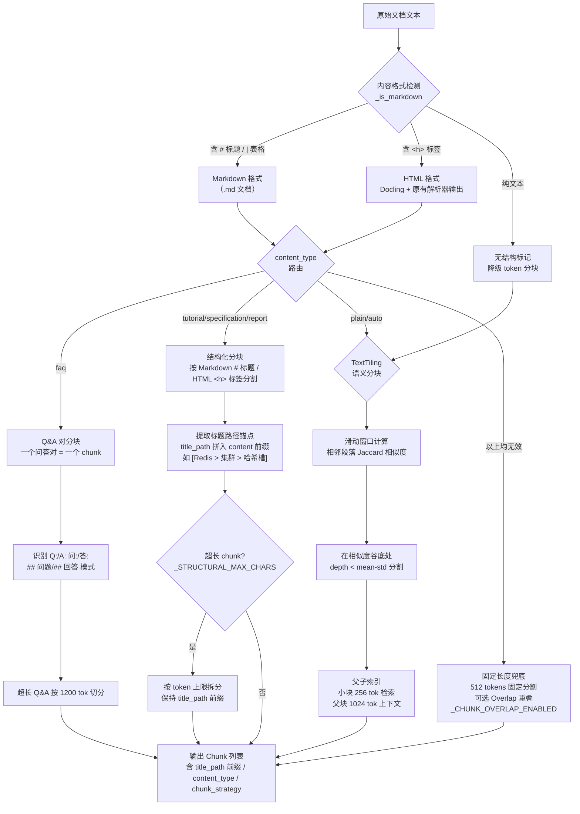
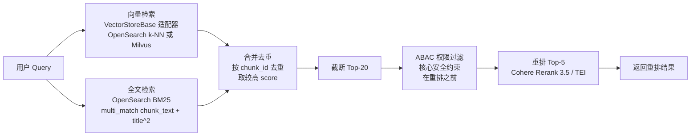
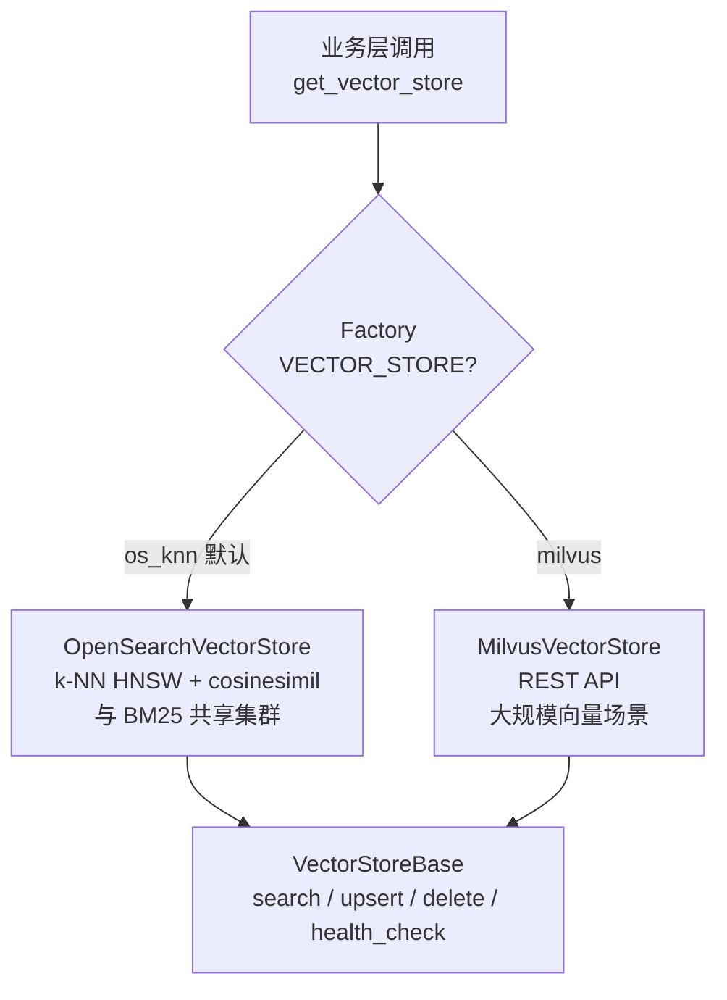
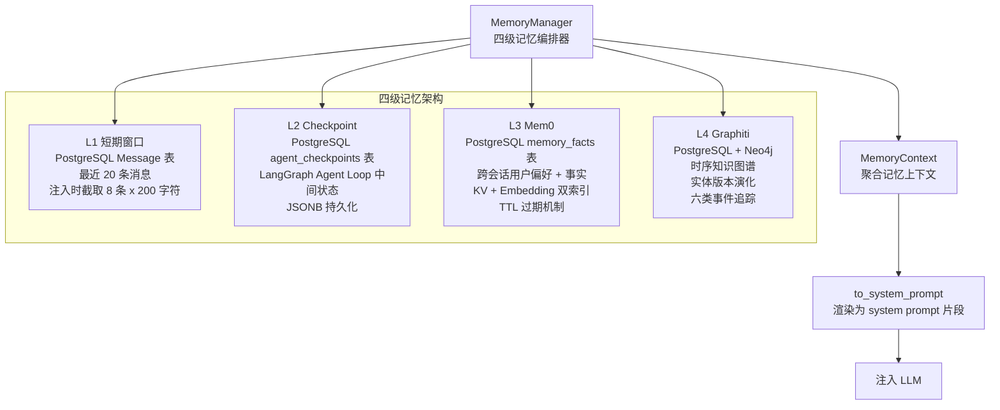

# RAG 检索与记忆架构

## 四级语义分块策略

`SemanticChunker` 采用**内容格式智能检测** + 内容类型路由 + 四级优先级降级策略，保证总能产出有效分块。每个 `Chunk` 携带 `title_path`（标题路径锚点，作为 `[标题路径]` 前缀拼入 content 增强 embedding 上下文感知）、`content_type`（内容类型标签）、`chunk_strategy`（实际使用策略）等元数据。

### 上下文保留机制

分块策略采用**分层上下文保留**，不同层级使用不同机制，避免一刀切的 Overlap：

| 层级 | 策略 | 上下文保留机制 | 说明 |
|------|------|----------------|------|
| P1 | 结构化分块 | `title_path` 拼入 content 前缀 | `[标题路径]` 前缀让 embedding 感知层级，如 `[系统架构 > 服务层]` |
| P2 | TextTiling 语义分块 | 话题边界天然完整 | 在相似度谷底分割，块内话题一致 |
| P3 | 父子索引 | `parent_id` 回取父块 | 小块命中后回取父块扩充上下文，优于 Overlap |
| 兜底 | 固定长度 | 可选 Overlap（`_CHUNK_OVERLAP_ENABLED`） | 仅硬切场景需要，默认关闭 |

> **设计决策**：Overlap 是"硬切"的补救措施。高级策略（结构化分块、TextTiling）在语义边界切分，天然保留上下文，不需要 Overlap。父子索引是比 Overlap 更优雅的机制——Overlap 是"预防性冗余"，父子索引是"按需回取"，后者精度更高、冗余更少。

### 内容格式智能检测

`_structural_split()` 不再依赖 `doc_type` 路由，而是通过 `_is_markdown()` 检测实际内容格式：

| 检测条件 | 正则 | 匹配示例 |
|----------|------|----------|
| Markdown 标题 | `^#{1,3}\s+` | `# 标题` / `## 章节` / `### 小节` |
| Markdown 表格 | `^\|.+\|\s*$` | `\| 列1 \| 列2 \|` |
| 表格分隔行 | `^\|[\s\-:|]+\|\s*$` | `\|---\|---\|` |

这确保所有解析器输出（Docling HTML + 原有解析器 HTML）都能正确路由到 `_split_html()` 分块策略，而 `.md` 文档走 `_split_markdown()`。统一 HTML 格式后，`<h1>`/`<h2>`/`<h3>` 标题标签直接用于结构化分块和标题路径提取。

### 分块策略优先级

| 优先级 | 策略 | 触发条件 | 特点 |
|--------|------|----------|------|
| P0 | Q&A 对分块 | `content_type="faq"` | 问答对不被拆散 |
| P1 | 结构化分块 | `_is_markdown()` 检测到 Markdown 标记或 HTML `<h>` 标签 | title_path 拼入 content 前缀增强 embedding；超长章节按 `_STRUCTURAL_MAX_CHARS` 拆分 |
| P2 | TextTiling 语义分块 | plain / auto 兜底 | 话题边界自动识别 |
| P3 | 父子索引 | 语义分块后自动构建 | 小块检索 + 父块上下文（优于 Overlap） |
| 视频/音频 | 视频语义分块 | doc_type 为视频/音频类型 | 时间窗口（120s）合并 ASR 片段 + 关键帧 VLM 描述对齐，`title_path` 存时间戳 |
| 兜底 | 固定长度 | 以上均无效 | 512 tokens 段落边界断开；可选 Overlap（`_CHUNK_OVERLAP_ENABLED`，默认关闭） |

### 视频语义分块（`chunk_video_transcript`）

视频文档不走四级兜底链，而是由 `SemanticChunker.chunk_video_transcript()` 专用方法处理：

- **输入**：ASR 转写片段列表（`{start, end, text}`）+ 关键帧 VLM 描述列表（`{timestamp, description}`，P1 可选）
- **合并**：按 120 秒时间窗口将转写片段合并为语义块，`title_path` 存时间戳范围（如 `00:00-02:15`）
- **关键帧对齐**：VLM 描述按时间戳对齐到最近的转写块，追加为视觉上下文（`[画面: 幻灯片显示三层架构图]`）
- **降级**：单块过长时回退到 TextTiling 语义分块；无转写片段时返回空列表，由调用方降级为普通文本分块

---

## 混合检索管线

`HybridRetriever` 实现双路召回 + 合并去重，`Reranker` 通过工厂模式支持 SaaS（Cohere）和私有部署（TEI）双模式。

### 检索路对比

| 检索路 | 后端 | 算法 | 优势 |
|--------|------|------|------|
| 向量检索 | OpenSearch k-NN（默认）/ Milvus（可选） | HNSW + COSINE | 语义相似性匹配，按 VECTOR_STORE 切换 |
| 全文检索 | OpenSearch | BM25 + multi_match | 关键词精确匹配，标题权重 x2 |

任一检索路不可用时优雅降级（返回空列表），不影响另一路。

### 向量存储适配器

向量检索通过 `VectorStoreBase` 抽象接口实现，支持按客户体量切换后端，业务代码零改动。

| 后端 | 配置值 | 适用场景 | 优势 |
|------|--------|----------|------|
| OpenSearch k-NN | `VECTOR_STORE=os_knn`（默认） | < 500 万向量 | 与 BM25 共享集群，运维简单 |
| Milvus | `VECTOR_STORE=milvus` | > 500 万向量 | 专用向量引擎，IVF/PQ 压缩 |

### 重排器双模式

| 部署模式 | 实现 | 模型 |
|----------|------|------|
| SaaS | CohereReranker | rerank-multilingual-v3.0 |
| 私有部署 | TEIReranker | Jina-reranker-v2 / BGE-reranker-v2-m3 |

---

## 四级记忆架构

系统采用四级记忆编排器模式，`MemoryManager` 作为单一入口协调四个记忆层级，每层独立加载、优雅降级。

### 各层级职责

| 层级 | 存储 | 数据类型 | 读写频率 | TTL |
|------|------|----------|----------|-----|
| L1 短期窗口 | PostgreSQL Message 表 | 当前对话最近消息 | 高频读写 | 会话级 |
| L2 Checkpoint | PostgreSQL JSONB | Agent Loop 中间状态 | 中频 | 永久 |
| L3 Mem0 | PostgreSQL + Embedding | 用户偏好/历史摘要/工作记忆 | 中频 | working 24h / summary 7d / preference 永久 |
| L4 Graphiti | PostgreSQL + Neo4j | 实体关系演化/知识时间线 | 低频写 | 永久 |

### L3 Mem0 事实分类

| 类别 | 用途 | TTL |
|------|------|-----|
| `preference` | 用户偏好（"我喜欢简洁回答"） | 永不过期 |
| `working` | 工作记忆（当前任务上下文） | 24 小时 |
| `summary` | 对话摘要 | 7 天 |
| `entity` | 实体事实 | 永不过期 |

### L4 Graphiti 事件类型

`version_updated` / `status_changed` / `expired` / `deprecated` / `merged` / `split`

时间区间模型：`valid_from` / `valid_to`，新事件自动关闭前一事件的 `valid_to`。

---