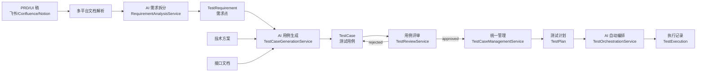
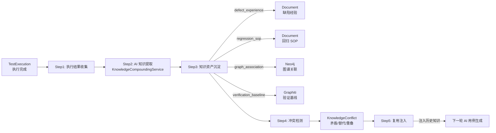

# 智能测试平台与离线评测

## 智能测试平台

基于知识库的 AI 驱动测试平台，实现从 PRD/UI 稿到测试用例的全流程自动化：需求自动拆分 → AI 用例生成 → 用例评审 → 统一管理 → AI 自动编排。

**核心能力**：
- **需求自动拆分**：从 PRD、UI 稿（支持飞书 Wiki、Confluence、Notion、Obsidian 多平台解析）自动提取原子需求点，分类（功能/非功能/UI/API/性能）+ 优先级 + 验收标准
- **AI 用例生成**：结合需求点 + 技术方案 + 接口文档，LLM 自动生成结构化测试用例（前置条件、测试步骤、预期结果）
- **用例评审**：复用审核工作流模式（pending → approved/rejected），支持评审建议和摘要
- **用例统一管理**：CRUD + 批量操作 + 多维度筛选（状态/类型/优先级/关键词）+ 用例编号自动生成
- **AI 自动编排**：根据用例优先级、测试类型依赖、执行节点容量，LLM 生成执行顺序和节点分配方案

**数据模型**（6 张表）：

| 表 | 说明 |
|----|------|
| `test_projects` | 测试项目，关联 PRD/技术方案/接口文档 |
| `test_requirements` | 需求点，从 PRD 自动拆分 |
| `test_cases` | 测试用例，AI 生成或手动创建 |
| `test_reviews` | 用例评审记录 |
| `test_plans` | 测试计划，含 AI 编排方案 |
| `test_executions` | 用例执行记录 |

**服务层**（5 个服务）：

| 服务 | 职责 |
|------|------|
| `RequirementAnalysisService` | LLM 驱动的需求点提取、分类、验收标准生成 |
| `TestCaseGenerationService` | LLM 驱动的结构化用例生成（结合技术方案+接口文档） |
| `TestReviewService` | 用例评审提交/通过/驳回，复用审核工作流模式 |
| `TestCaseManagementService` | 用例 CRUD、批量操作、多维度筛选、统计聚合 |
| `TestOrchestrationService` | LLM 驱动的执行顺序编排、节点分配、依赖分析 |

**API 端点**（28 个，prefix=`/api/v1/testing`）：

| 分组 | 端点 | 说明 |
|------|------|------|
| 项目 | `POST/GET/PUT /projects` | 测试项目 CRUD |
| 需求 | `POST /requirements/extract` | AI 从文档提取需求点 |
| 需求 | `GET/PUT /requirements` | 需求点查询/更新 |
| 用例 | `POST /cases/generate` | AI 生成测试用例 |
| 用例 | `POST/GET/PUT/DELETE /cases` | 用例 CRUD |
| 用例 | `POST /cases/batch-status` | 批量更新状态 |
| 评审 | `POST /reviews` | 提交用例评审 |
| 评审 | `GET /reviews/pending` | 待评审列表 |
| 评审 | `PUT /reviews/{id}/approve` | 通过评审 |
| 评审 | `PUT /reviews/{id}/reject` | 驳回评审 |
| 计划 | `POST /plans` | 创建测试计划 |
| 计划 | `POST /plans/{id}/orchestrate` | AI 编排执行方案 |
| 执行 | `POST/GET /executions` | 执行记录 |
| 统计 | `GET /stats` | 测试平台统计 |

**多租户门控**：注册为 `testing_platform` 模块，Pro 套餐及以上可用。

**数据库迁移**：`e5f6a7b8c9d0` — 6 张表 + 24 个索引，启动时自动执行 `alembic upgrade head` 创建。

**Celery 异步任务**：
- `extract_requirements_task` — 异步需求提取
- `generate_test_cases_task` — 异步用例生成
- `orchestrate_test_plan_task` — 异步 AI 编排

### 知识回流层（知识复利）

测试执行后自动沉淀 4 类知识资产，检测新旧知识冲突，并在下一轮用例生成时注入历史经验，实现"知识复利"积累。

**5 步闭环流程**：
1. **执行结果收集** — TestExecution 状态变更触发，组装执行上下文（用例+需求+日志+证据）
2. **AI 知识提取** — LLM 分析缺陷模式、根因分析、回归 SOP 草案、图谱三元组
3. **知识资产沉淀** — 4 类资产分别落地：
   - `defect_experience` 缺陷经验文档 → KnowledgeAsset + Document
   - `regression_sop` 回归 SOP → KnowledgeAsset + Document
   - `graph_association` 知识图谱关联 → KnowledgeAsset + Neo4j（复用 GraphService）
   - `verification_baseline` 验证基线时序 → KnowledgeAsset + Graphiti（复用 GraphitiManager）
4. **冲突检测** — LLM 检测新旧知识矛盾/替代/重叠，记录 KnowledgeConflict
5. **复用注入** — RAG 检索历史知识资产，注入下一轮用例生成 LLM 上下文

**数据模型**（3 张新表 + 3 个测试模型新增字段）：

| 表 | 说明 |
|----|------|
| `knowledge_assets` | 知识资产（4 类：缺陷经验/回归SOP/图谱关联/验证基线） |
| `compounding_tasks` | 回流任务（跟踪异步知识提取过程） |
| `knowledge_conflicts` | 知识冲突（检测到的新旧知识冲突记录） |

测试模型新增字段：
- `test_requirements.change_thread_id` — 变更线程 ID（追踪需求演化）
- `test_cases.verification_channels` — 验证渠道列表（多渠道验证记录）
- `test_executions.evidence_ref` — 证据引用（不可变证据快照）
- `test_executions.compounding_status` — 回流状态（none/pending/processed，幂等保护）

**服务层**：

| 服务 | 职责 |
|------|------|
| `KnowledgeCompoundingService` | 5 步知识回流闭环（收集→提取→沉淀→冲突检测→复用注入） |

**API 端点**（12 个，prefix=`/api/v1/compounding`）：

| 分组 | 端点 | 说明 |
|------|------|------|
| 提取 | `POST /extract` | 从执行结果提取知识资产 |
| 资产 | `GET /assets` | 知识资产列表（按项目/类型/状态筛选） |
| 资产 | `GET /assets/{id}` | 知识资产详情 |
| 冲突 | `POST /conflicts/detect` | 检测知识冲突 |
| 冲突 | `GET /conflicts` | 冲突列表 |
| 冲突 | `PUT /conflicts/{id}/resolve` | 解决冲突 |
| 复用 | `POST /reuse/inject` | 复用注入（历史知识 → 用例生成上下文） |
| 任务 | `GET /tasks` | 回流任务列表 |
| 统计 | `GET /stats` | 回流统计聚合 |

**Celery 异步任务**：
- `extract_knowledge_task` — 异步知识提取（Step 1~4）
- `detect_conflicts_task` — 异步冲突检测
- `inject_for_reuse_task` — 异步复用注入

**优雅降级**：LLM 不可用时跳过 AI 提取（资产数为 0）；Neo4j 不可用时跳过图谱写入；Graphiti 不可用时跳过时序追踪。

**幂等保护**：通过 `compounding_status` 字段防止重复提取（none → pending → processed）。

**数据库迁移**：`f6a7b8c9d0e1` — 3 张新表 + 4 个新增字段 + 17 个索引。

---