# Token 优化与上下文压缩设计

## Token 优化与上下文压缩设计

### 设计背景：14 个 Token 浪费点

通过对比分析 [Headroom](https://github.com/headroomlabs-ai/headroom) 项目的上下文压缩思路，识别出本项目中 14 个 token 浪费点（W1-W14），并提出 6 大优化方案（P0-P2）：

| 编号 | 浪费点 | 位置 | 严重度 |
|------|--------|------|--------|
| W1 | system prompt 每轮重建（含动态迭代数/文档数） | `engine.py` `_think` | 高 |
| W2 | 用户 query 在每轮 think 中重复传递 | `engine.py` `_think` | 中 |
| W3 | 未启用 Anthropic Prompt Caching | `anthropic_provider.py` | 高 |
| W4 | ChatService 全量加载历史消息（无 limit） | `chat_service.py` `_build_llm_messages` | 高 |
| W5 | 工具结果在多轮迭代中累积，重复内容重复传 | `engine.py` `_run_decision_loop` | 高 |
| W6 | reflect 阶段回传完整答案全文（~2000 tok） | `engine.py` `_reflect` | 高 |
| W7 | L1 短期窗口加载后不渲染，ChatService 另从 DB 双重加载 | `memory_manager.py` + `chat_service.py` | 高 |
| W8 | 幽灵字段：AgentState 中的 `_decision` / `_stream_tokens` 在纯 Python 路径无用但仍占空间 | `engine.py` AgentState | 低 |
| W9 | L3 用户偏好注入 top-10（实际只需 top-3） | `memory_manager.py` `to_system_prompt` | 中 |
| W10 | 历史消息每条全量传递（无截断） | `chat_service.py` | 中 |
| W11 | 检索文档在 think 上下文中全量传递（只需摘要） | `engine.py` `_think` | 中 |
| W12 | system prompt 中嵌入 UUID / 时间戳等易变内容，破坏 KV Cache | `engine.py` + `anthropic_provider.py` | 高 |
| W13 | 多轮迭代后 messages 列表无限增长（无上限保护） | `engine.py` `_run_decision_loop` | 高 |
| W14 | 生成阶段注入过多检索文档（>2500 tok 导致 Context Cliff） | `generator.py` | 中 |

### 优化方案总览

针对上述 14 个浪费点，实施 6 大优化方案，分为三层：**基础设施层（P0）→ 消息传递层（P1）→ 上下文管理层（P2）**，预期总节省 ~35%。

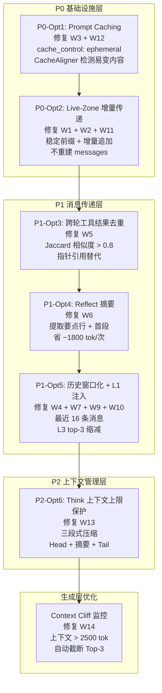

### 上下文压缩架构

以下流程图展示了一条用户 Query 在 Agent Loop 中经过的完整上下文压缩管线，每一层压缩都有对应的保障机制确保信息不丢失：

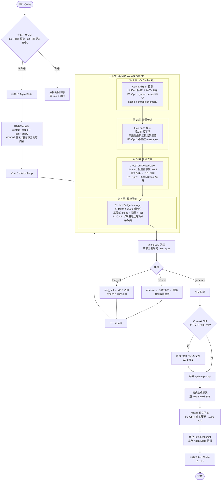

### P0-Opt1: Prompt Caching + CacheAligner

**解决的问题**：W3（未启用 Prompt Caching）+ W12（易变内容破坏 KV Cache）

**设计原理**：Anthropic Claude API 支持 Prompt Caching — 将 system prompt 标记 `cache_control: {"type": "ephemeral"}` 后，首次写入按 1.25x 费率计算，5 分钟内再次读取同一前缀仅按 0.1x 费率。但前提是前缀字节必须稳定，任何 UUID / 时间戳 / JWT 的变化都会导致缓存失效。

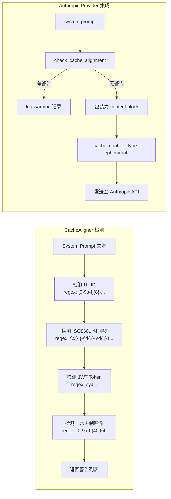

**关键代码路径**：`app/llm/cache_aligner.py` → `app/llm/anthropic_provider.py._build_api_kwargs()`

**效果**：重复前缀读取费率从 1x 降至 0.1x，10 倍成本节省。

### P0-Opt2: Live-Zone 增量上下文传递

**解决的问题**：W1（system prompt 每轮重建）+ W2（query 重复传递）+ W11（检索文档全量传递）

**设计原理**：将 think 的上下文分为**稳定前缀**（system prompt + user query）和**增量 Live Zone**（每轮新追加的工具结果摘要）。稳定前缀在循环开始前一次性设置，后续每轮只追加增量消息，不重建 messages 列表。

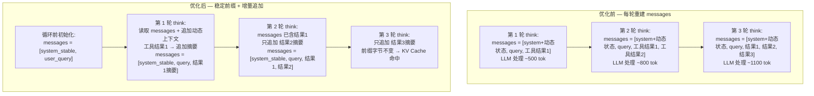

**关键设计**：
- `_THINK_SYSTEM_STABLE` 常量：不含迭代计数、文档数、工具数等动态内容
- 动态状态作为 "live zone" 消息追加：`{"role": "user", "content": "[系统] 当前状态：迭代 3/5..."}`
- 前缀字节稳定 → Anthropic KV Cache 命中 → 0.1x 读取费率

**关键代码路径**：`app/rag/engine.py` → `_run_decision_loop()` + `_think()`

### P1-Opt3: 跨轮工具结果去重

**解决的问题**：W5（工具结果在多轮迭代中累积，重复内容重复传）

**设计原理**：Agent 常在多轮迭代中调用同一工具获取相同或高度相似结果（如反复查同一 ERP 订单）。首次结果保留完整摘要，后续相似结果替换为指针引用 `"↑ [见第1轮 search_erp 结果]"`。

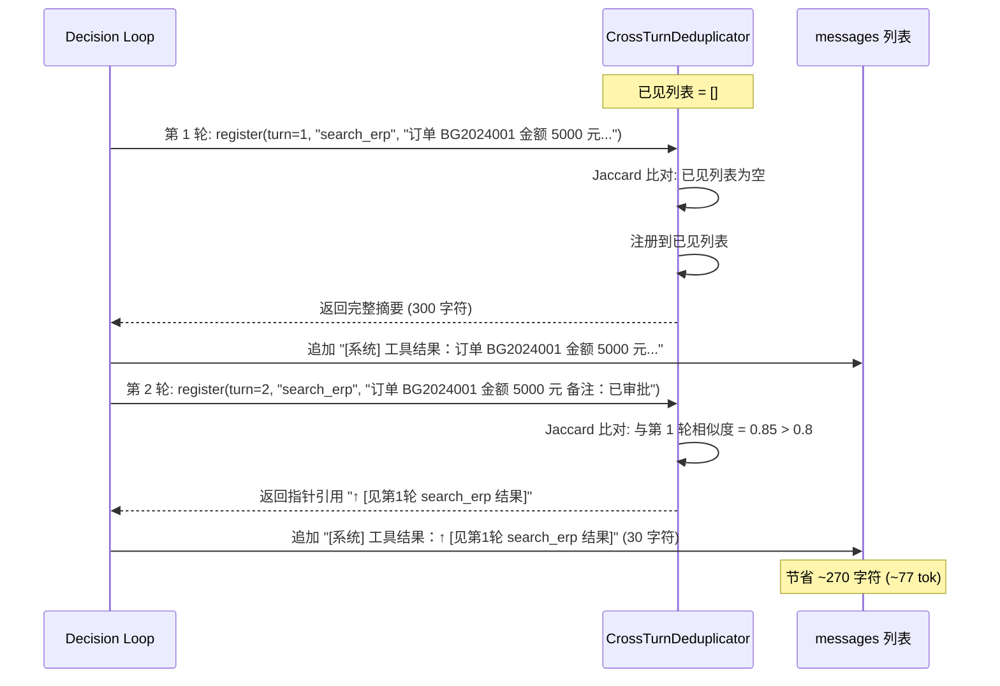

**Jaccard 相似度算法**：
```python
set_a = set(text_a.split())  # 词集
set_b = set(text_b.split())
similarity = len(set_a & set_b) / len(set_a | set_b)
# similarity > 0.8 → 替换为指针引用
```

**两个硬不变量**（与 Headroom CrossTurnDedup 一致）：
1. **前缀单调性**：只匹配严格更早的块，追加轮次不修改早期轮次
2. **无信息离开窗口**：只有逐字出现的 span 才被反向引用，原始内容物理存在于首次轮次

**关键代码路径**：`app/rag/context_dedup.py` → `engine.py._run_decision_loop()`

### P1-Opt4: Reflect 摘要替代全文

**解决的问题**：W6（reflect 阶段回传完整答案全文，~2000 tok）

**设计原理**：reflect 节点只需评估答案质量（引用准确性 / 完整性 / 幻觉风险），不需要完整答案文本。将答案压缩为摘要（前 3 个要点行 + 首段引言，截断 700 字符），从 ~2000 tok 降至 ~200 tok。

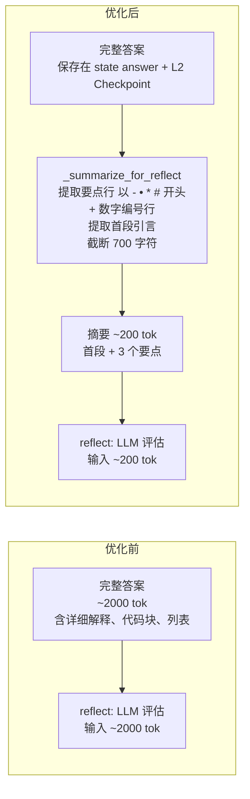

**摘要提取规则**：
- 要点行：以 `-`、`•`、`*`、`#` 开头的行，或以数字 + `.` / `、` / `)` 开头的行
- 首段引言：第一行文本
- 最多保留 3 个要点 + 首段，截断到 700 字符

**信息安全**：完整答案保存在 `state["answer"]` 和 L2 Checkpoint 中，reflect 只读取摘要。

**关键代码路径**：`app/rag/engine.py` → `_reflect()` + `_summarize_for_reflect()`

### P1-Opt5: ChatService 历史窗口化 + L1 实际注入

**解决的问题**：W4（全量加载历史无 limit）+ W7（L1 加载后不渲染，双重加载）+ W9（L3 top-10 过多）+ W10（历史消息无截断）

**设计原理**：ChatService 之前从 DB 全量加载对话历史，同时 MemoryManager 也加载了 L1 短期窗口但不渲染，导致双重加载。优化后 ChatService 优先使用 `memory_ctx.short_term`，L1 渲染到 system prompt（每条截断 200 字符），L3 从 top-10 缩减到 top-3。

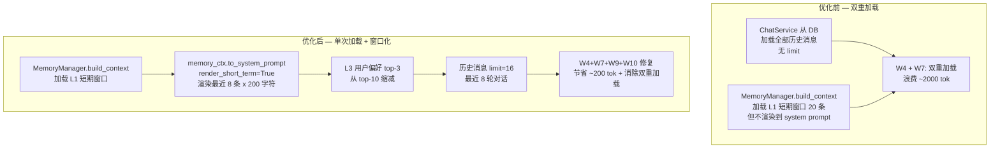

**关键参数**：
- `_SHORT_TERM_INJECT_SIZE = 8`：L1 注入最近 8 条消息（4 轮对话）
- `_SHORT_TERM_MSG_MAX_CHARS = 200`：每条消息截断到 200 字符
- `_L3_INJECT_TOP_N = 3`：L3 用户偏好从 top-10 缩减到 top-3
- `_HISTORY_WINDOW = 16`：历史消息最多 16 条（8 轮对话）

**关键代码路径**：`app/memory/memory_manager.py.to_system_prompt()` + `app/services/chat_service.py._build_llm_messages()`

### P2-Opt6: Think 上下文上限保护

**解决的问题**：W13（多轮迭代后 messages 无限增长）

**设计原理**：即使经过 P1-Opt3 跨轮去重，5 次迭代后 messages 仍可能累积到 2500+ tokens。借鉴 Headroom Memory Budget + Time Decay 设计，实施三段式压缩：Head（前 2 条不动）→ Middle（压缩为单条摘要）→ Tail（最近 2 条不动）。

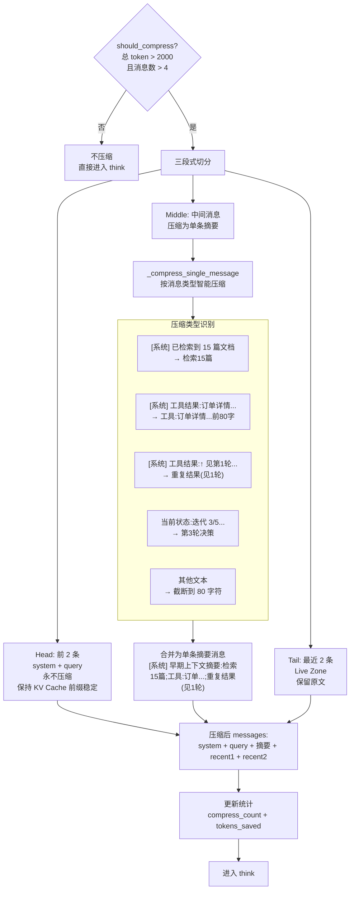

**两个硬不变量**（与 Headroom Memory Budget 一致）：
1. **Head 不变性**：system + query 始终保留，保证 KV Cache 命中
2. **信息保真**：压缩摘要保留每条消息的关键动作类型和核心数据指针，原始完整内容保存在 `state["retrieved_docs"]` 和 `state["tool_results"]` 中

**压缩效果示例**：

```
压缩前 (10 条消息, ~3500 tok):
  [system_stable, query, 检索结果1(500字), 工具结果1(800字), 检索结果2(500字),
   工具结果2(800字), 指针引用(30字), 检索结果3(500字), 工具结果3(800字), recent]

压缩后 (5 条消息, ~800 tok):
  [system_stable, query,
   "[系统] 早期上下文摘要：检索5篇；工具:订单BG2024...；检索8篇；工具:审批状态...；重复结果(见1轮)",
   工具结果3(800字), recent]

节省: ~2700 tok (77%)
```

**关键代码路径**：`app/rag/context_budget.py` → `engine.py._run_decision_loop()`

### Context Cliff 监控

**解决的问题**：W14（生成阶段注入过多检索文档导致 Context Cliff）

**设计原理**：当注入上下文总 token 超过 2500 时，LLM 对中间位置信息的提取能力会显著下降（"Context Cliff" 现象）。`_check_context_cliff()` 在组装 prompt 前自动检测并降级为 Top-3 文档。

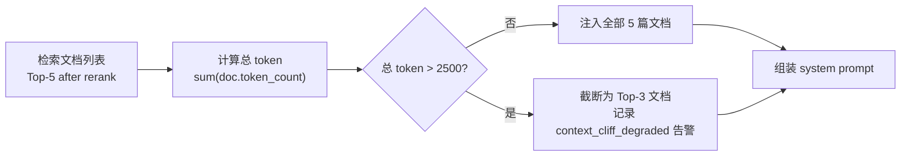

**关键代码路径**：`app/rag/generator.py._check_context_cliff()`

### 记忆不丢失四层保障

压缩不是丢弃，而是分层保真。四层保障确保任何压缩操作都不丢失关键信息：

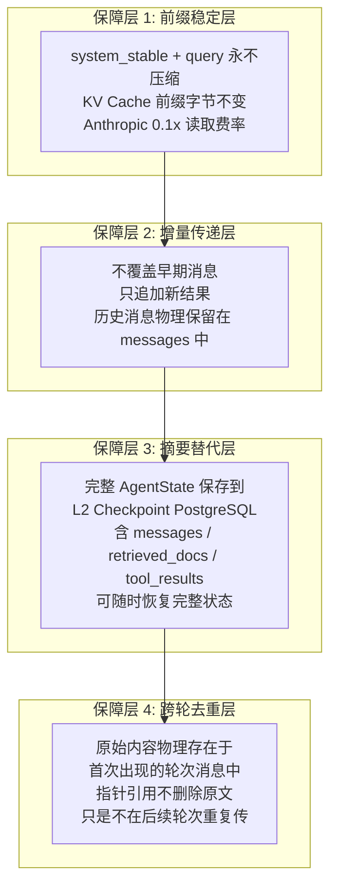

### 三级 Token 缓存

除了上下文压缩，系统还实现三级缓存避免重复 LLM 调用：

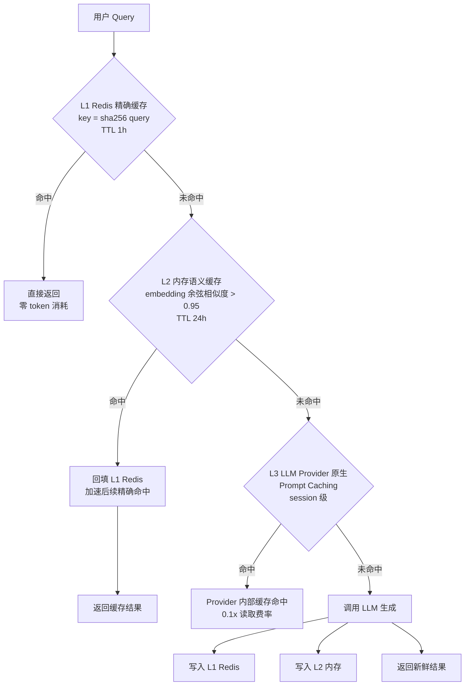

| 级别 | 介质 | 策略 | TTL | 命中效果 |
|------|------|------|-----|----------|
| L1 | Redis | 精确缓存，key = sha256(query) | 1h | 零 token 消耗 |
| L2 | 进程内 dict | 语义缓存，embedding 余弦相似度 > 0.95 | 24h | 零 token 消耗 |
| L3 | LLM Provider 原生 | Prompt Caching，session 级 | 5 min | 0.1x 读取费率 |

### Token 优化效果汇总

| 优化项 | 修复浪费点 | 模块 | 节省效果 | 层级 |
|--------|-----------|------|----------|------|
| P0-Opt1 | W3, W12 | `cache_aligner.py` + `anthropic_provider.py` | 0.1x 读取费率 | 基础设施 |
| P0-Opt2 | W1, W2, W11 | `engine.py` | 命中 KV Cache | 基础设施 |
| P1-Opt3 | W5 | `context_dedup.py` | 重复结果 ~300 tok/次 | 消息传递 |
| P1-Opt4 | W6 | `engine.py` | ~1800 tok/次 | 消息传递 |
| P1-Opt5 | W4, W7, W9, W10 | `memory_manager.py` + `chat_service.py` | ~200 tok + 消除双重加载 | 消息传递 |
| P2-Opt6 | W13 | `context_budget.py` | ~50%+ 中间消息 | 上下文管理 |
| Context Cliff | W14 | `generator.py` | 避免中间位置信息丢失 | 生成层 |
| 三级缓存 | — | `cache.py` | 命中时零 token 消耗 | 缓存 |

---